# 线性表

在线性数据结构中，数据像排队一样保存：

1. 集合中必存在唯一的一个"第一个元素”。
2. 集合中必存在唯一的一个"最后的元素"。
3. 除最后元素之外，其它数据元素均有唯一的"后继"。
4. 除第一元素之外，其它数据元素均有唯一的"前驱”。

线性结构的实际存储方式，分为两种实现模型：

1. 顺序表：将元素顺序地存放在一块连续的存储区里，元素间的顺序关系由它们的存储顺序自然表示。
2. 链表：将元素存放在通过链接构造起来的一系列存储块中，存储区是非连续的。

顺序表和链表都是线性的存储结构，统称为线性表。

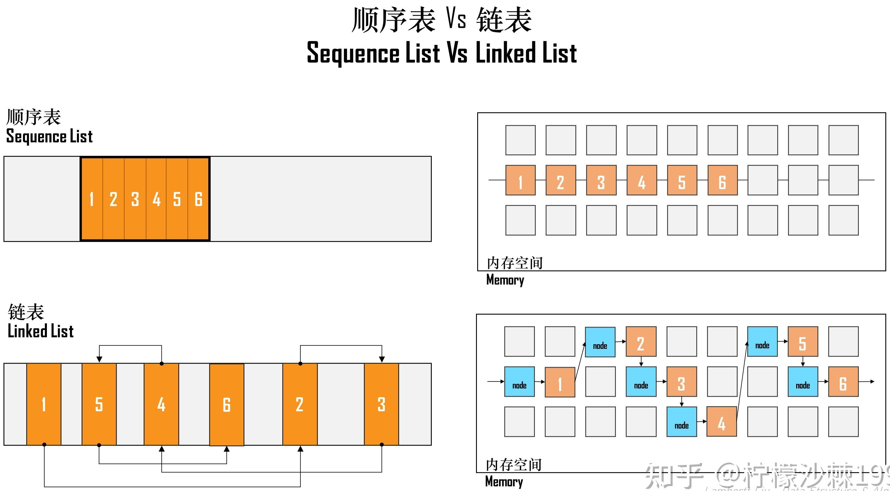

## 顺序表

顺序表存储数据的两种情况：

1. 一体式结构。
2. 分离式结构。

### 一体式结构

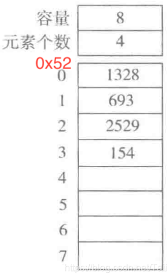

Python中可以使用`array`包实现一体式结构。

```python
import array

arr = array.array('i', [1238, 693, 2529, 154, 0, 0, 0, 0])  
print(arr)  
print(f"数组长度: {len(arr)}")
```

1. `arr`会记录列表的首元素地址。
2. 由于列表所有的数据都是整形，大小都为4个字节，偏移量为4。
3. 第一个元素通过首地址`0x52`找到。
4. 后面的元素根据，首地址`0x52`加偏移量$4\times(n-1)$找到。

### 分离式结构

> [!think]
>
> 如下数据如何存储
>
> ```python
> arr = [100, 'a', 'b']
> ```

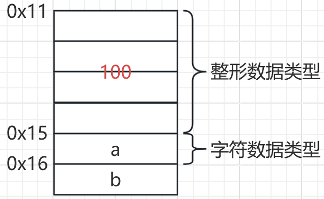

由于列表中数据大小不固定，偏移量也不确定。无法通过偏移的方式查找。

由于内存地址的值是固定的，可以不存储数据，而是存储地址。

* 32位计算机的内存地址占用4个字节。
* 64位计算机的内存地址占用8个字节，部分内存管理使用6个字节。

> [!note]
>
> 地址可以看做是一个16进制的数值编号，也可以保存在内存中。

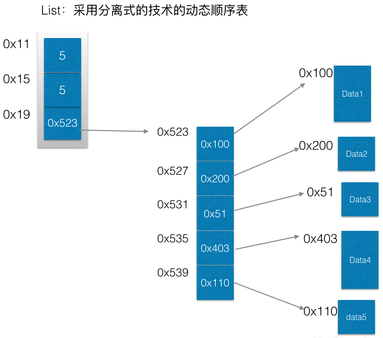

Python的列表就是采取这种存储方式。

> [!warning]
>
> 无论一体式结构，还是分离式结构，在获取数据的时候，直接通过下标偏移就可以找到数据所在空间的地址。所以顺序表在获取地址操作时的时间复杂度$O(1)$。

### 顺序表的结构

顺序表的完整信息包括两部分：

1. 数据区。
2. 信息区，即元素存储区的容量和当前表中已有的元素个数。

顺序表的空间存储分布

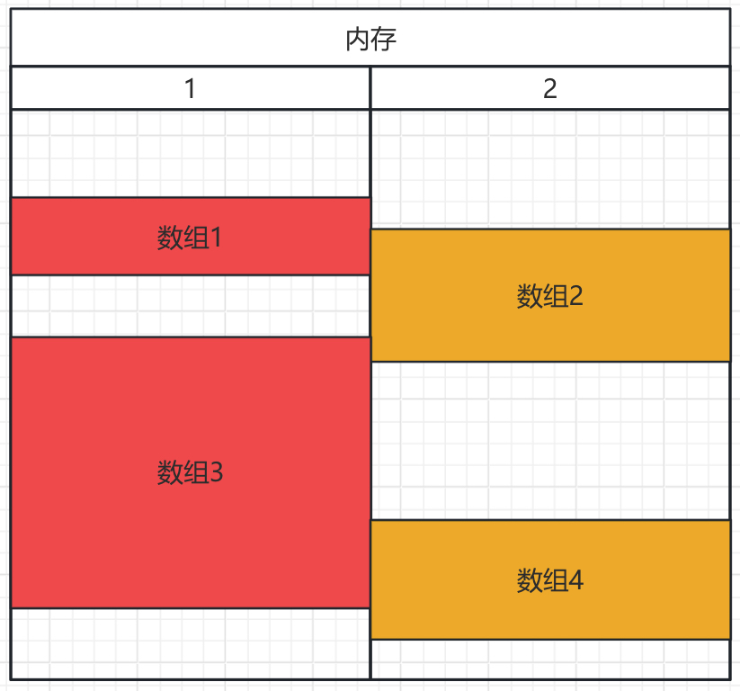

### 顺序表的扩充

增加顺序表的数据容量，扩充的两种策略

1. 线性增长：每次扩充增加固定数目的存储位置，如：每次扩充增加10个元素。特点：节省空间，但是扩充操作频繁，操作次数多。
2. 倍数增长：每次扩充容量加倍，如：每次扩充增加一倍存储空间。特点：减少了扩充操作的执行次数，但可能会浪费空间资源，以空间换时间，推荐的方式。

> [!warning]
>
> 常用的扩充测量是倍数增长。

顺序表存储在连续的空间，则只能整体搬迁。

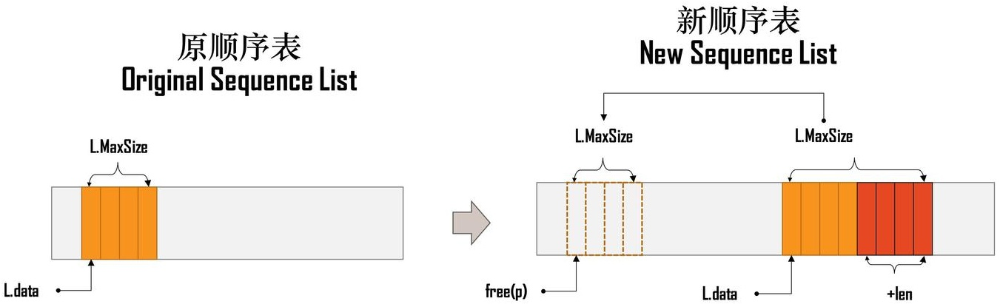

### 顺序表增加与删除元素

1. 增加元素

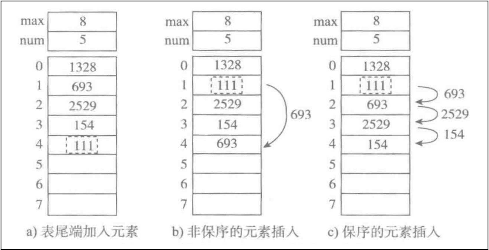

* 尾端加入元素，时间复杂度为$O(1)$。
* 非保序的加入元素（不常见），时间复杂度为$O(1)$。
* 保序的元素加入，时间复杂度为$O(n)$。

2. 删除元素

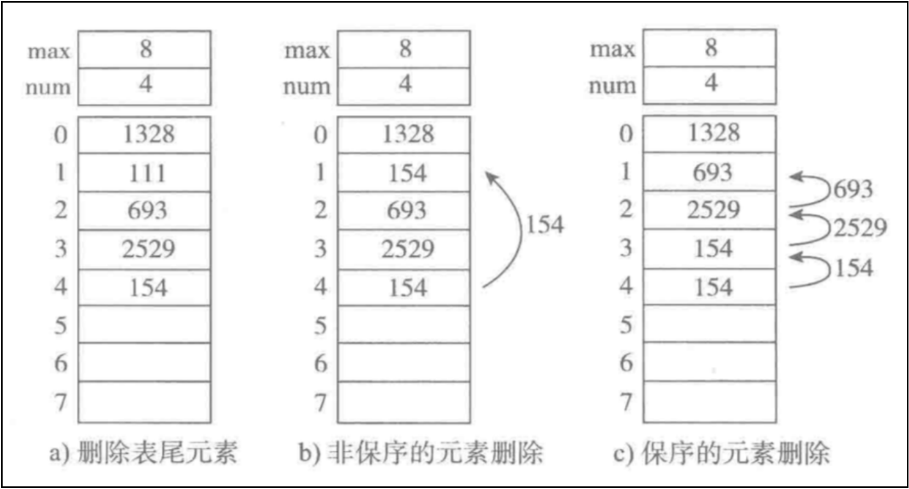

* 删除表尾元素，时间复杂度为$O(1)$。
* 非保序的元素删除（不常见），时间复杂度为$O(1)$。
* 保序的元素删除，时间复杂度为$O(n)$。

### 顺序表存在的问题

1. 插入和删除效率极低。保序的元素插入和删除，时间复杂度为$O(n)$。
2. 空间碎片化与申请失败。顺序表要求内存必须是连续的，即使内存总剩余量很大，但如果没有一块足够大的“整块空间”，顺序表就无法创建。
3. 容量难以预测与扩容成本高。 当数组扩容时，需要把老数据搬到新空间。
4. 无法充分利用零散内存。

## 顺序表的操作

操作顺序表实际上就是操作数组。

**[leetcode 283 移动零](https://leetcode.cn/problems/move-zeroes/)**

1. 直观的解决方案
   1. 将非零元素统计出来。
   2. 将非零元素填入原数组。
   3. 将原数组后面的元素设置为0。

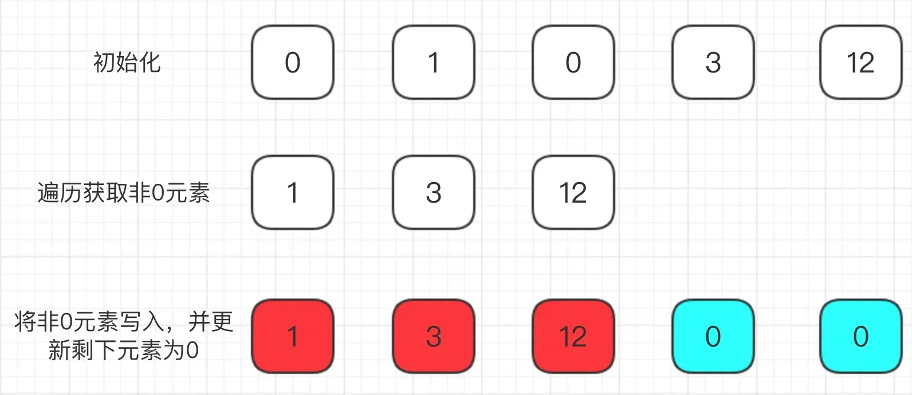

```python
class Solution:
    def moveZeroes(self, nums: List[int]) -> None:
        non_zeros = []
        for i in nums:
            if i != 0:
                non_zeros.append(i)

        for i in range(len(non_zeros)):
            nums[i] = non_zeros[i]

        for index in range(len(non_zeros), len(nums)):
            nums[index] = 0
```

* 算法的时间复杂度为$O(n)$ ，空间复杂度都为 $O(n)$ 。

2. 原地移动操作
   1. 定义两个游标，一个游标变量数组，一个游标记非0元素。
   2. 当元素为非零元素时，将非零元素向前交换。

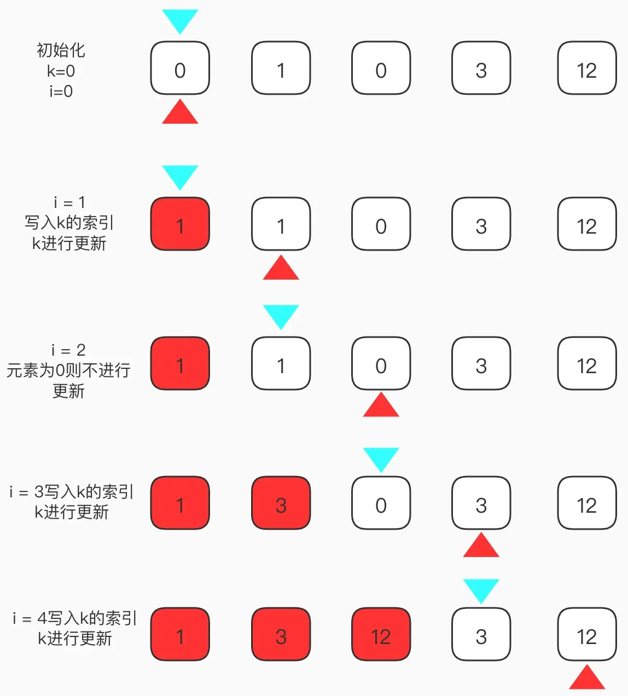

```python
class Solution:
    def moveZeroes(self, nums: List[int]) -> None:
        slow = 0

        for value in nums:
            if value != 0:
                nums[slow] = value
                slow += 1
                
        for i in range(slow, len(nums)):
            nums[i] = 0
```

* 算法的时间复杂度 $O(n)$，空间复杂度是 $O(1)$。

3. 使用数据交换操作
   1. 定义两个游标与上面方法一致。
   2. 当元素为非零元素时，与前面的非零元素交互。


```python
class Solution:
    def moveZeroes(self, nums: List[int]) -> None:
        slow = 0

        for index, value in enumerate(nums):
            if value != 0:
                nums[slow], nums[index] = nums[index], nums[slow]
                slow += 1
```

4. 避免数组中元素全不为0，自身进行交换。

```python
class Solution:
    def moveZeroes(self, nums: List[int]) -> None:
        slow = 0

        for index, value in enumerate(nums):
            if value != 0:
                if slow != index:
                    nums[slow], nums[index] = nums[index], nums[slow]
                    slow += 1
                else:
                    slow += 1
```

**[209. 长度最小的子数组](https://leetcode.cn/problems/minimum-size-subarray-sum/)**

子数组：一般不要求连续，本题中要求子数组连续。

* 穷举法：遍历所有的子数组，并求和。
* 滑动窗口解法
  * 滑动窗口为`[lo, hi]`，统计滑动窗口内的值是否满足条件。
  * 其`lo == hi`时表示窗口内只有一个元素。

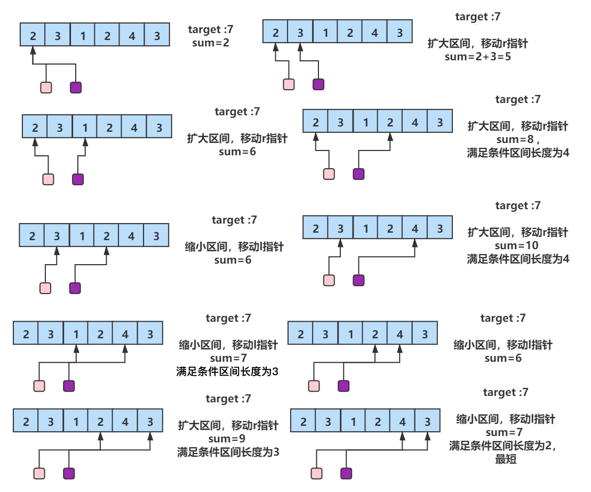

```python
class Solution:
    def minSubArrayLen(self, target: int, nums: List[int]) -> int:
        lo = 0
        hi = -1
        sum = 0
        min_len = len(nums) + 1
        
        while lo < len(nums):
            if hi + 1 < len(nums) and sum < target:
                hi += 1
                sum += nums[hi]
            else:
                sum -= nums[lo]
                lo += 1
            
            if sum >= target:
                min_len = min(min_len, hi - lo + 1)
        
        if min_len == len(nums) + 1:
            return 0
        else:
            return min_len
```

* `hi=-1`表示初始滑动窗口中没有任何值。
* `hi += 1`每次先执行，所以在执行前要保证`hi + 1`不越界。

## 练习

| 题目名称                                                     |
| ------------------------------------------------------------ |
| [27. 移除元素](https://leetcode.cn/problems/remove-element/) |
| [26. 删除有序数组中的重复项](https://leetcode.cn/problems/remove-duplicates-from-sorted-array/) |
| [80. 删除有序数组中的重复项 II](https://leetcode.cn/problems/remove-duplicates-from-sorted-array-ii/) |

