# 链表

1. 线性的存储结构。
1. 不需要连续的存储空间。

## 单链表

单链表（单向链表）是链表的一种形式，它的每个节点包含两个域，一个数据域和一个链接域。这个链接指向链表中的下一个节点，而最后一个节点的链接域则指向一个空值。

1. 链表的节点。

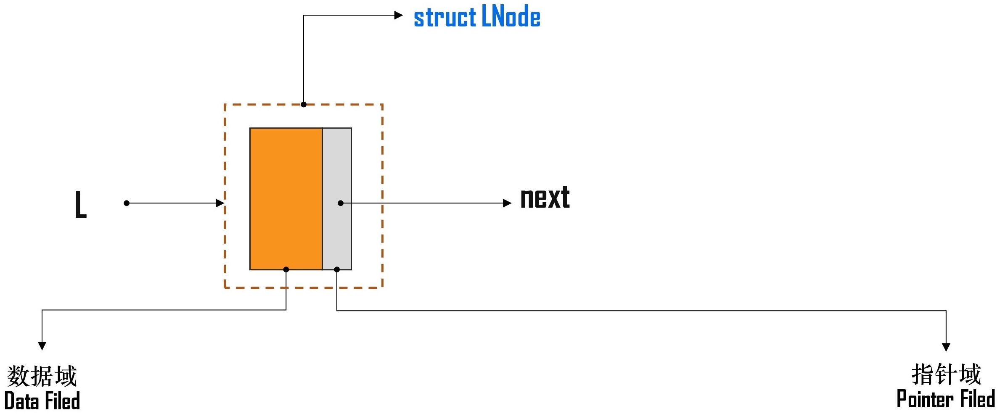

* 数据域用来存放具体的数据。
* 链接域用来存放下一个节点的位置。

2. 链表的结构

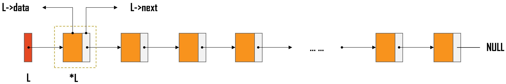

* 链表头指向首节点，从表头出发能找到表中的任意节点。
* 链表的尾节点的链接域为空。

> [!warning]
>
> 根据链表的结构，链表的遍历和查找一定是从头部出发，无法从中间开始。

单链表可以理解为一种“轻量级的流水线”，其应用如：

* 银行、医院的简易排队系统。
* 电商平台的“限时抢购”等待队列。
* 企业的审批流系统。

### 节点与链表

定义节点

```python
class SingleNode:
    def __init__(self, item):
        self.item = item # 数据域
        self.next = None # 链接域
```

定义链表

```python
class SingleLinkList:
    def __init__(self, node=None):
        self.head = node # 头节点
```

链表的初始化

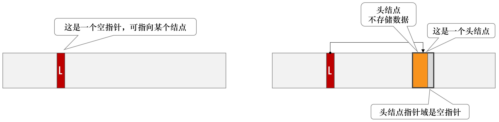

```python
node = SingleNode(100)
link = SingleLinkList()
link.head = node
```

### 基本操作

在链表查找或遍历等操作时，需要定义一个临时变量用于记录当前节点，这个变量称为游标。

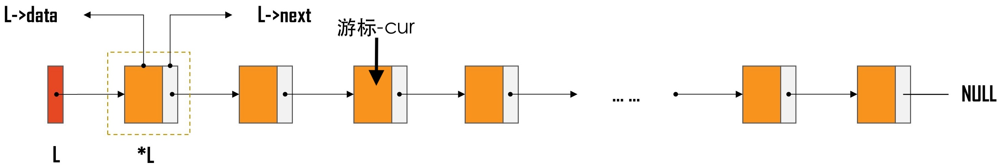

> [!warning]
>
> 链表的各种操作都需要借助游标来完成。

```python
class SingleLinkList:
    ...
    def is_empty(self):
        if self.head is None:
            return True
        else:
            return False

    def length(self):
        cur = self.head
        count = 0
        while cur is not None:
            count += 1
            cur = cur.next
        return count

    def travel(self):
        cur = self.head
        while cur is not None:
            print(cur.item, end='\t')
            cur = cur.next
```

* `cur = cur.next`实现了游标的移动。
* `while cur is not None`判断游标是否可以移动。

### 增加节点

1. 头插法，在链表的头部安插新节点。操作步骤：
   1. 创建新节点。
   2. 新节点的`next`指向首节点。
   3. 首节点变量指向新节点。

   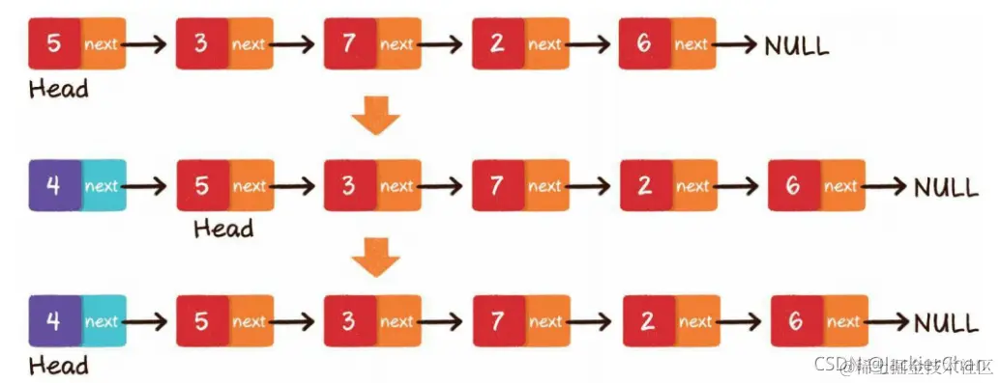

> [!Caution]
>
> 不能打乱上述操作顺序。

```python
class SingleLinkList:
    ...
    def unshift(self, value):
        node = SingleNode(value)
        node.next = self.head
        self.head = node
```

* 头插法的时间复杂度为$O(1)$。

2. 尾插法，在链表的尾部插入新节点。操作步骤：
   1. 通过遍历找到节点的尾部。
   2. 将节点的尾部指向新创建的节点。

> [!warning]
>
> 使用游标的`next`判断节点是否到达尾部，否则无法记录获取当前节点位置。

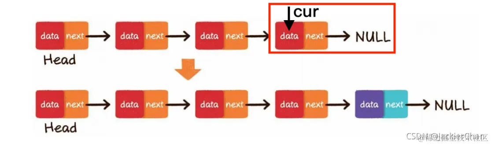

```python
class SingleLinkList:
    ...
    def append(self, value):
        node = SingleNode(value)
        if self.is_empty():
            self.head = node
        else:
            cur = self.head
            while cur.next is not None:
                cur = cur.next
            cur.next = node
```

* 尾插法的时间复杂度为$O(n)$。

3. 指定位置插入。
   1. 在第$i$个位置插入元素，需要遍历到第$i-1$个位置。
   2. 创建新节点。
   3. 新节点指针指向第$i$个节点。
   4. 第$i-1$个节点指向新节点。

   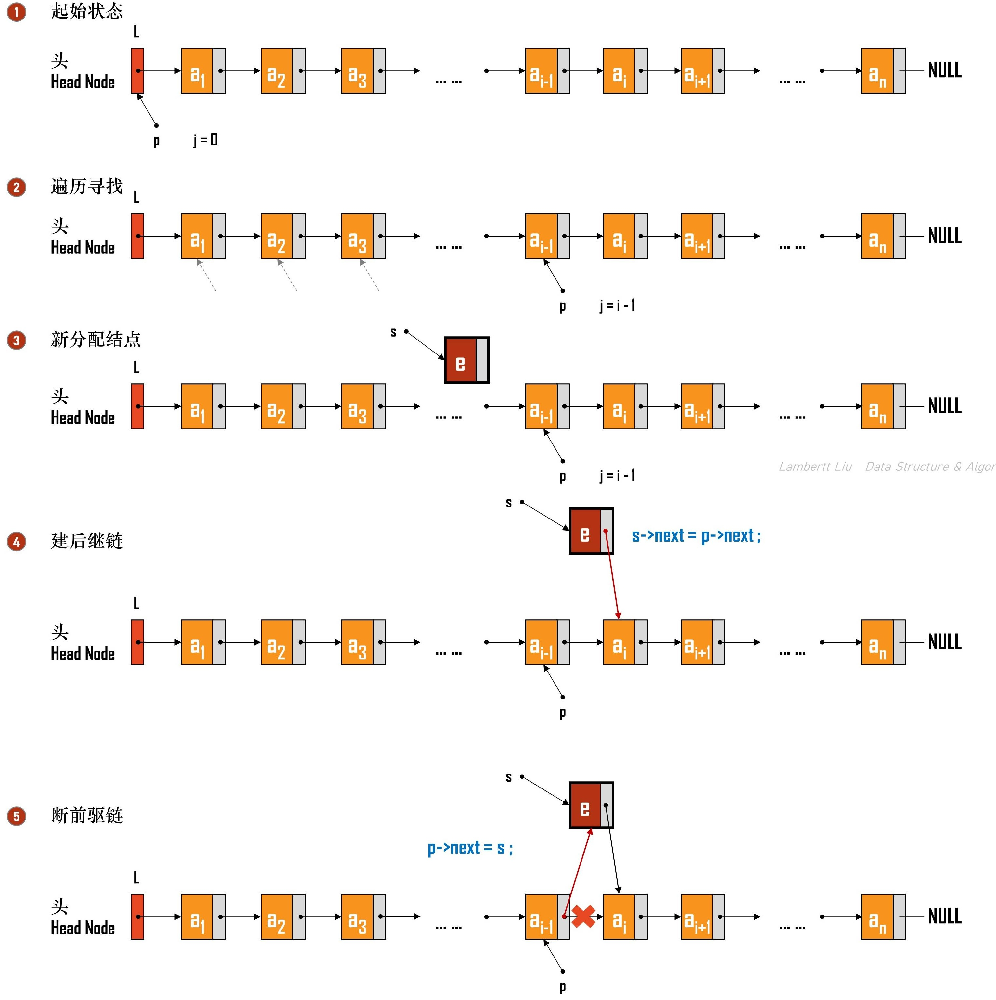

```python
class SingleLinkList:
    ...
    def insert(self, index, value):
        if index <= 0:
            self.unshift(value)
        elif index >= self.length():
            self.append(value)
        else:
            node = SingleNode(value)
            cur = self.head
            for _ in range(index - 1):
                cur = cur.next
            node.next = cur.next
            cur.next = node
```

* 指定位置插入的时间复杂度为$O(n)$。

> [!important]
>
> 插入节点一般流程：
>
> 1. 创建新建节点，将新节点挂载在要插入的位置。
> 2. 调整前后节点链接。

### 删除节点

1. 删除指定位置
   1. 删除第$i$个位置元素，需要遍历到第$i-1$个位置。
   2. 将$i-1$的`next`，指向$i+1$元素。

   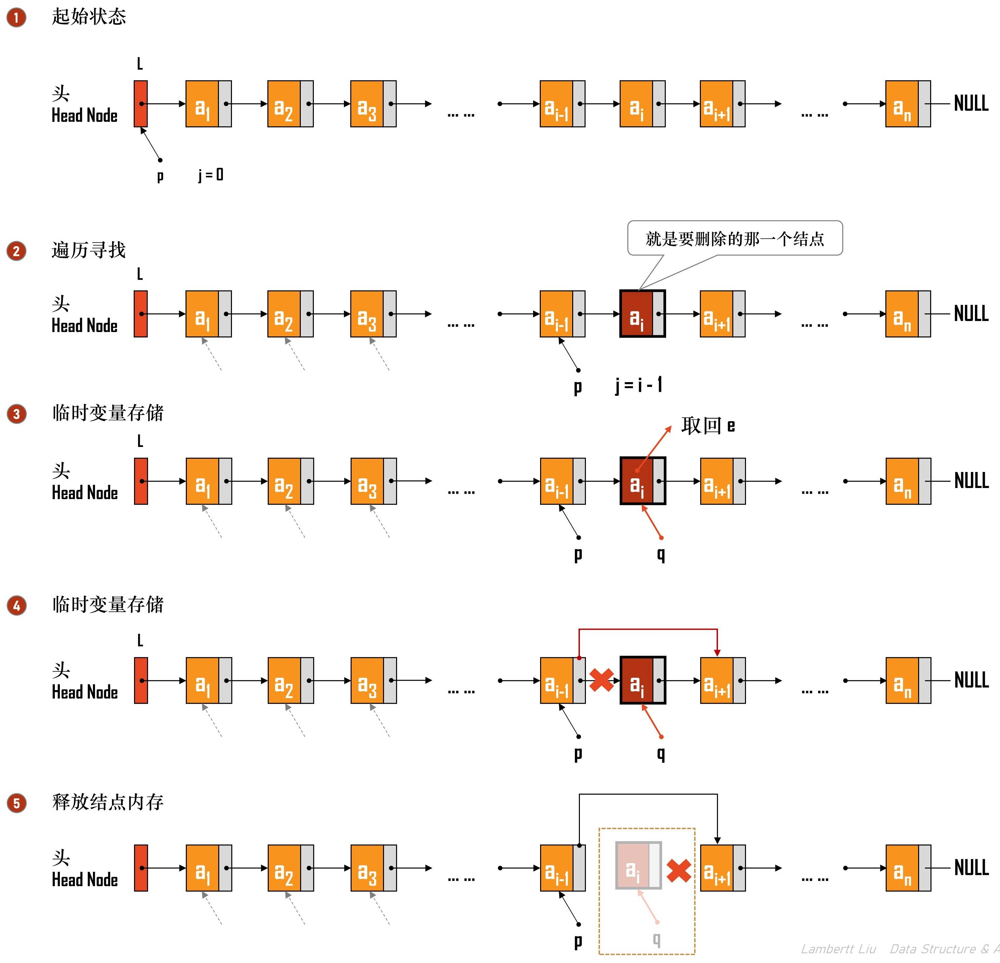

```python
class SingleLinkList:
    ...
    def remove_index(self, index):
        if index < 0 or index >= self.length():
            return False
        if index == 0:
            self.head = self.head.next
            return True
        cur = self.head
        for _ in range(index - 1):
            cur = cur.next
        cur.next = cur.next.next
        return True
```

2. 删除指定值
   1. 使用`cur`查找要删除的数据，使用`prev`指向前一个数据。
   2. 查找到要删除的数据后，将`prev`的`next`指向`cur`的`next`。

   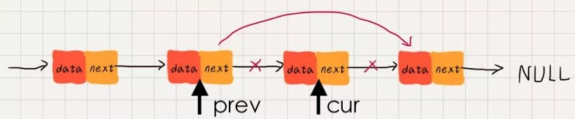

```python
class SingleLinkList:
    ...
    def remove_value(self, value):
        cur = self.head
        prev = None
        while cur is not None:
            if cur.item == value:
                if prev is None:
                    self.head = cur.next
                else:
                    prev.next = cur.next
                return True
            else:
                prev = cur
                cur = cur.next
        return False
```

### 查找节点

使用`cur`查找当前数据。

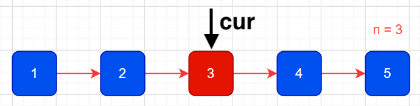

```python
class SingleLinkList:
    ...
    def search(self, value):
        cur = self.head
        count = 0
        while cur is not None:
            if cur.item == value:
                return count
            else:
                cur = cur.next
                count += 1
        return -1
```

> [!important]
>
> 删除和查找的时间复杂度$O(n)$。

## 链表操作的技巧

**[leetcode 206 反转链表](https://leetcode.cn/problems/reverse-linked-list/)**

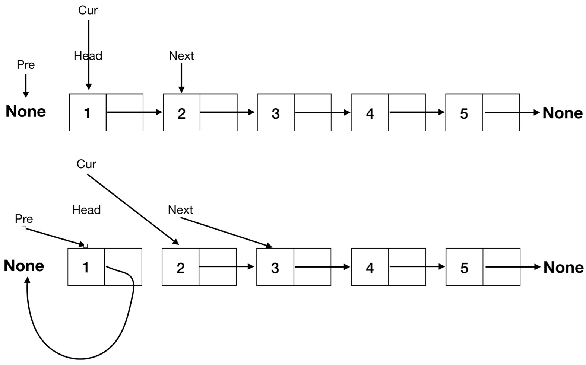

```python
class Solution:
    def reverseList(self, head: Optional[ListNode]) -> Optional[ListNode]:
        pre = None
        cur = head
        while cur is not None:
            next = cur.next
            cur.next = pre
            pre = cur
            cur = next

        return pre
```

* `next`在循环中赋值，避免`cur`值为空。

### 虚拟头节点

虚拟头节点是一个人为添加在原链表真正头节点之前的节点，它通常不存储任何实际数据，或者存储`0`。虚拟头节点的作用：

1. 原链表的第一个节点现在也有了前驱节点（即虚拟头节点），使得**操作中间节点**和**操作头节点**的代码逻辑一样。
2. 节点操作可以统一在一个循环中处理。
3. 虚拟头节点的`next`指向的节点就是首节点。


**[leetcode 203 移除链表元素](https://leetcode.cn/problems/remove-linked-list-elements/)**

题目中的删除节点与`SingleLinkList.remove_value`的区别：

1. 和`remove_value`一样是删除相同的值。
2. 一次性删除多个值，`remove_value`一次只能删除一个值。

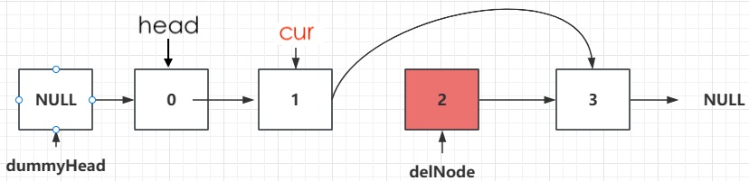

```python
class Solution:
    def removeElements(self, head: Optional[ListNode], val: int) -> Optional[ListNode]:
        dummy = ListNode(0)
        dummy.next = head
        cur = dummy
        while cur.next is not None:
            if cur.next.item == val:
                del_node = cur.next
                cur.next = del_node.next
            else:
                cur = cur.next
        return dummy.next
```

> [!tip]
>
> 如果上述代码不用虚拟头节点方法，应该如何修改？比较两种方法的优劣。

**[leetcode 24 两两交换链表中的节点](https://leetcode.cn/problems/swap-nodes-in-pairs/)**

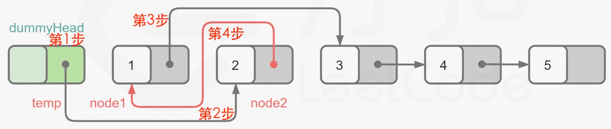

```python
class Solution:
    def swapPairs(self, head: Optional[ListNode]) -> Optional[ListNode]:
        dummy = ListNode(0)
        dummy.next = head

        cur = dummy
        while cur.next is not None and cur.next.next is not None:
            node1 = cur.next
            node2 = cur.next.next
            cur.next = node2
            node1.next = node2.next 
            node2.next = node1
            cur = node1
        
        return dummy.next
```

### 从中间操作

**[237. 删除链表中的节点](https://leetcode.cn/problems/delete-node-in-a-linked-list/)**

* 给出的节点不是表头，删除当前给定的节点

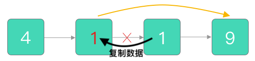

* 将后面的数据复制给删除节点，删除下一个节点。

```python
class Solution:
    def deleteNode(self, node):
        if node is None:
            return

        if node.next is None:
            del node
        
        del_node = node.next 
        node.val = del_node.val
        node.next = del_node.next
```

### 双指针

**[19. 删除链表的倒数第 N 个结点](https://leetcode.cn/problems/remove-nth-node-from-end-of-list/)**

* 常规解法：先遍历一遍链表，计算总长度。遍历一遍删除倒数第n个节点。

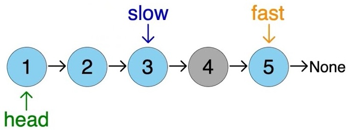

* 当`fast`到达最后的时候，`slow`正好指向要删除的节点的前一节点。

```python
class Solution:
    def removeNthFromEnd(self, head: Optional[ListNode], n: int) -> Optional[ListNode]:
        dummy = ListNode(0)
        dummy.next = head

        fast = dummy
        slow = dummy

        for i in range(n+1):
            fast = fast.next

        while fast is not None:
            fast = fast.next
            slow = slow.next

        if slow.next is None:
            return None

        del_node = slow.next 
        slow.next = del_node.next

        return dummy.next
```

## 练习

| 题目名称                                                     |
| ------------------------------------------------------------ |
| [92. 反转链表 II](https://leetcode.cn/problems/reverse-linked-list-ii/) |
| [83. 删除排序链表中的重复元素](https://leetcode.cn/problems/remove-duplicates-from-sorted-list/) |
| [86. 分隔链表](https://leetcode.cn/problems/partition-list/) |
| [328. 奇偶链表](https://leetcode.cn/problems/odd-even-linked-list/) |
| [2. 两数相加](https://leetcode.cn/problems/add-two-numbers/) |
| [445. 两数相加 II](https://leetcode.cn/problems/add-two-numbers-ii/) |
| [82. 删除排序链表中的重复元素 II](https://leetcode.cn/problems/remove-duplicates-from-sorted-list-ii/) |
| [25. K 个一组翻转链表](https://leetcode.cn/problems/reverse-nodes-in-k-group/) |

