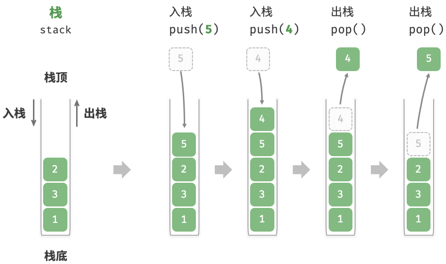
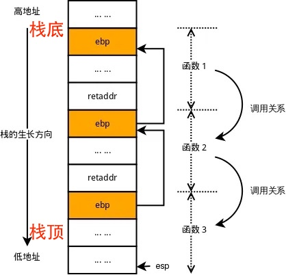
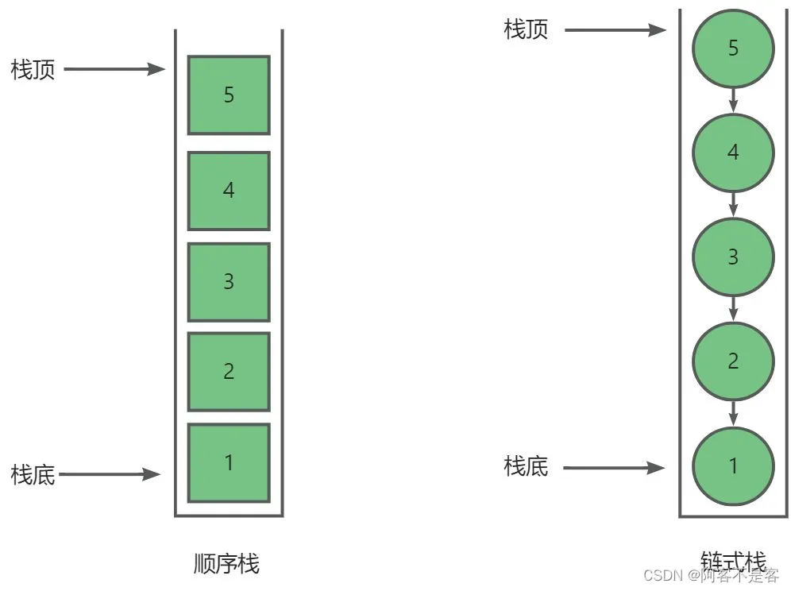
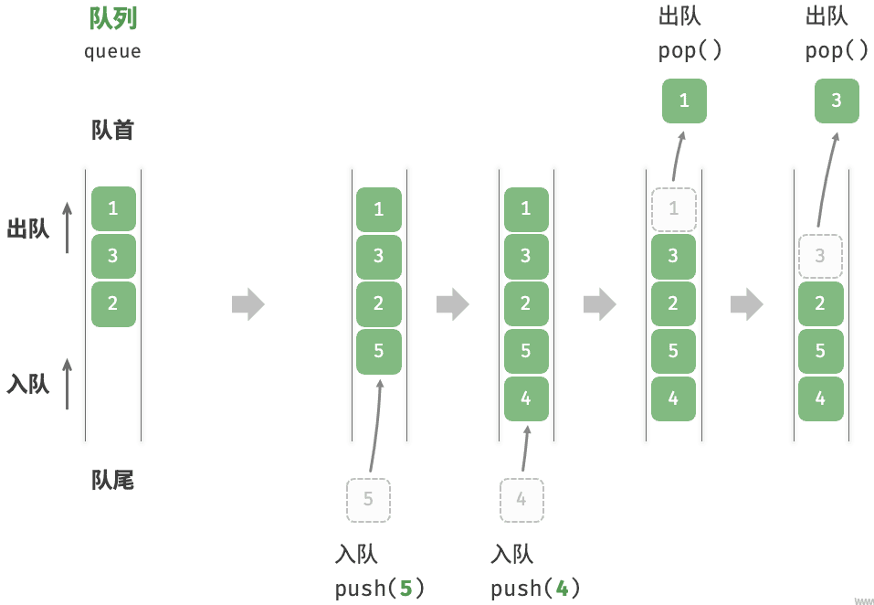
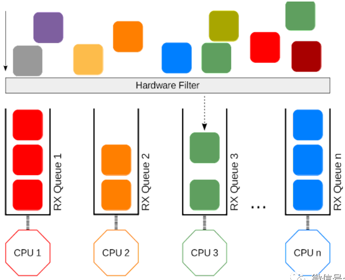
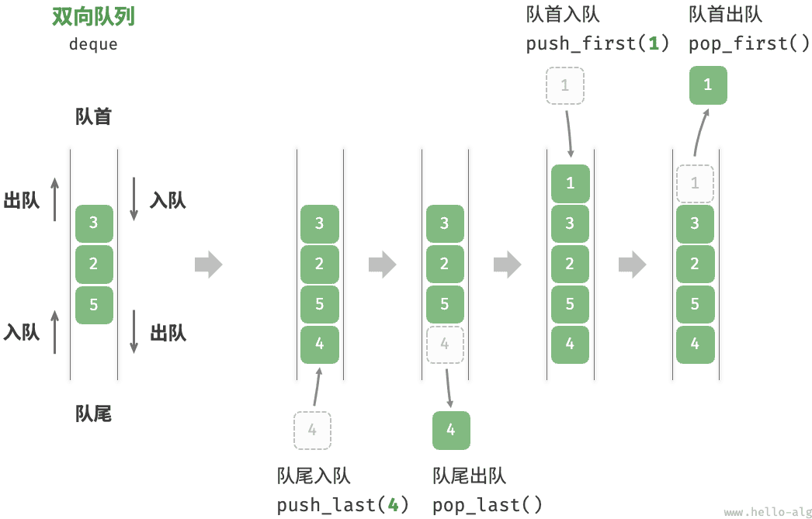
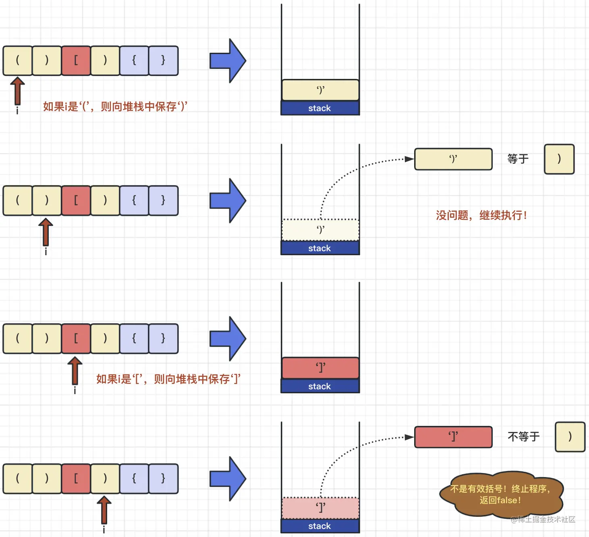
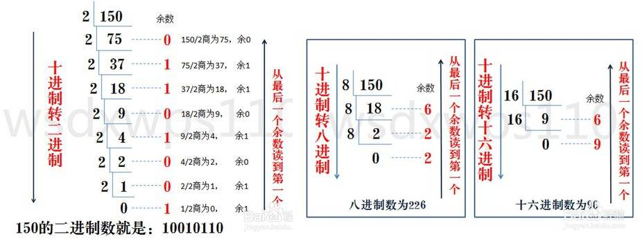

# 栈和队列

栈和队列也是线性数据。栈和队列与线性表的区别在于：

1. 线性表关注的是数据在内存里是怎么存放的。
2. 栈和队列关注的是数据是怎么操作的。即：业务逻辑的要求，什么数据优先处理。

栈和队列可以由线性表来实现。

> [!warning]
>
> 栈和队列是算法实现中，常用的数据存储容器。

## 栈

栈（Stack）它是一种运算受限的线性表。其限制是仅允许在表的一端进行插入和删除运算，这一端被称为栈顶，相对地，把另一端称为栈底。栈的结构特点，让它在处理数据的时候，符合后进先出的特点。



栈在计算机中最经典的应用就是函数调用堆栈 (Call Stack)，任何编程语言在运行函数时都依赖它。



1. 执行1时，把1的信息压入栈。
2. 函数1调用函数2时，把2压入栈。
3. 函数2调用函数3时，把3压入栈。
4. 执行函数3完弹出，系统回到栈顶的函数2；函数2执行完弹出，回到函数1。

> [!important]
>
> 从理论上讲，所有的递归算法都可以用栈来转化为非递归（迭代）形式。

### 栈的实现

使用顺序表`list`实现栈的功能

```python
class Stack:
    def __init__(self):
        self.__items = []

    def push(self, item):
        self.__items.append(item)

    def pop(self):
        return self.__items.pop()

    def length(self):
        return len(self.__items)
```

* `pop`操作和`push`操作的时间复杂度均为$O(1)$。

> [!tip]
>
> 如果使用单链表来实现栈？



* 因为单链表头插的效率为$O(1)$，明显比尾差$O(N)$更高，所以用单链表实现栈时，应该以链表的头为栈顶。

## 队列

队列（Queue）是一种操作受限制的线性表，它只允许在表的头部进行删除操作，而在表的尾部进行插入操作。队列的结构特点让它在处理数据的时候符合了先进先出的特点。



操作系统中的任务调度是一个典型的队列，电脑CPU同时要处理听歌、打字、下载等多个任务，但CPU的核心数有限。CPU按照“先来后到”的顺序给每个任务分配执行时间。



### 队列的实现

如果使用`list`实现队列的功能，数据弹出是要进行内存迁移，时间复杂度为$O(n)$。可以考虑使用链表的形式来实现队列。

```python
class Queue:
    def __init__(self):
        self.__head = None
        self.__tail = None
        self.size = 0

    def push(self, value):
        node = {'value': value, 'next': None}
        if self.size == 0:
            self.__head = node
            self.__tail = node
        else:
            self.__tail.next = node
            self.__tail = node
        self.size += 1

    def pop(self):
        if self.size == 0:
            return None
        node = self.__head
        self.__head = node.next
        self.size -= 1
        return node.value
```

* `pop`操作和`push`操作的时间复杂度均为$O(1)$。

### 双端队列

双端队列（deque），是一种具有队列和栈的性质的数据结构，双端队列入队和出队可以在队列的两端进行。



双端队列中，如何使得`push_first`、`push_last`、`pop_first`和`pop_first`的时间复杂度均为$O(1)$。需要使用双向链表来实现。

```python
class Deque:
    def __init__(self):
        self.__head = None
        self.__tail = None
        self.length = 0

    def push_first(self, value):
        node = {'value': value, 'next': None, 'prev': None}
        if self.length == 0:
            self.__head = node  
            self.__tail = node
        else:
            node['next'] = self.__head
            self.__head['prev'] = node
            self.__head = node
        self.length += 1

    def push_last(self, value):
        node = {'value': value, 'next': None, 'prev': None}
        if self.length == 0:
            self.__head = node  
            self.__tail = node
        else:
            self.__tail['next'] = node
            node['prev'] = self.__tail
            self.__tail = node
        self.length += 1

    def pop_first(self):
        if self.length == 0:
            return None
        node = self.__head
        self.__head = node['next']
        if self.__head:
            self.__head['prev'] = None
        self.length -= 1
        return node['value']

    def pop_last(self):
        if self.length == 0:
            return None
        node = self.__tail
        self.__tail = node['prev']
        if self.__tail:
            self.__tail['next'] = None
        self.length -= 1
        return node['value']
```

python中`collections`中自带双端队列`deque`

```python
from collections import deque

deq = deque()

# 添加至队尾
deq.append(2)    
deq.append(4)

# 添加至队首
deq.appendleft(3)  
deq.appendleft(1)

# 弹出队尾元素
print(deq.pop()) 

# 弹出队首元素 
print(deq.popleft())  
```

* `collections.deque`底层采用了“块状链表”结构，后端插入、后端弹出、前端插入和前端弹出的时间复杂度都是$O(1)$。

## 栈与队列的应用

**[20. 有效的括号](https://leetcode.cn/problems/valid-parentheses/)**



* 栈顶元素反映在嵌套的层次关系中，最近的需要匹配的元素。

```python
class Solution:
    def isValid(self, s: str) -> bool:
        stack = []

        for c in s:
            if c == '(' or c == '[' or c == '{':
                stack.append(c)
            else:
                if len(stack) == 0:
                    return False

                top = stack.pop()

                match = None
                if c == ')':
                    match = '('
                elif c == ']':
                    match = '['  
                else:
                    match = '{'  

                if top != match:
                    return False

        if len(stack) != 0:
            return False

        return True
```

**[504. 七进制数](https://leetcode.cn/problems/base-7/)**



```python
class Solution:
    def convertToBase7(self, num: int) -> str:
        if num == 0:
            return '0'
        res = []
        negative = num < 0
        num = abs(num)
        while num:
            res.append(str(num % 7))
            num //= 7
        if negative:
            res.append('-')
        return ''.join(res[::-1])
```

**[1823. 找出游戏的获胜者](https://leetcode.cn/problems/find-the-winner-of-the-circular-game/)**

上面的问题也称为约瑟夫环问题，可以使用队列来解决：

1. 构建一个循环链表，链表节点的值为1到n
2. 从链表头开始，数到第k个节点，将该节点从链表中删除
3. 重复步骤2，直到链表中只有一个节点
4. 返回该节点的值

```python
from collections import deque

class Solution:
    def findTheWinner(self, n: int, k: int) -> int:
        # 1. 构建一个循环链表，链表节点的值为1到n
        queue = deque(range(1, n+1))
        
        
        # 3. 重复步骤2，直到链表中只有一个节点
        while len(queue) > 1:
          	# 2. 从链表头开始，数到第k个节点，将该节点从链表中删除
            for _ in range(k-1):
                queue.append(queue.popleft())
            queue.popleft()
        
        # 4. 返回该节点的值
        return queue[0]
```

## 练习

| 题目名称                                                     |
| ------------------------------------------------------------ |
| [150. 逆波兰表达式求值](https://leetcode.cn/problems/evaluate-reverse-polish-notation/) |
| [71. 简化路径](https://leetcode.cn/problems/simplify-path/)  |
| [341. 扁平化嵌套列表迭代器](https://leetcode.cn/problems/flatten-nested-list-iterator/) |
