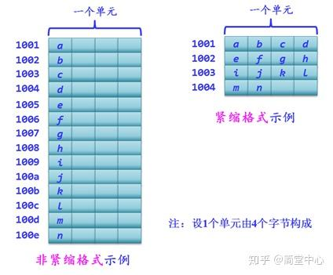
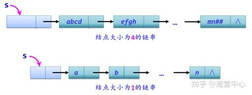
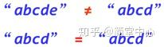
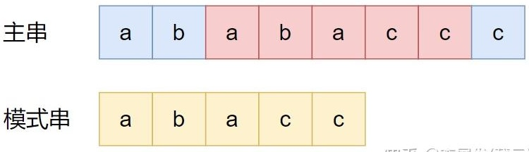
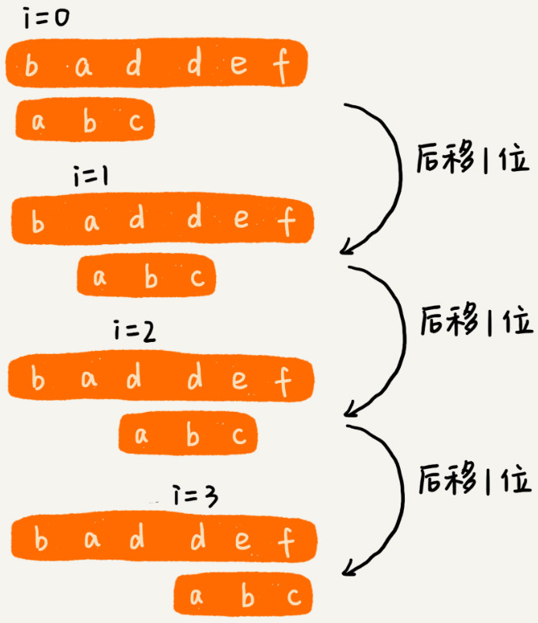
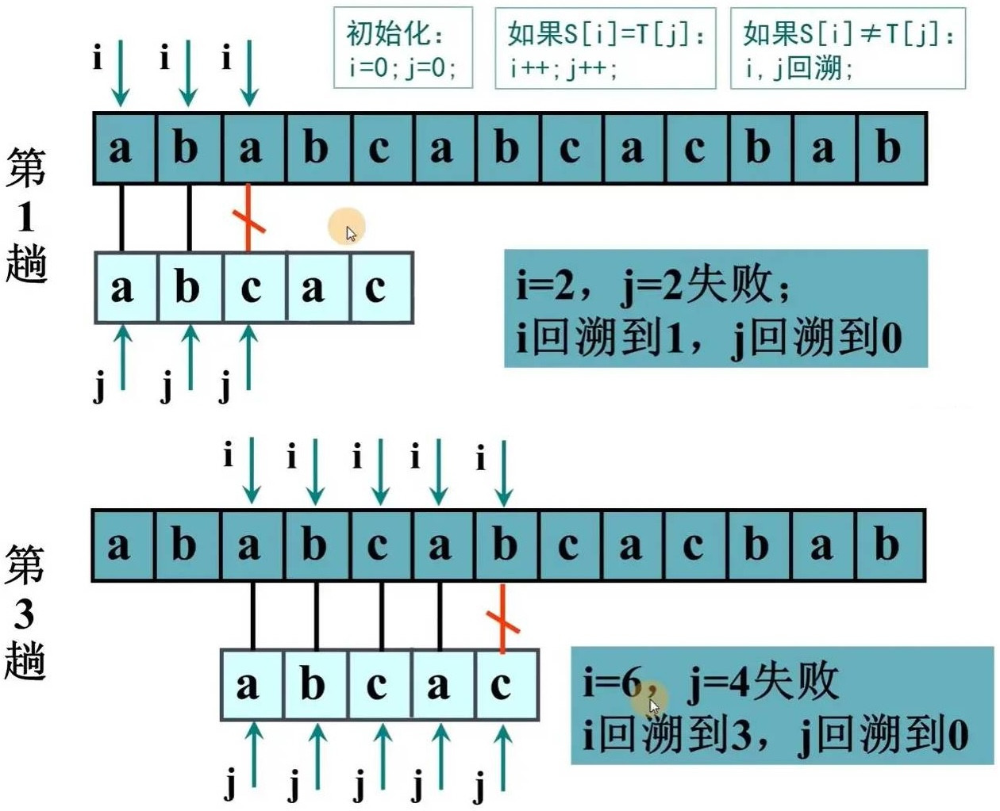
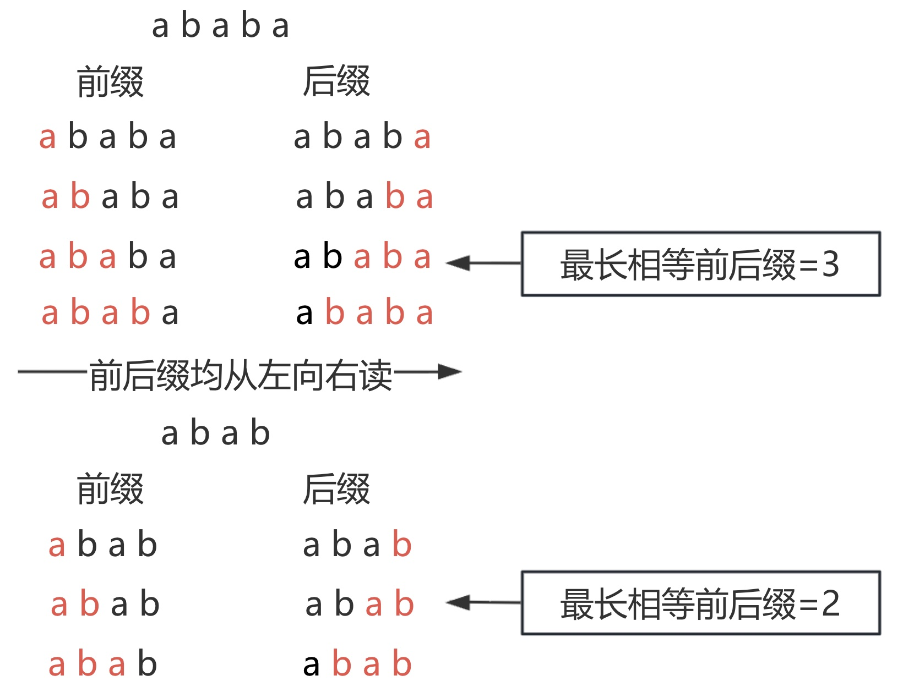
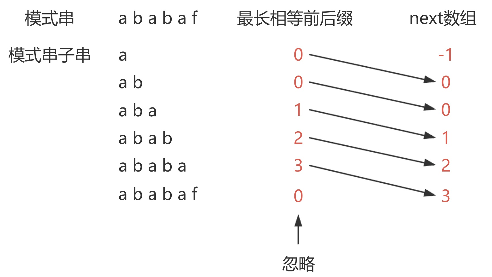
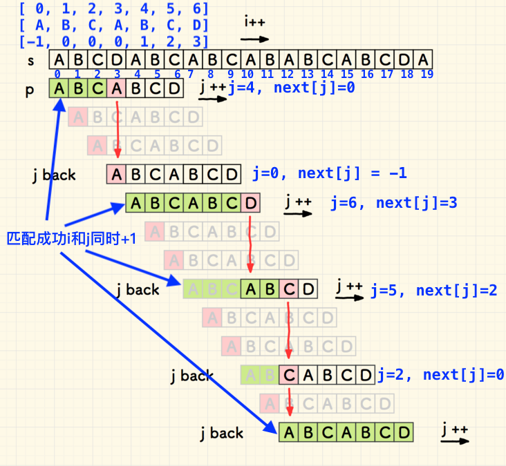
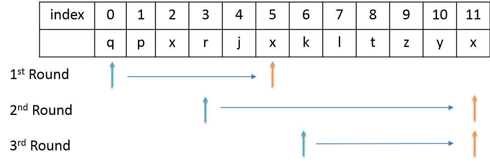

# 字符串

字符串简称为串，字符串是由字符元素构成的，字符串中元素的逻辑关系是⼀种线性关系。 

## 基本特性

### 存储结构

字符串的存储可以使用顺序表，也可以使用链表。

1. 顺序存储：字符被依次存放在⼀组连续的存储单元⾥。



* 非紧缩格式：每个单元存放多个字符，如：UTF-32（任何字符都雷打不动地占用4个字节）。
* 紧缩格式：每个单元只存一个字符，如：UTF-8编码。

2. 链表存储：链串中的一个结点可以存储多个字符。通常将链串中每个结点所存储的字符个数称为结点大小。



> [!warning]
>
> Python中字符串是顺序存储的结构。由于是顺序存储且不可变，当使用`+`拼接字符串时：
>
> 1. Python必须申请一块新的、足够大的连续内存。
> 2. 将旧内容和新内容依次拷贝进去。
>
> 使用`+`进行拼接字符串，效率较低。

### 字符比较

1. 字符串相等：当且仅当两个串的长度相等并且各个对应位置上的字符都相同时，这两个串才是相等的。



2. 字符串匹配。在字符串A中查找字符串B，那字符串A就是主串，字符串B就是模式串。主串的长度记作$n$，模式串的长度记作$m$，一般是在主串查找模式串，所以$n>m$。



## 字符串匹配算法

字符串匹配算法主要用于，在主串中查找模式串的方法。

### BF算法

BF算法采用穷举的方法进行字符串匹配。



1. 使用双循环方式实现。

```python
def bf_search_double_loop(pattern, text):
    if not pattern or not text:
        return -1

    for i in range(len(text) - len(pattern) + 1):
        for j in range(len(pattern)):
            if text[i + j] != pattern[j]:
                break
        else:
            return i
    return -1

```

2. 使用切片方法实现。

```python
def bf_search_slice(pattern: str, text: str) -> int:
    if not pattern or not text:
        return -1

    for i in range(len(text) - len(pattern) + 1):
        if text[i:i+len(pattern)] == pattern:
            return i
    return -1
```

3. 使用单循环方法



```python
def bf_search_single_loop(pattern: str, text: str) -> int:
    if not pattern or not text:
        return -1

    ti = 0
    pi = 0

    while ti < len(text) and pi < len(pattern):
        if text[ti] == pattern[pi]:
            ti += 1
            pi += 1
        else:
            ti = ti - pi + 1
            pi = 0

        if pi == len(pattern):
            return ti - pi

    return -1
```

最坏情况的时间复杂度为
$$
C=(n-m+1)\times m=mn-m^2+m
$$
由于通常情况下主串长度 $n$ 远大于模式串长度 $m$，且 $m \ge 1$，公式中的主导项是 $n \times m$。所以时间复杂度为$O(m\times n)$

### KMP算法

KMP算法发表于1977年，KMP分别是三个发明者姓氏的首字母。

KMP算法的核心思想是，利用匹配失败后的信息，不让主串指针回溯，同时让模式串尽可能多地跳过冗余比较：

* 主串指针永不回退。
* 模式串根据“部分匹配表”滑动。
* 时间复杂度$O(m+n)$。

1. 最长相等前后缀。
   * 前后缀长度一定小于字符串本身，所以一个字母`a`前后缀均为空集。



> [!warning]
>
> 后缀字符串可以从后向前数，但是读的时候是从左向右读。

2. next数组。用于字符串匹配的数组，由最长相等前后缀构成。



```python
def get_pm_next(pattern):
    m = len(pattern)
    if m == 0: return []
    
    pm_map = [0] * m  
    
    j = 0 
    for i in range(1, m):
        while j > 0 and pattern[i] != pattern[j]:
            j = pm_map[j - 1] 
            
        if pattern[i] == pattern[j]:
            j += 1
            
        pm_map[i] = j

    next_arr = [0] * m
    next_arr[0] = -1
    for i in range(1, m):
        next_arr[i] = pm_map[i - 1]

    return pm_map, next_arr
  
pattern = "ababaf"
print(f"模式串: {pattern}")
pm_map, next_arr = get_next(pattern)
print(f"PM 数组: {pm_map}")
print(f"Next 数组: {next_arr}")
```

* `i`记录模式串的遍历位置，其中$i \in \left[1, m-1\right]$。

* `j`代表前缀末尾的下标

  * 如果1个字符也没有匹配，下一个要比较的字符下标是0。
  * 如果匹配了1个字符（即 `pattern[0]`），下一个要比较的字符下标是1。
  * 如果匹配了k个字符（即 `pattern[0...k-1]`），下一个要比较的字符下标就是k。

* `j`代表了当前已经匹配的长度

  * `pm_map[i] = j`使用`pm_map`记录了当前已经匹配的长度。

* `if pattern[i] == pattern[j]:`如果二者可以匹配，匹配的长度加1.

* `while j > 0 and pattern[i] != pattern[j]:`向前搜索
  1. 匹配的后缀与前缀相等，假如`pm_map`中的值是3，表示后缀与前缀，匹配了3个字符串，这时`j`也为3。
  2. 但是`pattern[i] != pattern[j]`不相等，但前面的已匹配的是相当的。
  3. 从`i`开始向前数三个字母和从`pattern[0]`开始向后数3个字母是一样的。
  4. `j = pm_map[j - 1]`在更小的范围内`pattern[i] != pattern[j]`是不是相等，`pm_map`已经记录过字符串是否匹配了。
  
* 对`next_arr`重新赋值，`next_arr[0] = -1`，后面的值依次赋值。

> [!warning]
>
> 当字符串无法匹配时，计数器`j`返回到`0`位置重新开始匹配，计算器`j`不断的从`0`开始，记录最长相等前后缀的值。

3. `next`数组的简洁计算

```python
def get_next(pattern):
    m = len(pattern)
    next_arr = [0] * m
    next_arr[0] = -1  # 首位固定为 -1
    
    i = 0   # 模式串当前的下标
    j = -1  # 记录最长相等前后缀的长度（也是回跳的目标下标）
    
    # i = [0, m-1] 
    while i < m - 1:
        if j == -1 or pattern[i] == pattern[j]:
            i += 1
            j += 1
            next_arr[i] = j
        else:
            j = next_arr[j]
            
    return next_arr

# 测试案例
pattern = "ababaf"
print(f"模式串: {pattern}")
print(f"Next 数组: {get_next(pattern)}")
```

4. KMP完成算法
   1. 定义两计数器`i`和`j`
      1. `i`表示主串的指针，一直向前不回退。
      2. `j`记录模式串的匹配进度，可以回溯。
   2. 匹配成功`i`和`j`都加1。
   3. 匹配不成功根据`next_arr`数组回溯。



```python
def kmp_search(pattern, text):
    if not pattern or not text:
        return -1

    n = len(text)
    m = len(pattern)
    next_arr = get_next(pattern)
    
    i = 0 # 主串的指针
    j = 0 # 模式串的匹配进度
    
    while i < n and j < m:
        if j == -1 or text[i] == pattern[j]:
            i += 1
            j += 1
        else:
            j = next_arr[j]
            
    if j == m:
        return i - m
    else:
        return -1
```

* `j = next_arr[j]`回溯的位置从`next_arr`取值。

[KMP算法动画演示](https://www.bilibili.com/video/BV1AY4y157yL/?spm_id_from=333.337.search-card.all.click&vd_source=c5271ca82571b2b45d1adc27aa9f3275)

## 相关问题

解决字符串问题时需要注意的条件：

1. 字符集的范围。例如：只有字母、包括数值和字母等。
2. 是否有大小写敏感。

**[面试题 01.01. 判定字符是否唯一](https://leetcode.cn/problems/is-unique-lcci/)**

1. 使用列表处理：将不重复的元素放入列表中，判断列表中是否已经记录过。

```python
class Solution:
    def isUnique(self, astr: str) -> bool:
        if not astr:
            return True

        arr = []
        for char in astr:
            if char not in arr:
                arr.append(char)
            else:
                return False
                
        return True
```

2. 使用集合：将列表转换为集合，判断二者长度是否相等。

```python
class Solution:
    def isUnique(self, astr: str) -> bool:
        chars = set(astr)
        return len(chars) == len(astr)
```

**[面试题 01.02. 判定是否互为字符重排](https://leetcode.cn/problems/check-permutation-lcci/)**

这个问题也称为变位词问题

1. 使用排序算法。将两个字符串排序，比较是否相等。

```python
class Solution:
    def CheckPermutation(self, s1: str, s2: str) -> bool:
        if len(s1) != len(s2):
            return False

        sorted_s1 = list(s1)
        sorted_s2 = list(s2)
        sorted_s1.sort()
        sorted_s2.sort()
        for i in range(len(sorted_s1)):
            if sorted_s1[i] != sorted_s2[i]:
                return False
                
        return True
```

* 该问题时间复杂度与排序算法有关。

2. 使用字典对字符计数，字典中键值对完全相等，则两个字符串相等。

```python
class Solution:
    def CheckPermutation(self, s1: str, s2: str) -> bool:
        if len(s1) != len(s2):
            return False

        map_c1 = {}
        map_c2 = {}

        for i in range(len(s1)):
            map_c1[s1[i]] = map_c1.get(s1[i], 0) + 1
            map_c2[s2[i]] = map_c2.get(s2[i], 0) + 1
        
        for char in map_c1:
            if map_c1[char] != map_c2.get(char, 0):
                return False
        
        return True
```

* `for i in range(len(s1))`的时间复杂度为$O(n)$。
* `map_c1.get(s1[i], 0)`的时间复杂度为$O(1)$。
* `for char in map_c1:`时间复杂度为$O(1)$（注意：`map_c1`最多有26个字母）。

3. 与上面方法一致，使用`from collections import Counter`。

```python
from collections import Counter

class Solution:
    def CheckPermutation(self, s1: str, s2: str) -> bool:
        return Counter(s1) == Counter(s2)
```

* `Counter`用来统计可迭代对象中元素的出现次数，支持列表和字典。
* `Counter`支持加减法和交并集运算。
* `Counter`对象可以直接使用`==`和`!=`进行比较，`Counter`中的键和值完全相等，则`==`成立。

**[面试题 01.06. 字符串压缩](https://leetcode.cn/problems/compress-string-lcci/)**

1. 统计每个连续字符的数据保存到`[('a', 2), ('b', 3), …]`。
   1. 循环遍历字符串。
      1. 比较`i`和`i+1`的值，相等计数增加。
      2. 不相等将统计结果保存到数组中。


```python
class Solution:
    def compressString(self, S: str) -> str:
        result = []
        counter = 1
        aim = S + ' '
        for i in range(len(aim) - 1):
            if aim[i] == aim[i + 1]:
                counter += 1
            else:
                result.append((aim[i], counter))
                counter = 1
        result = [f"{char}{count}" for char, count in result]
        compressed = ''.join(result)
        return compressed if len(compressed) < len(S) else S
```

* 只有当`aim[i]`不等于`aim[i + 1]`时，才会把当前字符和它的计数存入`result`。
* 增加空字符，最后一个字符与空格不同，遍历结束后将计数存入`result`。
* `aim = S + ' '`的长度就是 $n + 1$，`len(aim) - 1` 的结果就是 $n$。

2. 算法流程与上面一致，直接将字符串保存成`['a2', 'b3', …]`

```python
class Solution:
    def compressString(self, S: str) -> str:
        result = []
        counter = 1
        aim = S + ' '
        for i in range(len(aim) - 1):
            if aim[i] == aim[i + 1]:
                counter += 1
            else:
                result.append(aim[i] + str(counter))
                counter = 1
        compressed = ''.join(result)
        return compressed if len(compressed) < len(S) else S
```

**[LCR 182. 动态口令](https://leetcode.cn/problems/zuo-xuan-zhuan-zi-fu-chuan-lcof/)**

1. 使用循环队列。

```python
from collections import deque

class Solution:
    def dynamicPassword(self, password: str, target: int) -> str:
        if target == 0:
            return password
        
        queue = deque(password)
        for i in range(target):
            queue.append(queue.popleft())
        
        return ''.join(queue)
```

2. 使用字符串切片。字符串旋转的本质是将字符串截断并重新组合

```python
class Solution:
    def dynamicPassword(self, password: str, target: int) -> str:
        target = target % len(password)
        return password[target:] + password[:target]
```

* `target = target % len(password)`避免`target`大于字符串长度。

**[3. 无重复字符的最长子串](https://leetcode.cn/problems/longest-substring-without-repeating-characters/)**

使用滑动窗口解决问题

* 如果当前子串没有重复的字符，移动`hi`游标，增加窗口长度。
* 增加窗口长度后发现重复字符，移动`lo`游标，跳过重复的字符。
* 使用`set`记录字符串是否重复。



```python
class Solution:
    def lengthOfLongestSubstring(self, s: str) -> int:
        lo = 0
        hi = -1
        max_len = 0
        char_set = set()
        
        while lo < len(s):
            if hi + 1 < len(s) and s[hi + 1] not in char_set:
                hi += 1
                char_set.add(s[hi])
            else:
                char_set.remove(s[lo])
                lo += 1
            
            max_len = max(max_len, hi - lo + 1)
        
        return max_len
```

* 当`char_set`中存在重复时，不断缩小`lo`直到排除重复值。

## 练习

| 题目名称                                                     |
| ------------------------------------------------------------ |
| [438. 找到字符串中所有字母异位词](https://leetcode.cn/problems/find-all-anagrams-in-a-string/) |
| [76. 最小覆盖子串](https://leetcode.cn/problems/minimum-window-substring/) |
