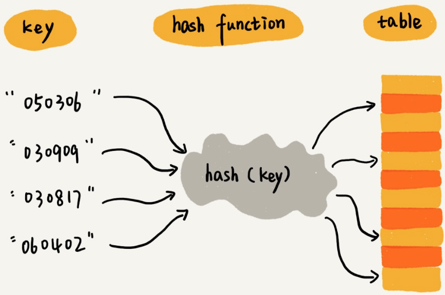
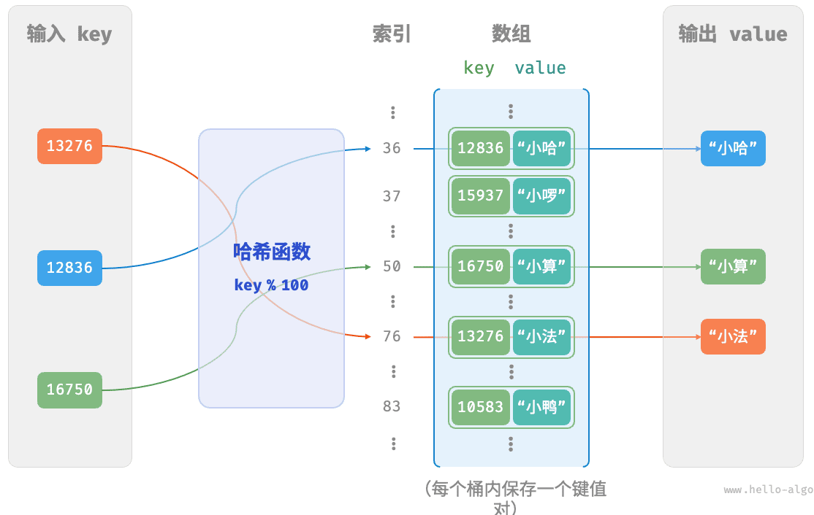
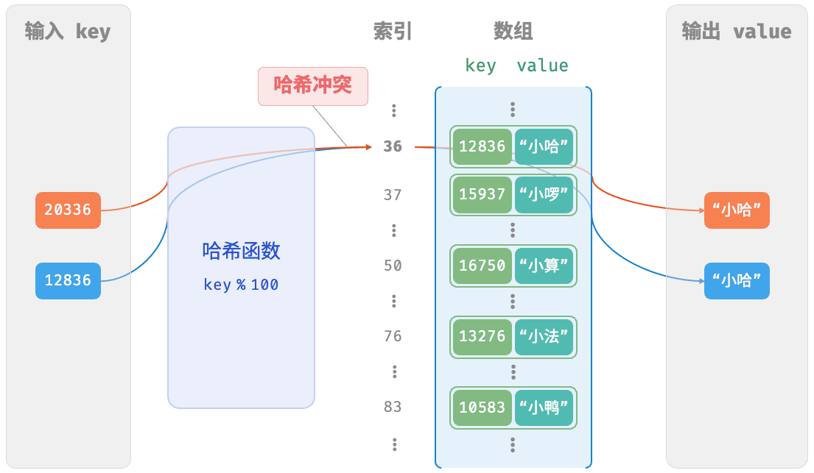
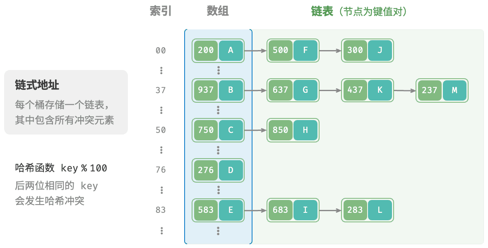
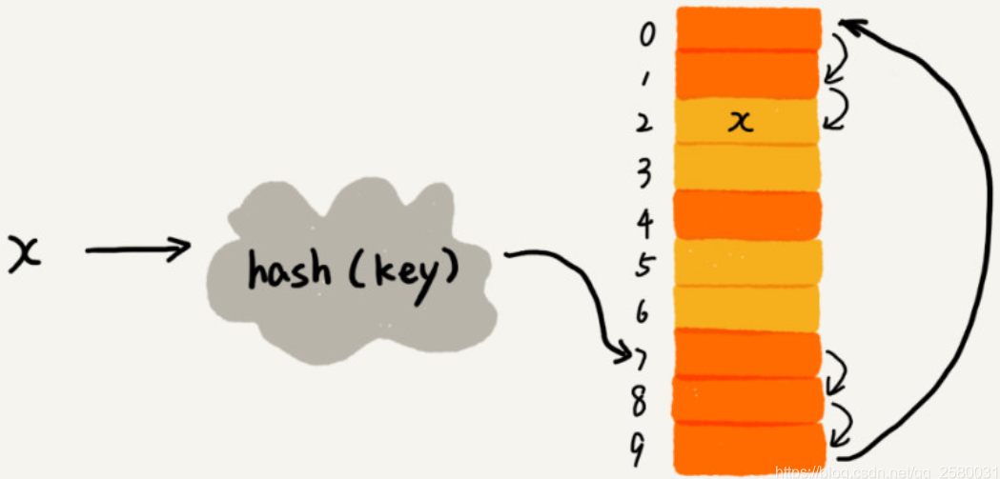
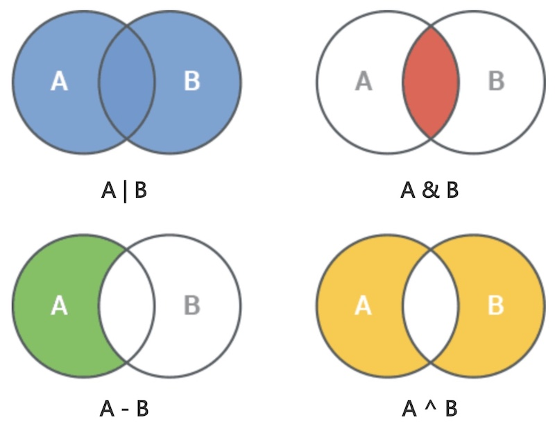

# 哈希表

哈希表（hash table，又称散列表），它通过建哈希函数（hash function），来立键`key`与值`value`之间的映射，实现高效的元素查询。具体而言，向哈希表中输入一个键`key`，则可以在 时间内获取对应的值`value`。哈希表常见的操作包括：

- 添加元素：将键值对`(key, value)`添加至哈希表，使用$O(1)$时间。
- 查询元素：如果存在键为`key`，则返回其`value`，否则返回空值，使用$O(1)$时间。
- 删除元素：删除键为`key`的键值对，使用$O(1)$时间。

数据结构效率对比

|          | 数组   | 链表   | 哈希表 |
| :------- | :----- | :----- | ------ |
| 查找元素 | $O(n)$ | $O(n)$ | $O(1)$ |
| 添加元素 | $O(1)$ | $O(1)$ | $O(1)$ |
| 删除元素 | $O(n)$ | $O(n)$ | $O(1)$ |

Python语言中的`dict`和`set`就是典型的哈希表。

## 哈希表的实现

在哈希表中，将数组中的每个空位称为桶（bucket），每个桶可存储一个键值对。因此，查询操作就是找到 `key`对应的桶，并在桶中获取`value`。定义一个键值对

```python
class Pair:
    def __init__(self, key, val):
        self.key = key
        self.val = val
```

哈希函数（hash function）实现了`key`到桶的映射。

> [!important]
>
> 哈希函数的作用是将一个较大的输入空间，映射到一个较小的输出空间。向哈希函数输入一个`key` ，就可以通过哈希函数得到该`key`对应的键值对在数组中的存储位置。

哈希函数在哈希表中起到常关键的作用。



哈希函数的选择**不是唯一的**，设计一个“好”的哈希函数是一门极具艺术性的技术。哈希函数设计的基本要求：

* 散列函数计算得到的散列值是一个非负整数。
* 如果$\text{key}_1 = \text{key}_2$，那$hash(\text{key}_1) = hash(\text{key}_2)$。
* 如果$\text{key}_1 \ne \text{key}_2$，那$hash(\text{key}_1) \ne hash(\text{key}_2)$。

设数组长度为100，哈希函数为`key % 100`。以学号为`key`，以学生姓名为`value`构成的哈希表为



在真实的情况下，要想找到一个不同的`key`对应的散列值都不一样的散列函数，几乎是不可能的。多个输入对应相同输出的情况就是哈希冲突：

* 即便像著名的MD5、SHA等哈希算法，也无法完全避免这种散列冲突。
* 数组的存储空间有限，也会加大散列冲突的概率。
* 到目前为止，还无法找到一个完美的无冲突的哈希函数。
* 即便能找到，付出的时间成本、计算成本一般也不可接受。

> [!warning]
>
> 哈希冲突无法避免。

例如：查询学号为`12836`和`20336`的两个学生时

```python
12836 % 100 = 36
20336 % 100 = 36
```



哈希表扩容：

* 哈希表容量$n$越大，多个`key`被分配到同一个桶中的概率就越低，冲突就越少。因此，可以通过扩容哈希表来减少哈希冲突。
* 类似于数组扩容，哈希表扩容需将所有键值对从原哈希表迁移至新哈希表，非常耗时。
* 编程语言通常会预留足够大的哈希表容量，防止频繁扩容。

负载因子（load factor）是哈希表的一个重要概念，其定义为哈希表的元素数量除以桶数量，用于衡量哈希冲突的严重程度，也常作为哈希表扩容的触发条件。
$$
\text{Factor}=\frac{\text{size}}{\text{capacity}}
$$
例如在Java中，当负载因子超过0.75时，系统会将哈希表扩容至原先的2倍。

定义哈希表

```python
class HashMapChaining:
    def __init__(self):
        self.size = 0
        self.capacity = 4
        self.load_thres = 2.0 / 3.0
        self.extend_ratio = 2 

    def hash(self, key):
        return key % self.capacity

    def load_factor(self):
        return self.size / self.capacity
```

* `self.size`用于记录哈希表中已有键值对的数量。
* `self.capacity`表示哈希表的初始容量。
* `self.load_thres`触发扩容条件的负载因子，当负载大于0.66时进行扩容。
* `self.extend_ratio`每次扩容的倍数。

上面的哈希表中没有定义存储数据的桶，为了解决哈希冲突，不同的方法桶的定义也不同。

### 解决哈希冲突

解决哈希冲突的两类方法：开放寻址法（open addressing）和链表法（chaining）。

#### 1. 链表法

每个桶会对应一条链表，所有散列值相同的元素都放到相同位置对应的链表中。链表法是解决哈希冲突的常用方法。



哈希函数计算桶的位置，插入和查找的时间复杂度为$O(1)$。链表插入和查找的时间复杂的度与链表的长度$k$成正比，时间复杂度为$O(k)$​。对于比较均匀的散列函数来说，理论上
$$
k=\frac{n}{m}
$$
其中$n$表示数据的个数，$m$表示哈希表中桶的个数。

1. 使用二维数组模拟链表定义桶，并打印全部数据

```python
class HashMapChaining:
    def __init__(self):
        ...
        self.buckets = [[] for _ in range(self.capacity)]

    def print(self):
        for bucket in self.buckets:
            res = []
            for pair in bucket:
                res.append(str(pair.key) + " -> " + pair.val)
            print(res)
```

2. 添加数据和桶的扩容。

```python
class HashMapChaining:
    ...
    def put(self, key, val):
        # 当负载因子超过阈值时，执行扩容
        if self.load_factor() > self.load_thres:
            self.extend()
        index = self.hash(key)
        bucket = self.buckets[index]
        
        # 更新指定的key
        for pair in bucket:
            if pair.key == key:
                pair.val = val
                return
              
        # 添加新的key
        pair = Pair(key, val)
        bucket.append(pair)
        self.size += 1

    def extend(self):
        buckets = self.buckets
        # 扩容后修改桶的容量，并清空数据记录
        self.capacity *= self.extend_ratio
        self.buckets = [[] for _ in range(self.capacity)]
        self.size = 0
        
        # 需要将数据重新放入桶中
        for bucket in buckets:
            for pair in bucket:
                self.put(pair.key, pair.val)
```

* 添加数据和桶的扩容，是相互依赖的。

**均摊分析**：添加数据的时间复杂度

1. 每次添加一个元素时间复杂度为$O(1)$。
2. 当空间不够时自动扩容。扩容后需要将原来的$n$个数据拷贝到新空间时间复杂度为$O(n)$。
3. 每添加$n$实际的时间复杂度为$nO(1)+O(n)=O(2n)$。
4. 均摊下来，每个添加元素的时间复杂度为$O(2)$。
5. 所以添加元素的时间复杂度仍为$O(1)$。

> [!Caution]
>
> 如果是“常数扩容”（即每次增加固定$K$），那么插入操作的均摊时间复杂度会从 $O(1)$ 退化到 $O(n)$。

假设要插入$n$个元素，扩容发生的次数大约为 $m = \frac{n}{K}$ 次。
$$
\begin{aligned}
Total \ Cost  
& = K + 2K + 3K + \dots + mK \\
& = K \cdot \frac{m(m+1)}{2} \\
& \approx K \cdot \frac{(n/K)^2}{2} = \frac{n^2}{2K}
\end{aligned}
$$
总时间复杂度为$O(n^2)$，均摊到每个元素
$$
\frac{O(n^2)}{n} = O(n)
$$

3. 读取和删除数据

```python
class HashMapChaining:
    ...
    def get(self, key):
        index = self.hash(key)
        bucket = self.buckets[index]
        for pair in bucket:
            if pair.key == key:
                return pair.val
        return None


    def remove(self, key):
        index = self.hash(key)
        bucket = self.buckets[index]
        # 遍历桶，从中删除键值对
        for pair in bucket:
            if pair.key == key:
                bucket.remove(pair)
                self.size -= 1
                break
```

#### 2. 开放寻址法

开放寻址法的核心思想是，如果出现了散列冲突，就重新探测一个空闲位置，将其插入。探测的方法包括：线性探测、平方探测和多重哈希等。

线性探测的操作：

* 插入元素：通过哈希函数计算桶索引，若发现桶内已有元素，则从冲突位置向后线性遍历（步长通常为 ），直至找到空桶，将元素插入其中。
* 查找元素：若发现哈希冲突，则使用相同步长向后进行线性遍历，直到找到对应元素，返回`value`即可；如果遇到空桶，说明目标元素不在哈希表中，返回`None`。



* 删除操作：在开放寻址哈希表中不能直接将元素置空。直接设置空元素，会在数组内产生一个空桶`None` 。当查询元素时，线性探测到该空桶就会返回，因此在该空桶之下的元素都无法被访问，从而产生查询遗漏。
  * 采用惰性删除，来替代直接清除。不直接从哈希表中移除元素，而是利用一个常量 `TOMBSTONE` 来标记这个桶。
    * `None` 和`TOMBSTONE`都代表空桶，都可以放置键值对。
    * 线性探测到`TOMBSTONE`时应该继续遍历，因为其之下可能还存在键值对。
    * 查询记录时，遇到的首个`TOMBSTONE`的索引，并将搜索到的目标元素与`TOMBSTONE`交换位置。这样做的好处是：
      * 当每次查询或添加元素时，元素会被移动至距离理想位置（探测起始点）更近的桶，从而优化查询效率。
      * 防止惰性删除造成哈希表的查询性能退化。

      开放寻址法，插入和查找的时间复杂度为$O(1)$。

1. 开放寻址法使用数组来保存桶。

```python
class HashMapOpenAddressing:
    def __init__(self):
        ...
        self.buckets = [None] * self.capacity
        self.TOMBSTONE = Pair(-1, "-1")

    def print(self):
        for pair in self.buckets:
            if pair is None:
                print("None")
            elif pair is self.TOMBSTONE:
                print("TOMBSTONE")
            else:
                print(pair.key, "->", pair.val)
```

* `self.TOMBSTONE`为惰性删除标志位，这里假设索引值不为`-1`。

2. 添加数据和扩容。

```python
class HashMapOpenAddressing:
    ...
    def find_bucket(self, key):
        index = self.hash(key)
        # 记录首个TOMBSTONE
        first_tombstone = -1
        # 线性探测算法
        while self.buckets[index] is not None:
            # 若遇到key，返回对应的桶索引
            if self.buckets[index].key == key:
                # 将搜索目标与首个TOMBSTONE交换位置
                if first_tombstone != -1:
                    self.buckets[first_tombstone] = self.buckets[index]
                    self.buckets[index] = self.TOMBSTONE
                    return first_tombstone
                return index
            # 记录首个TOMBSTONE
            if first_tombstone == -1 and self.buckets[index] is self.TOMBSTONE:
                first_tombstone = index
            # 计算桶索引，循环计算
            index = (index + 1) % self.capacity
        # 若 key 不存在，则返回添加点的索引
        return index if first_tombstone == -1 else first_tombstone


    def put(self, key, val):
        # 当负载因子超过阈值时，执行扩容
        if self.load_factor() > self.load_thres:
            self.extend()
        index = self.find_bucket(key)
        # 修改key对应的值
        if self.buckets[index] not in [None, self.TOMBSTONE]:
            self.buckets[index].val = val
            return
        # 添加新的键值对
        self.buckets[index] = Pair(key, val)
        self.size += 1

    def extend(self):
        # 暂存原哈希表
        buckets_tmp = self.buckets
        # 扩容后修改桶的容量，并清空数据记录
        self.capacity *= self.extend_ratio
        self.buckets = [None] * self.capacity
        self.size = 0
        
        # 将键值对从原哈希表搬运至新哈希表
        for pair in buckets_tmp:
            if pair not in [None, self.TOMBSTONE]:
                self.put(pair.key, pair.val)
```

3. 读取和删除数据

```python
class HashMapOpenAddressing:
    ...
    def get(self, key):
        index = self.find_bucket(key)
        if self.buckets[index] not in [None, self.TOMBSTONE]:
            return self.buckets[index].val
        return None

    def remove(self, key):
        index = self.find_bucket(key)
        # 惰性删除
        if self.buckets[index] not in [None, self.TOMBSTONE]:
            self.buckets[index] = self.TOMBSTONE
            self.size -= 1
```

> [!warning]
>
> 线性探测容易产生“聚集现象”，即：数组中连续被占用的位置越长，这些连续位置发生哈希冲突的可能性越大。

其他探测方法：

1. 平方探测：当发生冲突时，跳过“探测次数的平方”的步数
   * 平方探测通过跳过探测次数平方的距离，试图缓解线性探测的聚集效应。
   * 平方探测会跳过更大的距离来寻找空位置，有助于数据分布得更加均匀。
   * 平方探测仍然存在聚集现象.
2. 多次哈希：使用多个哈希函数进行探测。
   * 多次哈希方法不易产生聚集，但多个哈希函数会带来额外的计算量。

## 哈希算法

由于哈希函数可以看做是一种空间映射，将一个无限或巨大的原像空间映射到一个有限且固定的大小空间。哈希算法可以分为两类：非加密哈希（Non-Cryptographic Hash）和加密哈希（Cryptographic Hash）。

* 非加密哈希：追求“快”。
  * 代表算法：MurmurHash、CityHash和CRC32。
  * 特点：可以轻易构造出大量产生碰撞的数据，计算速度快。
  * 应用场景：哈希表、快速索引与缓存。
  * 范畴：通用计算机学科
* 加密哈希：追求“安全”。
  * 代表算法：SHA-256、SHA-3、BLAKE3和MD5。
  * 特点：计算速度慢，碰撞概率低。
  * 应用场景：数字签名、密码存储（加盐）、区块链、文件完整性校验。
  * 范畴：密码学

> [!Caution]
>
> 到目前为止MD5和SHA-1算法已经不在安全。

### 哈希算法目标

针对非加密哈希算法，主要有以下特点：

- 确定性：对于相同的输入，哈希算法应始终产生相同的输出。这样才能确保哈希表是可靠的。
- 效率高：计算哈希值的过程应该足够快。计算开销越小，哈希表的实用性越高。
- 均匀分布：哈希算法应使得键值对均匀分布在哈希表中。分布越均匀，哈希冲突的概率就越低。

### 哈希算法设计

常见的非加密哈希算法设计：

* 加法哈希：对输入的每个字符的ASCII码进行相加，将得到的总和作为哈希值。
* 乘法哈希：利用乘法的不相关性，每轮乘以一个常数，将各个字符的 ASCII 码累积到哈希值中。
* 异或哈希：将输入数据的每个元素通过异或操作累积到一个哈希值中。
* 旋转哈希：将每个字符的ASCII码累积到一个哈希值中，每次累积之前都会对哈希值进行旋转操作。

## 相关问题

**[349. 两个数组的交集](https://leetcode.cn/problems/intersection-of-two-arrays/)**

使用`set`容器：将两个数组放入`set`求交集

```python
class Solution:
    def intersection(self, nums1: List[int], nums2: List[int]) -> List[int]:
        set1 = set(nums1)
        set2 = set(nums2)
        return list(set1 & set2)
```

python中的集合运算



```python
a = set([1, 2])
b = set([2, 3])
inter = a & b
union = a | b
minus = a - b
diff = a ^ b

print(a)
print(b)
print(f"inter: {inter}")
print(f"union: {union}")
print(f"minus: {minus}")
print(f"diff: {diff}")
```

* `Counter`也支持上面的操作。
* 从Python 3.9开始`dict`支持并集操作`|`，但其他操作不支持。


**[202. 快乐数](https://leetcode.cn/problems/happy-number/)**

* 如果是快乐数，最终结果为1。
* 如果不是快乐数，将进入无限循环。
* 使用`set()`，记录生成的数，当出现重复时，表示无法生成快乐数了。

```python
class Solution:
    def isHappy(self, n: int) -> bool:
        seen = set()
        while n != 1 and n not in seen:
            seen.add(n)

            # 计算下一个数字
            n = self.get_next(n)

        # 如果最终结果为1，则是快乐数
        if n == 1:
            return True
        else:
            return False

    def get_next(self, n):
        next_num = 0
        
        while n > 0:
            # 从个位数开始取
            digit = n % 10
            next_num += digit ** 2
            # 移动到下一个位置
            n //= 10

        return next_num
```

## 练习

| 题目名称                                                     |
| ------------------------------------------------------------ |
| [242. 有效的字母异位词](https://leetcode.cn/problems/valid-anagram/) |
| [290. 单词规律](https://leetcode.cn/problems/word-pattern/)  |
| [205. 同构字符串](https://leetcode.cn/problems/isomorphic-strings/) |
| [451. 根据字符出现频率排序](https://leetcode.cn/problems/sort-characters-by-frequency/) |
