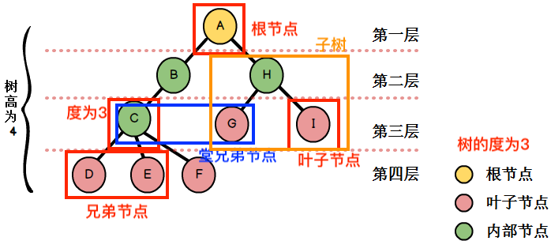
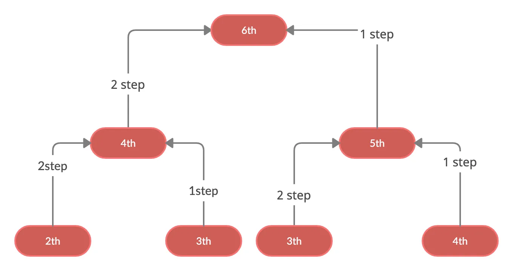
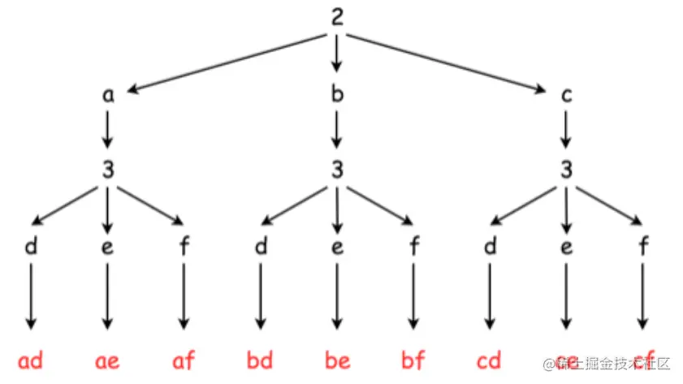

# 树和递归

数据结构树，是一种非线性结构，与自然界的树类似，从树根生长，逐级分支。实际上树数据结构，更像一棵倒过来的树。



树的相关概念

* 根节点：没有父节点的节点称为根节点。
* 节点的度：一个节点含有的子节点的个数称为该节点的度。
* 树的度：一棵树中，最大的节点的度称为树的度。
* 叶子节点：度为零的节点。
* 层次：从根开始定义起，根为第1层，根的子节点为第2层，以此类推。
* 树的高度（深度）：树中节点的最大层次。
* 子树：在树结构中分离出的子结构。
* 父节点：若一个节点含有子节点，则这个节点称为其子节点的父节点。
* 子节点：一个节点含有的子树的根节点称为该节点的子节点。
* 兄弟节点：具有相同父节点的节点互称为兄弟节点。
* 堂兄弟节点：父节点在同一层的节点互为堂兄弟。
* 祖先：从根到该节点所经分支上的所有节点。
* 子孙：以某节点为根的子树中任一节点都称为该节点的子孙。
* 森林：由m（m>=0）棵互不相交的树的集合称为森林。

树的种类：

* 无序树：树中任意节点的子节点之间没有顺序关系，这种树称为无序树，也称为自由树。
* 有序树：树中任意节点的子节点之间有顺序关系，这种树称为有序树。

> [!warning]
>
> 在编程实践中，真正有价值的树结构，都是有序树。

树结构的应用：

* xml、html等解析器，可以用到二叉树。
* 路由协议使用了树的算法。
* 数据库建立索引。
* 很多经典机器学习算法使用到树的搜索。

## 递归

递归是一种编程思想，函数内部自己调用自己。使用递归方法需要满足三个条件：

1.  要解决的问题可以转化⼀个或多个⼦问题来求解，⽽这些⼦问题的求解⽅法与原问题完 全相同 ， 只是在数量规模上不同。
2.  递归调⽤的次数必须是有限的。
3.  必须有结束递归的条件来终⽌递归。

斐波那契数列
$$
f(n) =
\begin{cases} 
0,  & n=0 \\
1, & n=1 \\
f(n-1) + f(n-2), & n \geqslant 2, n\in N^* \\
\end{cases}
$$


使用递归来实现斐波那契数列

```python
def fib(n):
    if n == 0:
        return 0
    elif n == 1:
        return 1
    else:
        return fib(n - 2) + fib(n - 1)
```

> [!important]
>
> 递归函数的两个要求：
>
> 1. 递归的终止条件。
> 2. 递归的过程，再次调用函数本身。

### 时间复杂

计算递归算法的时间复杂度，主要根据递归深度进行判断。

使用递归树计算时间复杂度：

1. 画出递归树：将每个函数调用作为一个节点，子调用作为分支。
   * 注意：这里说的递归树可能是链表形式。
2. 计算每层的工作量：计算树的每一层所有节点的耗时之和。
3. 计算总层数：确定树的深度。
4. 求和：将所有层的工作量相加。

> [!tip]
>
> 递归方法计算斐波那契数列的时间复杂度是多少？

* 第0层：1 个节点 ($F_n$)。
* 第1层：2 个节点 ($F_{n-1}, F_{n-2}$)
* 第2层：4 个节点
* …
* 第$n$层：$2^n$ 个节点。

树的总节点数：
$$
2^0 + 2^1 + 2^2 + ... + 2^n = 2^{n+1} - 1
$$
因此，时间复杂度是指数级的：$O(2^n)$。

[递归式求解——代入法、递归树与主定理](https://zhuanlan.zhihu.com/p/267890781)

### 空间复杂度

递归调用的空间复杂度，主要取决于递归调用的栈深度（Stack Depth）。

>[!tip]
>
>递归方法计算斐波那契数列的空间复杂度是多少？

递归计算斐波那契数列，系统需要压入$n+1$个栈帧来存储每个调用的上下文信息，直到达到基准条件`n == 0`。因此，所需的空间与 $n$ 成线性关系，即 $O(n)$。

### 递归的使用

使用递归解决问题的难点：

1. 确定何时使用递归。
2. 写出递归公式（状态转移方程）。

使用递归的三种情况：

1. 定义是递归的。
   * 有许多数学公式、数列等是递归定义的，可以使用递归求解。
2. 数据结构是递归的。
   * 链表结构
   * 树结构：树结构的子树也是树。
3. 问题求解方法是递归的。
   * 有些问题的求解过程是使用递归过程进行描述的。
   * 可以使用数学归纳法证明的问题。
     * 数学归纳法是一种证明方法，递归是数学归纳法的技术实现。
     * 递归公式和数学归纳法一致。
     * 数学归纳法：自底向上的“推导”$(1\rightarrow n)$。
     * 函数递归：自顶向下的“拆解”$(n\rightarrow 1)$。

## 相关问题

**[70. 爬楼梯](https://leetcode.cn/problems/climbing-stairs/)**

到达最后一层只有两种可能：

1. 从第$n-1$阶跨了1步上来，到达$n-1$用$x$种方法。
2. 从第$n-2$阶跨了2步上来，到达$n-2$用$y$种方法。



因此，到达第$n$阶的总方法数，就等于$x+y$，表达式为：
$$
f(n)=f(n-1)+f(n-2)
$$

```python
class Solution:
    def climbStairs(self, n: int) -> int:
        if n <= 2:
            return n
        
        return self.climbStairs(n - 1) + self.climbStairs(n - 2)
```

上面实际就是斐波那契数列求解，使用循环代替递归调用

```python
class Solution:
    def climbStairs(self, n: int) -> int:
        if n == 1:
            return 1
        
        a, b = 1, 2
        for _ in range(2, n):
            a, b = b, a + b
            
        return b
```

**[17. 电话号码的字母组合](https://leetcode.cn/problems/letter-combinations-of-a-phone-number/)**



上面的组合形成了一个树结构问题，树结构问题可以使用递归的方法解决。

- 第一次递归处理数字2，字符为a。
- 第二次递归处理数字3，字符为d。
- 后面没有字符，程序返回数组3，字符为e。
- 以此类推。

```python
class Solution:
    def __init__(self):
        self.phone_map = {
            "2": "abc", 
            "3": "def", 
            "4": "ghi", 
            "5": "jkl",
            "6": "mno", 
            "7": "pqrs", 
            "8": "tuv", 
            "9": "wxyz"
        }
        self.result = []

    def find_combinations(self, digits, current):
        if not digits:
            self.result.append(current)
            return
        
        digit = digits[0]
        for letter in self.phone_map[digit]:
            self.find_combinations(digits[1:], current + letter)
    
    def letterCombinations(self, digits):
        if not digits:
            return []

        self.find_combinations(digits, "")
        return self.result
```

上面的算法最坏情况下，数字对应4个字母，假设输入长度为$n$。如果所有数字都有4个字母，复杂度将达到 $4^n\rightarrow O(2^n)$。

## 练习

| 题目名称                                                     |
| ------------------------------------------------------------ |
| [93. 复原 IP 地址](https://leetcode.cn/problems/restore-ip-addresses/) |
| [131. 分割回文串](https://leetcode.cn/problems/palindrome-partitioning/) |
