# 二叉树

二叉树：每个节点最多含有两个子树的树称为二叉树。

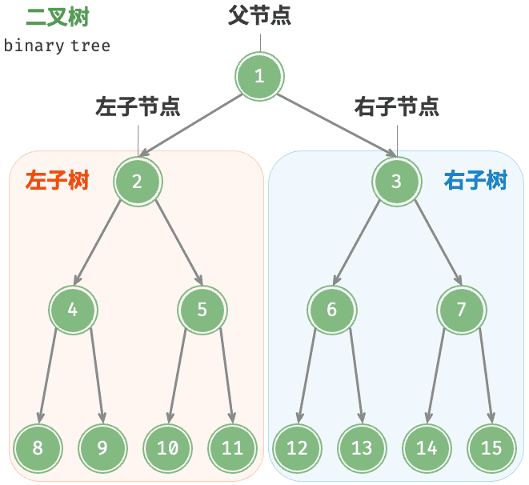

> [!warning]
>
> 二叉树天然具有递归的特点，二叉树问题都可以考虑使用递归方式解决。

## 二叉树的种类

根据二叉树“节点填充的完整度”和“填充顺序”分类：

* 完全二叉树：仅允许最底层的节点不完全填满，且最底层的节点**必须**从左至右依次连续填充。
* 满二叉树：所有层的节点都被完全填满，除叶节点的度为0，其余所有节点的度都为2。
* 非完全二叉树：仅允许最底层的节点不完全填满，但最底层的节点**不满足**从左至右依次连续填充。

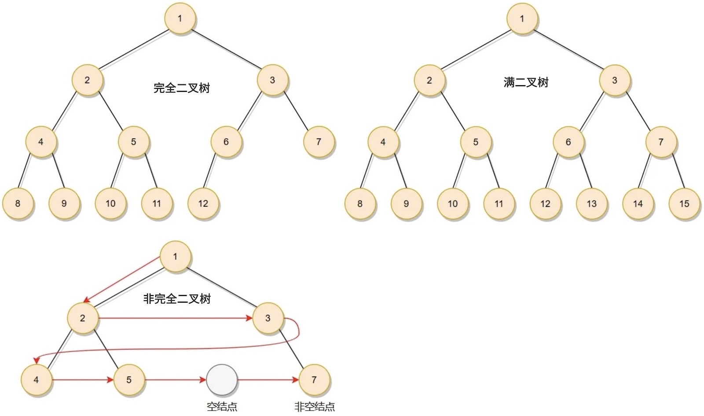

* 完满二叉树：除了叶节点之外，其余所有节点都有两个子节点。

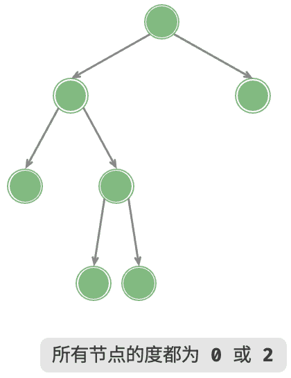

* 平衡二叉树（AVL树）：任意节点的左子树和右子树的高度之差的绝对值不超过 1 。

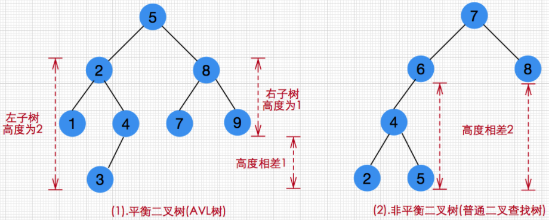

二叉搜索树（Binary Search Tree，BST），等类型。

## 二叉树的存储

### 顺序存储

将数据结构存储在固定的数组中，一般适合表示完全二叉树，非完全二叉树会有空间的浪费。

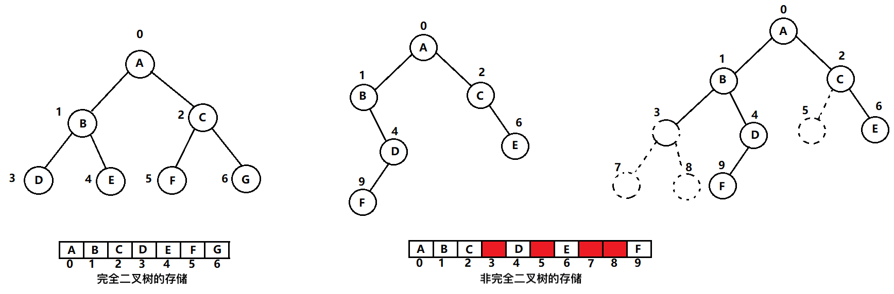

### 链式存储

二叉链表中结点不仅包含数据域，还包含两个指针域，一个指向左子树，另一个指向右子树。

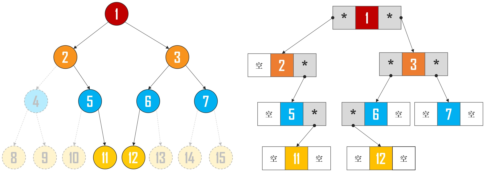

二叉树节点代码为

```python
class TreeNode:
    def __init__(self, val):
        self.val= val     
        self.left = None  
        self.right = None
```

* `val`用于保存值。
* `left`和`right`用于保存左子树和右子树。

二叉树的代码为

```python
class Tree:
    def __init__(self, root=None):
        self.root = root
```

## 二叉树的性质

1. 在二叉树的第$i$层上，至多有$2^{i-1}$个结点（$i>0$）。
2. 深度为$k$的二叉树，至多有$2^k - 1$个结点（$k>0$）。
3. 对于任意一棵二叉树，如果其叶结点数为$N_0$，而度数为$2$的结点总数为$N_2$，则$N_0=N_2+1$。
4. 最多有$n$个结点的完全二叉树的深度必为$log_2(n+1)$。
5. 对完全二叉树，若从上至下、从左至右编号，则编号为$i$的结点，其左孩子编号必为$2i$，其右孩子编号必为$2i＋1$，其父节点的编号必为`i // 2`（$i＝1$时为根除外）。

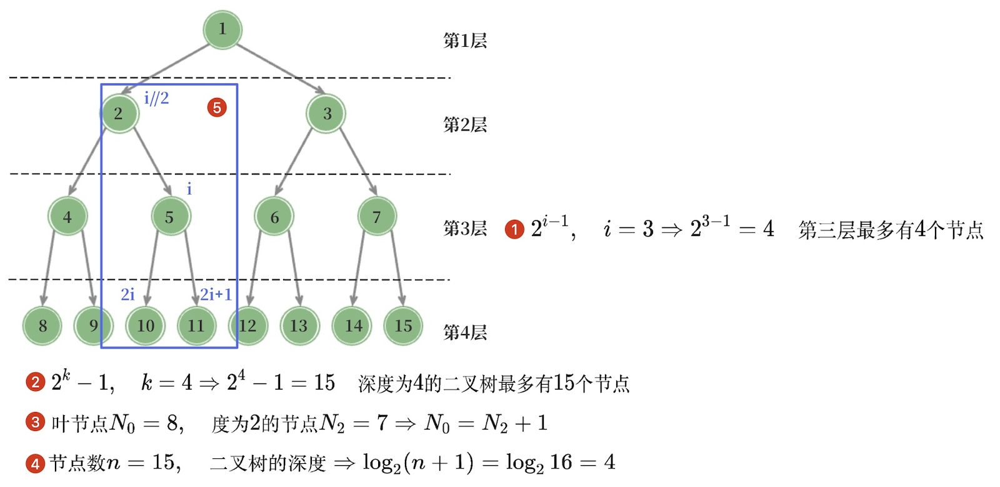

## 二叉树的遍历

二叉树的遍历，是通过指针逐个访问节点。由于树是一种非线性数据结构，这使得遍历树比遍历链表更加复杂，需要借助搜索算法来实现。二叉树常见的遍历方式包括：

1. 广度优先遍历（层序遍历）。
2. 深度优先遍历。
   1. 前序遍历。
   2. 中序遍历。
   3. 后序遍历。

### 广度优先遍历与添加节点

广度优先遍历（Breadth-First Search），从顶部到底部逐层遍历二叉树，并在每一层按照从左到右的顺序访问节点。

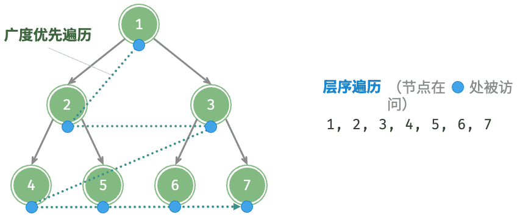

广度优先遍历可以借助队列来完成。

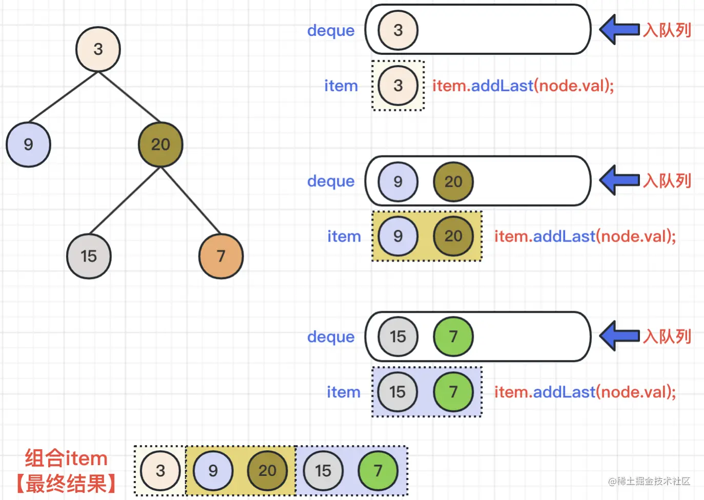

从广度优先遍历的顺序注意到，其顺序与构造完全二叉树一致。所以广度优先遍历也可以用来构造完全二叉树。

```python
class Tree:
    ...
    def add(self, val):
        if self.root is None:
            self.root = TreeNode(val)
            return 

        queue = deque()
        queue.append(self.root)

        while queue:
            node = queue.popleft()
            if node.left is None:
                node.left = TreeNode(val)
                return 
            else:
                queue.append(node.left)
                
            if node.right is None:
                node.right = TreeNode(val)
                return 
            else:
                queue.append(node.right)
```

1. 首先添加根节点。
2. 循环队列，从队列里取数据。
3. 再判断左右节点，是否为空，添加数据。

广度优先遍历

```python
class Tree:
    ...
    def bfs_travel(self):
        if self.root is None:
            return

        queue = deque()
        queue.append(self.root)

        while queue:
            node = queue.popleft()
            print(node.val, end=" " * 2)
            if node.left is not None:
                queue.append(node.left)
            if node.right is not None:
                queue.append(node.right)
```

### 深度优先搜索

深度优先遍历（Depth-First Search）：尽可能深地探索一条路径，直到走不通为止，然后回溯到上一个分叉点，再尝试另一条未探索的路径。深度优先搜索分为：

* 前序遍历
  1. 访问根结点。
  2. 先序遍历左子树。
  3. 先序遍历右子树。
* 中序遍历
  1. 中序遍历左子树。
  2. 访问根结点。
  3. 中序遍历右子树。
* 后序遍历
  1. 后序遍历左子树。
  2. 后序遍历右子树。
  3. 访问根结点。

> [!note]
>
> 三种常见遍历方式，定义都是递归定义，都是以根节点的相对访问顺序定来定义的。

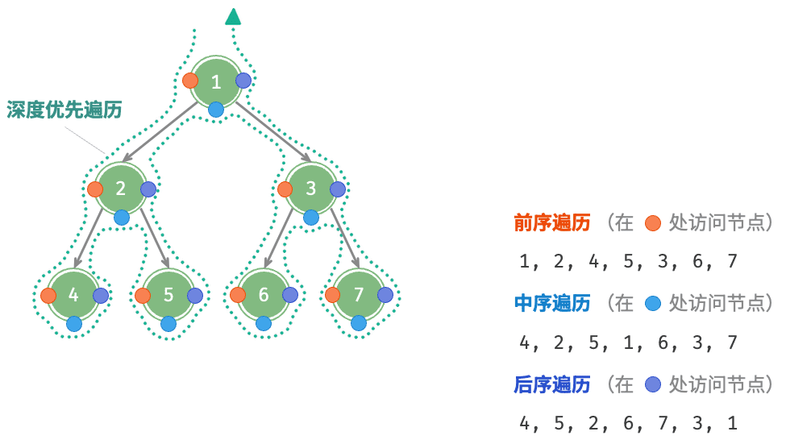

* 深度优先遍历就像是绕着整棵二叉树的外围“走”一圈。
* 在每个节点都会遇到三个位置，分别对应前序遍历、中序遍历和后序遍历。

#### 递归实现

二叉树遍历的定义是递归的，自然可以使用递归算法完成二叉树的遍历。

1. 前序遍历

```python
class Tree:
		...
    def preorder_travel_recursive(self):
        def _preorder_travel_recursive(root):
            if root is not None:
                print(root.val, end=" " * 2)
                _preorder_travel_recursive(root.left)
                _preorder_travel_recursive(root.right)
        _preorder_travel_recursive(self.root)
        print()
```

2. 中序遍历

```python
class Tree:
		...
    def inorder_travel_recursive(self):
        def _inorder_travel_recursive(root):
            if root is not None:
                _inorder_travel_recursive(root.left)
                print(root.val, end=" " * 2)
                _inorder_travel_recursive(root.right)
        _inorder_travel_recursive(self.root)
        print()
```

3. 后序遍历

```python
class Tree:
		...
    def postorder_travel_recursive(self):
        def _postorder_travel_recursive(root):
            if root is not None:
                _postorder_travel_recursive(root.left)
                _postorder_travel_recursive(root.right)
                print(root.val, end=" " * 2)
        _postorder_travel_recursive(self.root)
        print()
```

#### 栈实现

1. 前序遍历

```python
class Tree:
    ...
    def preorder_travel(self):
        if self.root is None:
            return

        stack = []
        stack.append(self.root)

        while stack:
            node = stack.pop()
            if isinstance(node, TreeNode):
                if node.right is not None:
                    stack.append(node.right)
                if node.left is not None:
                    stack.append(node.left)
                stack.append(node.val)
            else:
                print(node, end=" " * 2)
        print()
```

* `stack`模拟递归栈，所有操作直接入栈。
* `isinstance(node, TreeNode)`判断数据类型
  * 如果是`TreeNode`判断左右子树是否为空不为空入栈。
  * 如果是数组类型，直接打印。
* 栈是先进后出，所以最先的操作应该最后入栈，前序遍历入栈顺序：
  1. 右子树。
  2. 左子树。
  3. 节点值。

2. 中序遍历

```python
class Tree:
    ...
    def inorder_travel(self):
        if self.root is None:
            return

        stack = []
        stack.append(self.root)

        while stack:
            node = stack.pop()
            if isinstance(node, TreeNode):
                if node.right is not None:
                    stack.append(node.right)
                stack.append(node.val)
                if node.left is not None:
                    stack.append(node.left)
            else:
                print(node, end=" " * 2)
        print()
```

3. 后序遍历

```python
class Tree:
    ...
    def postorder_travel(self):
        if self.root is None:
            return

        stack = []
        stack.append(self.root)

        while stack:
            node = stack.pop()
            if isinstance(node, TreeNode):
                stack.append(node.val)
                if node.right is not None:
                    stack.append(node.right)
                if node.left is not None:
                    stack.append(node.left)
            else:
                print(node, end=" " * 2)
        print()
```

## 还原二叉树

根据已有的二叉树遍历顺序，还原一棵二叉树：

* 仅由先序遍历、中序遍历和后序遍历，中的任何⼀种方法，⽆法还原⼆叉树。
* 已知中序遍历和先序遍历，可以还原二叉树。
* 已知中序遍历和后序遍历，可以还原二叉树。
* 已知前序遍历和后序遍历，生成的二叉树不唯一。

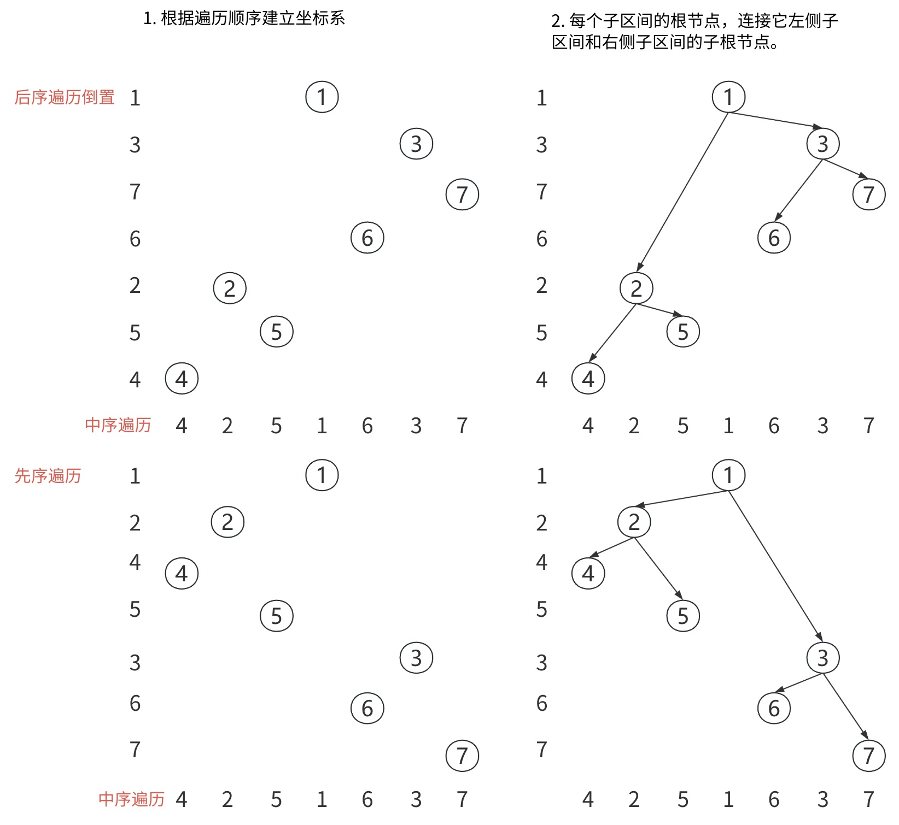

**[105. 从前序与中序遍历序列构造二叉树](https://leetcode.cn/problems/construct-binary-tree-from-preorder-and-inorder-traversal/)**

* 先序遍历：`[根 | 左子树 | 右子树]`
* 中序遍历：`[左子树 | 根 | 右子树]`
* 先序遍历的左子树结束位置，与中序遍历的根结束位置对齐。

```python
class Solution:
    def buildTree(self, preorder: List[int], inorder: List[int]) -> Optional[TreeNode]:
        if not preorder or not inorder:
            return None

        root = TreeNode(preorder[0])
        mid = inorder.index(preorder[0])
        root.left = self.buildTree(preorder[1:mid+1], inorder[:mid])
        root.right = self.buildTree(preorder[mid+1:], inorder[mid+1:])
        return root
```

## 相关问题

**[102. 二叉树的层序遍历](https://leetcode.cn/problems/binary-tree-level-order-traversal/)**

* 原理与广度优先搜索一致，但是需要按层存储节点。
* 在节点入队的同时，需要记录节点所在的层数。

```python
class Solution:
    def levelOrder(self, root: Optional[TreeNode]) -> List[List[int]]:
        if not root:
            return []

        res = []
        queue = collections.deque([(root, 0)])

        while queue:
            node, level = queue.popleft()
            if level == len(res):
                res.append([])
            res[level].append(node.val)
            if node.left:
                queue.append((node.left, level + 1))
            if node.right:
                queue.append((node.right, level + 1))
        return res
```

**[104. 二叉树的最大深度](https://leetcode.cn/problems/maximum-depth-of-binary-tree/)**

```python
class Solution:
    def maxDepth(self, root: Optional[TreeNode]) -> int:
        if not root:
            return 0
        return 1 + max(self.maxDepth(root.left), self.maxDepth(root.right))
```

**[226. 翻转二叉树](https://leetcode.cn/problems/invert-binary-tree/)**

```python
class Solution:
    def invertTree(self, root: Optional[TreeNode]) -> Optional[TreeNode]:
        if not root:
            return None
            
        root.left, root.right = root.right, root.left
        self.invertTree(root.left)
        self.invertTree(root.right)
        return root
```

> [我们90%的工程师都用你写的软件，但抱歉我们不能聘用你](https://www.pingwest.com/a/51826)

**[112. 路径总和](https://leetcode.cn/problems/path-sum/)**

1. 递归推导式：节点值为`val`，判断左、右子树是否满足`targetSum - val`。

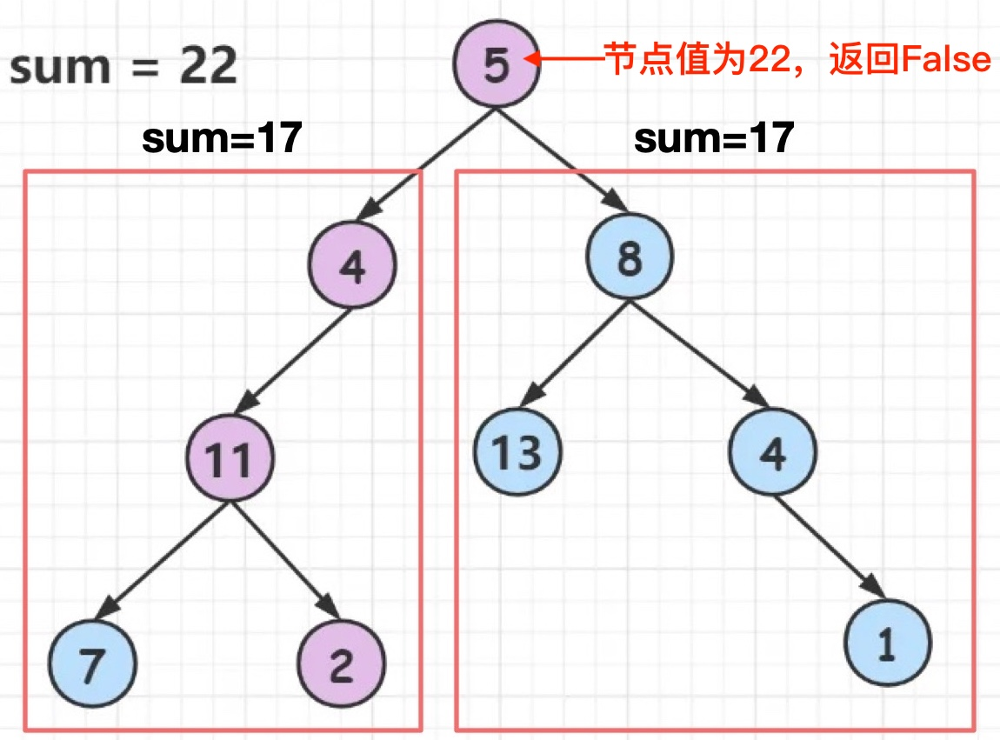

3. 终止条件：
   * 如果当前值`val == targetSum`，左右子树必须为空。
   * 空二叉树返回`False`

```python
class Solution:
    def hasPathSum(self, root: Optional[TreeNode], targetSum: int) -> bool:
        if not root:
            return False
        if not root.left and not root.right:
            return root.val == targetSum
        left = self.hasPathSum(root.left, targetSum - root.val)
        right = self.hasPathSum(root.right, targetSum - root.val)
        return left or right 
```

## 练习

| 题目名称                                                     |
| ------------------------------------------------------------ |
| [107. 二叉树的层序遍历 II](https://leetcode.cn/problems/binary-tree-level-order-traversal-ii/) |
| [103. 二叉树的锯齿形层序遍历](https://leetcode.cn/problems/binary-tree-zigzag-level-order-traversal/) |
| [199. 二叉树的右视图](https://leetcode.cn/problems/binary-tree-right-side-view/) |
| [111. 二叉树的最小深度](https://leetcode.cn/problems/minimum-depth-of-binary-tree/) |
| [100. 相同的树](https://leetcode.cn/problems/same-tree/)     |
| [101. 对称二叉树](https://leetcode.cn/problems/symmetric-tree/) |
| [222. 完全二叉树的节点个数](https://leetcode.cn/problems/count-complete-tree-nodes/) |
| [110. 平衡二叉树](https://leetcode.cn/problems/balanced-binary-tree/) |
| [404. 左叶子之和](https://leetcode.cn/problems/sum-of-left-leaves/) |

