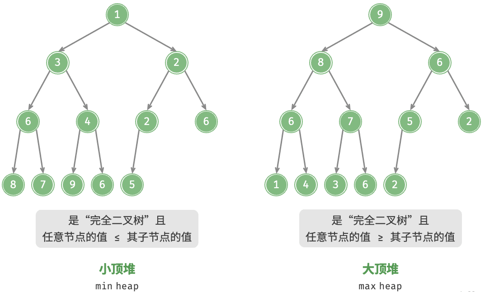
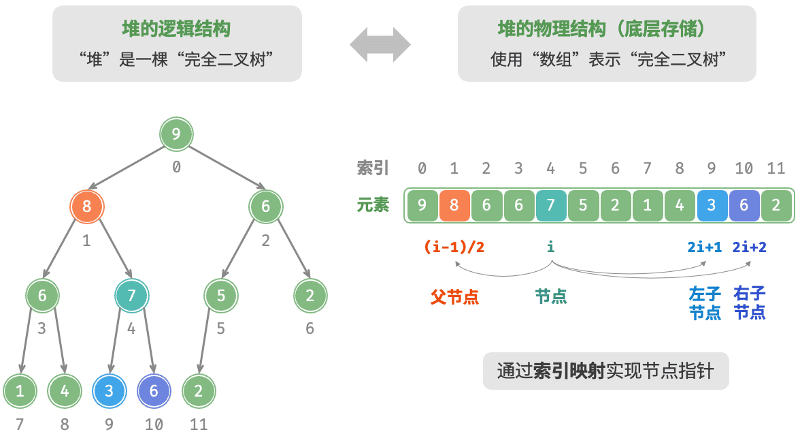
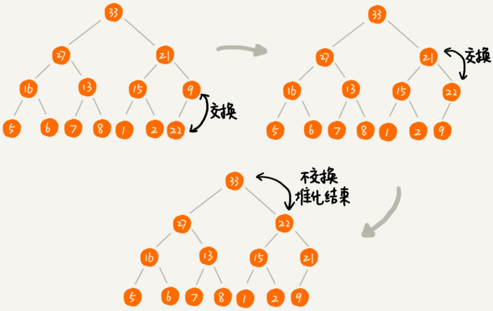
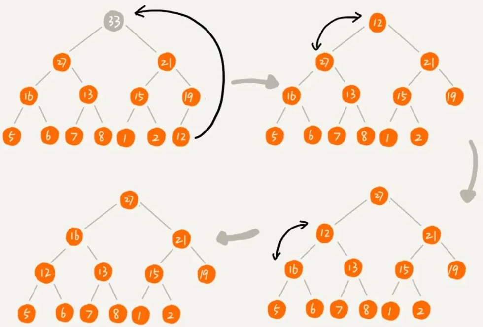
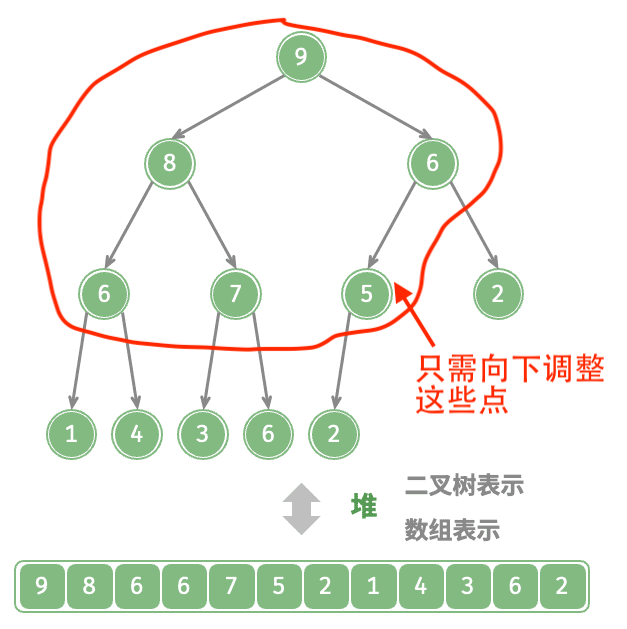
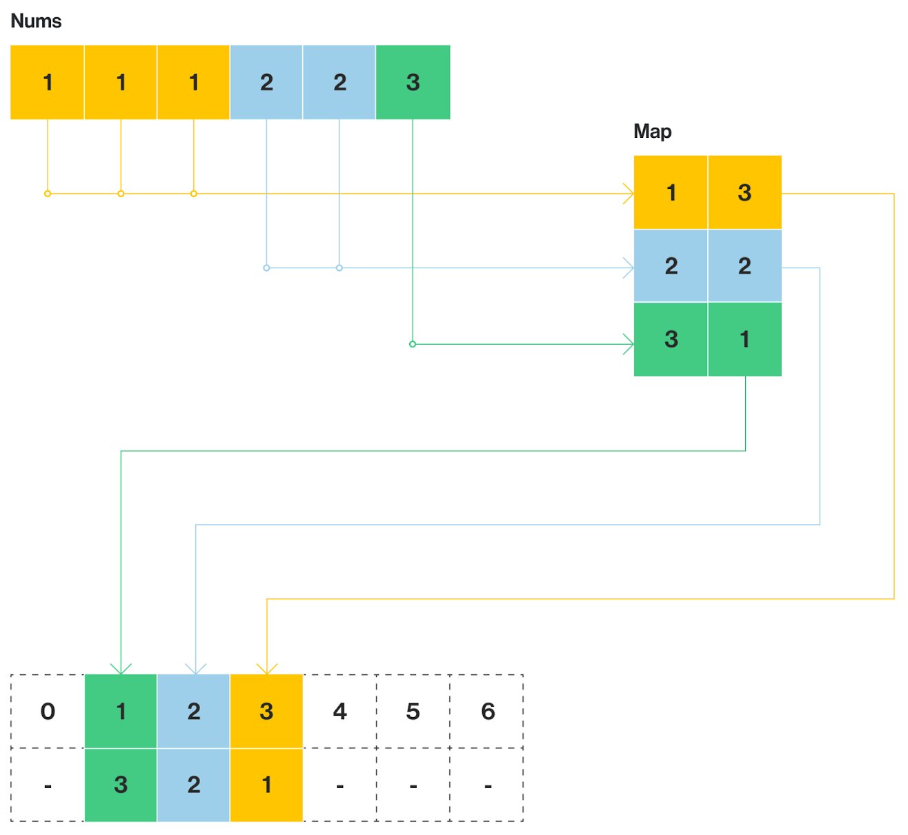

# 堆

堆（heap）是一种满足特定条件的完全二叉树，常见的堆主要可分为两种类型：

1. 小顶堆（min heap）：任意节点的值 $\le $ 其子节点的值。
   * 堆顶元素是最小值。
2. 大顶堆（max heap）：任意节点的值 $\ge$ 其子节点的值。
   * 堆顶元素是最大值。



## 堆的实现

以大顶堆为例实现堆。由于堆事完全二叉树，绝大多数情况下都是使用数组实现的。

> [!warning]
>
> 完全二叉树，可以被无缝隙地存储在一个数组中，而不会浪费任何空间。

在数组中可以通过下标计算，直接找到树中任意节点的父子关系。对于数组中任意下标为 `i` 的节点：

1. 它的左子节点下标是：`2 * i + 1`。
2. 它的右子节点下标是：`2 * i + 2`。
3. 它的父节点下标是：`(i - 1) // 2` (向下取整)。



定义堆大顶堆和常用方法

```python
class MaxHeap:
    def __init__(self):
        self.max_heap = []

    def left(self, i):
        return 2 * i + 1

    def right(self, i):
        return 2 * i + 2

    def parent(self, i):
        return (i - 1) // 2 

    def swap(self, i, j):
        self.max_heap[i], self.max_heap[j] = self.max_heap[j], self.max_heap[i]

    def size(self):
        return len(self.max_heap)

    def is_empty(self):
        return self.size() == 0

    def peek(self):
        return self.max_heap[0]
      
    def travel(self):
        if self.is_empty():
            return
        
        n = self.size()
        level = 0
        i = 0
        while i < n:
            level_size = 2 ** level
            start = i
            end = min(i + level_size, n)
            for j in range(start, end):
                print(f"{self.max_heap[j]}", end="  ")
            print()
            i = end
            level += 1
```

* `peek`返回堆顶的元素，即数组的首元素。
* `travel`按层打印。

### 元素入堆

将元素添加到堆底：

1. 在数组的尾部添加元素。
2. 不断比较子节点与父节点，如果子节点大于父节点，则交换。
3. 重复此过程，直到子节点小于其父节点。



```python
import random

class MaxHeap:
		...
    def push(self, val: int):
        self.max_heap.append(val)
        self.sift_up(self.size() - 1)

    def sift_up(self, i: int):
        while True:
            p = self.parent(i)
            if p < 0 or self.max_heap[i] <= self.max_heap[p]:
                break
            self.swap(i, p)
            i = p       
```

* `sift_up`向上调整。

### 堆顶元素出堆

弹出堆的首元素：

1. 交换堆顶元素与堆底元素。
2. 将堆底从列表中删除。
3. 不断比较父节点与子节点，如果父节点小于子节点，则交换。
4. 重复此过程，直到父节点大于其子节点。



```python
class MaxHeap:
    ...
    def pop(self) -> int:
        if self.is_empty():
            return None
        self.swap(0, self.size() - 1)
        val = self.max_heap.pop()
        self.sift_down(0)
        return val

    def sift_down(self, i: int):
        while True:
            l, r, ma = self.left(i), self.right(i), i
            if l < self.size() and self.max_heap[l] > self.max_heap[ma]:
                ma = l
            if r < self.size() and self.max_heap[r] > self.max_heap[ma]:
                ma = r
            if ma == i:
                break
            self.swap(i, ma)
            i = ma
```

* `sift_down`向下调整。

### 创建堆

1. 创建一个空堆，然后遍历列表，依次对每个元素执行“入堆操作”。
   1. 元素量为$n$，每个元素的入堆操作使用$O(\log n)$时间。
   2. 建堆的时间复杂度为$O(n\log n)$。
2. 借助向下调整实现创建堆：
   1. 将列表所有元素原封不动地添加到堆中，此时堆的性质尚未得到满足。
   2. 倒序遍历堆（层序遍历的倒序），依次对每个非叶节点执行“向下调整”。
   3. 每当堆化一个节点后，以该节点为根节点的子树就形成一个合法的子堆。
   4. 由于是倒序遍历，因此堆是“自下而上”构建的。



```python
class MaxHeap:
    def __init__(self, nums):
        self.max_heap = nums 
        for i in range(self.parent(self.size() - 1), -1, -1):
            self.sift_down(i)
```

* `self.parent(self.size() - 1)`计算最后一个，拥有子节点的节点的索引。
* `range(..., -1, -1)`逆序遍历。
  * `range(..., 0, -1)`不会遍历0元素。

#### 向下调整建堆的时间复杂度

假设堆的高度为 $h$，总节点数为 $n$。每一层节点能下沉的最大高度如下：

* 倒数第1层（叶子）：$n/2$个节点，下沉0层。
* 倒数第2层：$n/4$个节点，下沉1层。
* 倒数第3层：$n/8$个节点，下沉2层。
* ...
* 第1层（根节点）：1 个节点，下沉$h$层。

总操作次数$S$可以表示为一个级数：
$$
S = \sum_{i=1}^{h} \frac{n}{2^{i+1}} \times i
$$
$i$表示是节点距离叶子层的高度，所以从第二层开始，当$n \to \infty$时，这个级数收敛于
$$
S \approx n \times \sum \frac{i}{2^i} = n \times 1 = O(n)
$$
向下调整建堆的时间复杂度为$O(n)$。

## 堆的应用

优先队列

* 入队：将元素加入队列。
* 出队：每次移除并返回的是队列中优先级最高的元素。
  * 最大优先队列 (Max-Priority Queue)：元素的值越大，优先级越高。
  * 最小优先队列 (Min-Priority Queue)：元素的值越小，优先级越高。
* 优先队列底层实现就是基于堆。

python标准库中包含优先队列`heapq`，其实现为小顶堆。

```python
import heapq

nums = [5, 1, 9, 3]
heapq.heapify(nums)  
heapq.heappush(nums, 0) 

smallest = heapq.heappop(nums)
print(smallest) 
```

如果需要大顶堆，通常将数值取负后再存入，如`10`变为`-10`。

```python
max_heap = []
nums = [10, 20, 5]

for n in nums:
    heapq.heappush(max_heap, -n)

print(-heapq.heappop(max_heap))
```

还可以存入更复杂的元素

```python
tasks = []
heapq.heappush(tasks, (2, "写文档"))
heapq.heappush(tasks, (1, "修复紧急Bug"))
heapq.heappush(tasks, (3, "开周会"))

priority, task = heapq.heappop(tasks)
print(f"当前处理: {task}")
```

**[347. 前 K 个高频元素](https://leetcode.cn/problems/top-k-frequent-elements/)**

1. 扫描一遍数组统计前索引数据的频率，保存为字典。
2. 遍历字典，并维护一个含有K个元素的`PriorityQueue`。
3. 如果遍历的元素大于队列首位。
   1. 队列首元素出队。
   2. 遍历元素入队。

4. 最终队列中剩下的元素，就是前K个出现频率最高的元素。



```python
import heapq
from collections import Counter

class Solution:
    def topKFrequent(self, nums: List[int], k: int) -> List[int]:
        freq = Counter(nums)
        pq = []
        
        for num, count in freq.items():
            heapq.heappush(pq, (count, num))
            if len(pq) > k:
                heapq.heappop(pq)
        
        return [heapq.heappop(pq)[1] for _ in range(k)]
```

* 先将频率和元素放入队列中，当长度超过K时，去除堆顶元素，这是保证队列内K个元素都是最大的。

## 练习

| 题目名称                                                     |
| ------------------------------------------------------------ |
| [23. 合并 K 个升序链表](https://leetcode.cn/problems/merge-k-sorted-lists/) |

