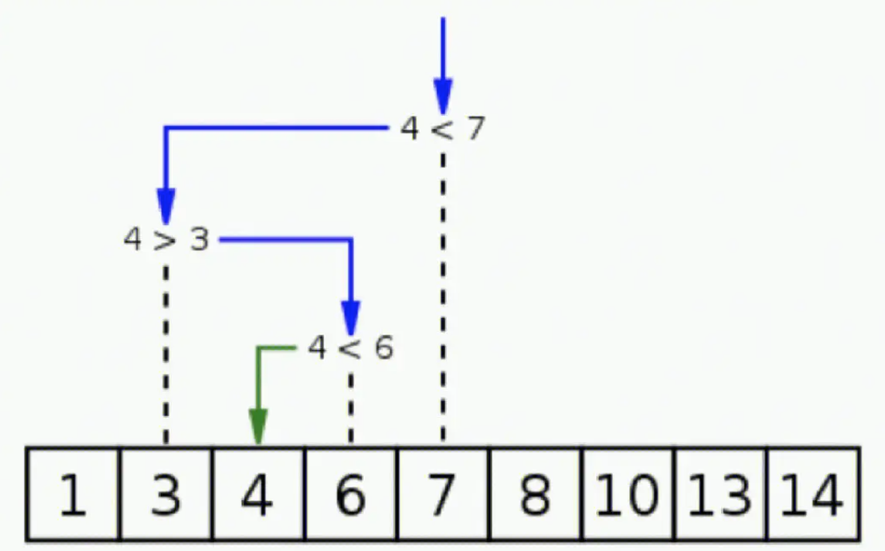
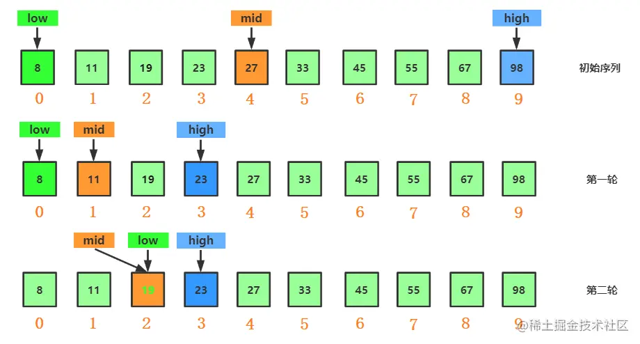
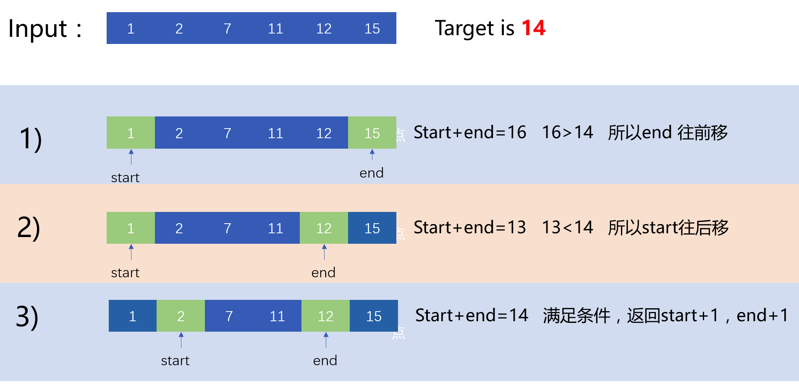
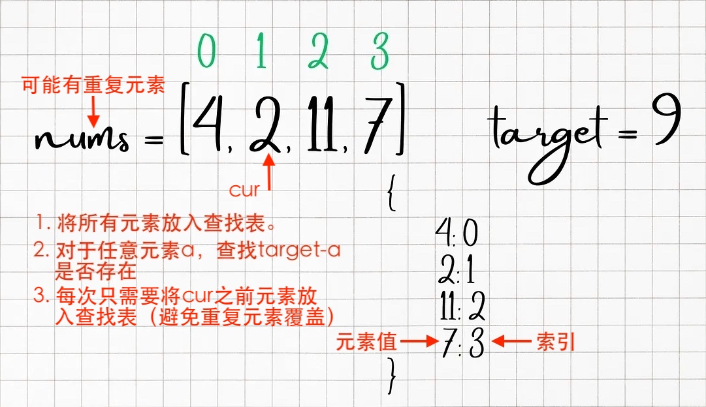
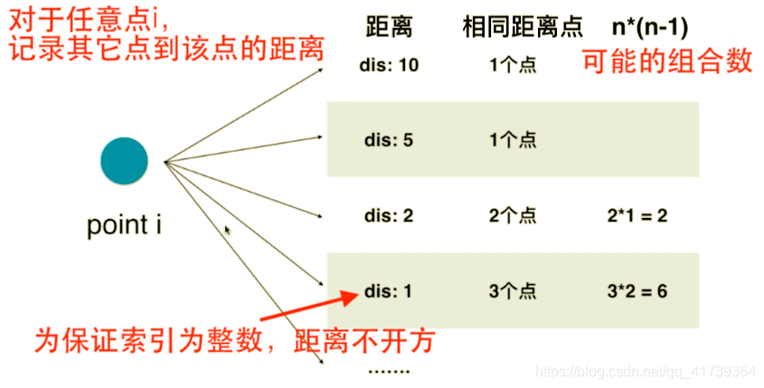
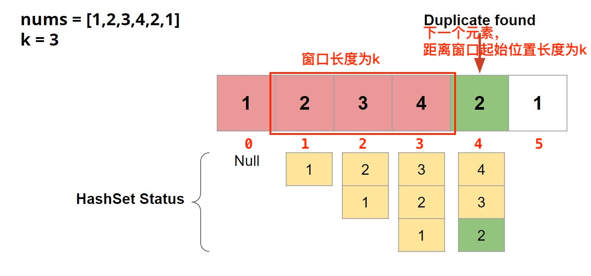

# 查找

查找⼜称为检索，是指在某种数据结构中找出满⾜给定条件的元素，查找是⼀种⼗分常用的算法。

## 线性查找

线性查找是最简单的查找算法，首先从列表的首项开始，按照下标增长的顺序，逐个比对数据，找到返回真，没找到返回假。

1. 无序表的线性查找。

```python
def linear_search(arr, target):
    for i in arr:
        if i == target:
            return arr.index(i)
    return -1
```

2. 有序表的线性查找。

```python
def linear_search_2(arr, target):
    for i in range(len(arr)):
        if arr[i] == target:
            return i
        elif arr[i] > target:
            return -1
    return -1
```

顺序查找的时间复杂度为$O(n)$。

## 二分查找

二分查找又称折半查找，它是一种效率较高的查找方法，算法流程是：

1. 在**已排序的数组**中查找特定元素。
2. 通过反复将搜索区间划分为两半，并确定目标值可能在哪一半中，从而将搜索范围缩小一半。
3. 这个过程不断重复，直到找到目标值或确定目标值不在数组中。



> [!warning]
>
> 二分查找只能在顺序存储结构中使用。

二分查找算法首次提出是1946年，第一个没有bug的二分查找法在1962年才出现。

### 递归实现

```python
def binary_search_recursive(arr, target):
    n = len(arr)
    if n == 0:
        return -1

    mid = n // 2
    if arr[mid] == target:
        return mid
    elif arr[mid] > target:
        return binary_search_recursive(arr[:mid], target)
    else:
        return binary_search_recursive(arr[mid+1:], target)
```

算法编程的注意事项：

1. 理解算法的规则。
2. 明确算法中所使用变量的定义。
3. 注意边界值。
4. 算法测试中注重小数据量的调试。

### 循环实现



* 定义两个游标用于表示查找的范围。
* 在区间`[low, hight]`之间寻找目标值，**注意：这里包含边界值，即为闭区间。**
* 当`low == high`，`[low, high]`依然有效，表示区间中只有一个元素。
* `low = mid + 1`修改左边界，`high = mid - 1`修改右边界。

> [!warning]
>
> 在处理算法边界时，按照闭区间思考，能显著降低逻辑出错的概率。

```python
def binary_search(arr, target):
    lo = 0
    hi = len(arr) - 1
    while lo <= hi:
        mid = (lo + hi) // 2
        if arr[mid] == target:
            return mid
        elif arr[mid] > target:
            hi = mid - 1
        else:
            lo = mid + 1
    return -1
```

* 在查找过程中变量`lo`和`hi`用来表示数组的边界，尽管数值发生变化，但是逻辑意义不变，称为循环不变量。

> [!important]
>
> 循环不变量（Loop Invariant）是在程序循环中为真的性质或条件。它是一个逻辑表达式，它在每次迭代循环时保持不变。

上面代码的隐含的问题，当`(lo + hi)`足够大的时候，会产生溢出的问题，所有中间值计算可改为。

```python
mid = lo + (hi - lo) // 2
```

### 时间复杂度

假设数组的长度为 $n$。在二分查找的每一步，取中间值并将搜索范围减半。

- 第`0`步：剩余元素个数为 $n$。
- 第`1`步：剩余元素个数为 $n/2$。
- 第`2`步：剩余元素个数为 $n/4$。
- 第`k`步：剩余元素个数为 $n/2^k$。

当搜索结束时，即最坏情况下，只剩下一个元素或范围为空，满足
$$
\frac{n}{2^k} = 1 \Rightarrow n = 2^k \Rightarrow k = \log_2 n
$$
因此，二分查找的时间复杂度为$O(\log n)$。例如：10亿的数据量，二分查找大约需要30次。

> [!tip]
>
> 下面的代码时间复杂度是多少？
>
> ```python
> def compute(n):
>     j = 1
>     while j < n:
>         for i in range(1, n):
>             print(i + j)
>         j += j
> ```

* `j += j`表示每次翻倍，直到值超过$n$，所以复杂度为$O(\log n)$。
* 内循环时间复杂度为$O(n)$。
* 总的时间复杂度为$O(n\log n)$。

常用数据结构的查找效率

|      | 普通数组 | 有序数组    | 二分查找树  | 哈希表 |
| ---- | -------- | ----------- | ----------- | ------ |
| 插入 | $O(1)$   | $O(n)$      | $O(\log n)$ | $O(1)$ |
| 查找 | $O(n)$   | $O(\log n)$ | $O(\log n)$ | $O(1)$ |
| 删除 | $O(n)$   | $O(n)$      | $O(\log n)$ | $O(1)$ |

* 哈希表中失去了数据的顺序性。

## 测试时间复杂度

算法的时间复杂度除了理论推导外，还可以通过实践测试：

1. 测试算法的时间复杂度的核心是不断将数据量翻倍，看算法的时间增长比例。
2. 测试算法复杂度时一般测试最坏情况。

> [!Caution]
>
> 由于许多算法，中间过程比较复杂，算法的实际复杂度远高于理论复杂度。

1. 查找最大值算法，时间复杂度为$O(n)$。

```python
def max_value(arr):
    max_val = arr[0]
    for i in range(1, len(arr)):
        if arr[i] > max_val:
            max_val = arr[i]
    return max_val
```

2. 二分查找法，时间复杂度为$O(\log n)$。

3. 生成测试数组

```python
def get_list(n):
    return [i for i in range(n)]
```

4. 测试查找最大值算法时间复杂度

```python
for i in range(10, 28):
    n = pow(2, i)
    arr = get_list(n)
    start = time.time()
    max_value(arr)
    end = time.time()
    print(f'n={n}, time={end-start}')
```

5. 测试二分查找法时间复杂度

```python
for i in range(10, 28):
    n = pow(2, i)
    arr = get_list(n)
    start = time.time()
    binary_search(arr, 0)
    end = time.time()
    print(f'n={n}, time={end-start}')
```

* 二分查找法时间增长的比例为$1.\text{x}$倍

$$
\frac{\log 2n}{\log n}=\frac{\log2+\log n}{\log n}
=1+\frac{\log 2}{\log n}
=1+\log_n2
$$

> [!tip]
>
> 如果是$O(n^2)$的算法，每次数据量翻倍，时间复杂度应该如何增长？

## 相关问题

解决查找问题的思路：

* 查找有无，如：'a'在字符串中是否出现。使用`set`数据结构。
* 查找对应关系，如：'a'在字符串中出现几次。使用`dict`数据结构。
* 有序的数组的查找问题，考虑二分查找法。
* Python库中，数据结构实现的方式，将影响算法整体性能。

> [!important]
>
> 查找表类问题，是典型的以空间换时间的方法。

**[167. 两数之和 II - 输入有序数组](https://leetcode.cn/problems/two-sum-ii-input-array-is-sorted/)**

一般解法

1. 穷举法，双层遍历数组，时间复杂度为$O(n^2)$。
2. 第一层遍历，第二层二分查找，时间复杂度为$O(n\log n)$。

对撞指针算法



```python
class Solution:
    def twoSum(self, numbers: List[int], target: int) -> List[int]:
        lo = 0
        hi = len(numbers) - 1
        
        while lo < hi:
            sum = numbers[lo] + numbers[hi]
            if sum == target:
                return [lo + 1, hi + 1]
            elif sum < target:
                lo += 1
            else:
                hi -= 1
```

* 时间复杂度为$O(n)$。


**[350. 两个数组的交集 II](https://leetcode.cn/problems/intersection-of-two-arrays-ii/)**

此题目需要统计相同元素的数量：

* 使用字典统计`nums1`中元素的数量。
* 遍历`nums2`中的元素，在字典中查询元素是否存在，如果存在添加入返回数组，且记录减1。

```python
class Solution:
    def intersect(self, nums1: List[int], nums2: List[int]) -> List[int]:
        record = {}
        for num in nums1:
            record[num] = record.get(num, 0) + 1

        res = []
        for num in nums2:
            if record.get(num, 0) > 0:
                res.append(num)
                record[num] -= 1

        return res
```

**[1. 两数之和](https://leetcode.cn/problems/two-sum/)**



```python
class Solution:
    def twoSum(self, nums: List[int], target: int) -> List[int]:
        record = {}
        for i, num in enumerate(nums):
            if target - num in record:
                return [record[target - num], i]
            record[num] = i
        return []
```

* 上面的算法时间复杂度和空间复杂度都是$O(n)$，因为可能将所有元素都放入字典中。


**[454. 四数相加 II](https://leetcode.cn/problems/4sum-ii/)**

使用字典创建查找表

* 遍历数组`C`和`D`，使用字典键记录`C + D`的和：
  * 键为`C + D`的和。
  * 值为满足条件条件元素的个数。
* 遍历数组`A`和`B`，计算`0-A-B`是否在在字典中存在。

```python
class Solution:
    def fourSumCount(self, nums1: List[int], nums2: List[int], nums3: List[int], nums4: List[int]) -> int:
        record = {}
        for num3 in nums3:
            for num4 in nums4:
                record[num3 + num4] = record.get(num3 + num4, 0) + 1

        res = 0
        for num1 in nums1:
            for num2 in nums2:
                res += record.get(-num1 - num2, 0)
        return ressd
```

* 上面的算法时间复杂度和空间复杂度都是$O(n^2)$，


**[447. 回旋镖的数量](https://leetcode.cn/problems/number-of-boomerangs/)**

> [!tip]
>
> 在使用查找表时，如何定义索引，是解决问题的关键。



* 定点不同被视为不同组合
  * 当$A$作为顶点时，找到了$(A, B, C)$。
  * 当$B$作为顶点时，找到了$(B, A, C)$。

```python
class Solution:
    def numberOfBoomerangs(self, points: List[List[int]]) -> int:
        res = 0
        for p in points:
            record = {}
            for q in points:
                if p == q:
                    continue
                record[self.distance(p, q)] = record.get(self.distance(p, q), 0) + 1
            for dist in record:
                res += record[dist] * (record[dist] - 1)
        return res

    def distance(self, p: List[int], q: List[int]) -> int:
        return (p[0] - q[0]) ** 2 + (p[1] - q[1]) ** 2
```

* `for p in points`循环遍历数组中每一个点。
* `record = {}`对每一个点都要建立一遍查找表。
* 算法的复杂度为$O(n^2)$。


**[219. 存在重复元素 II](https://leetcode.cn/problems/contains-duplicate-ii/)**



```python
class Solution:
    def containsNearbyDuplicate(self, nums: List[int], k: int) -> bool:
        record = set()
        for i, num in enumerate(nums):
            if num in record:
                return True

            record.add(num)
            if len(record) == k + 1:
                record.remove(nums[i - k])
        return False
```

## 练习

| 题目名称                                                     |
| ------------------------------------------------------------ |
| [125. 验证回文串](https://leetcode.cn/problems/valid-palindrome/) |
| [344. 反转字符串](https://leetcode.cn/problems/reverse-string/) |
| [345. 反转字符串中的元音字母](https://leetcode.cn/problems/reverse-vowels-of-a-string/) |
| [11. 盛最多水的容器](https://leetcode.cn/problems/container-with-most-water/) |
| [15. 三数之和](https://leetcode.cn/problems/3sum/)           |
| [18. 四数之和](https://leetcode.cn/problems/4sum/)           |
| [16. 最接近的三数之和](https://leetcode.cn/problems/3sum-closest/) |
| [49. 字母异位词分组](https://leetcode.cn/problems/group-anagrams/) |
| [149. 直线上最多的点数](https://leetcode.cn/problems/max-points-on-a-line/) |
| [217. 存在重复元素](https://leetcode.cn/problems/contains-duplicate/) |

