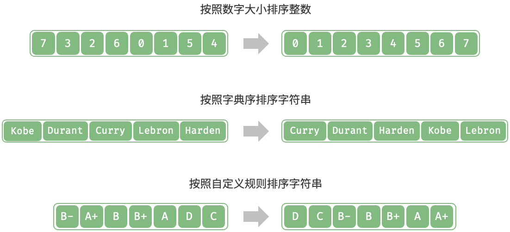
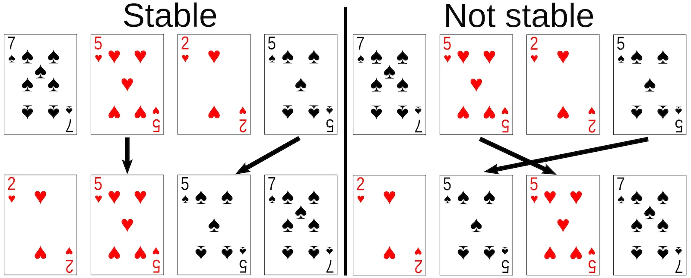
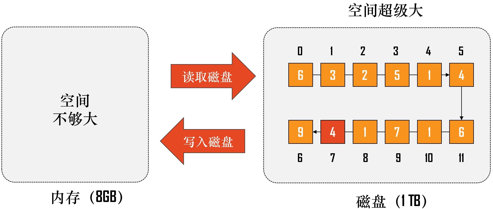
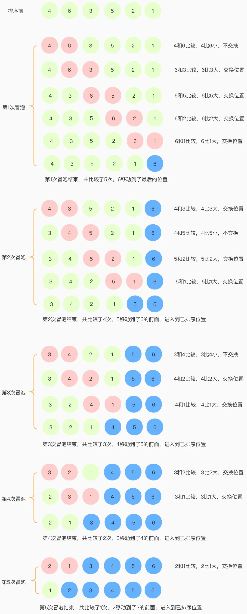
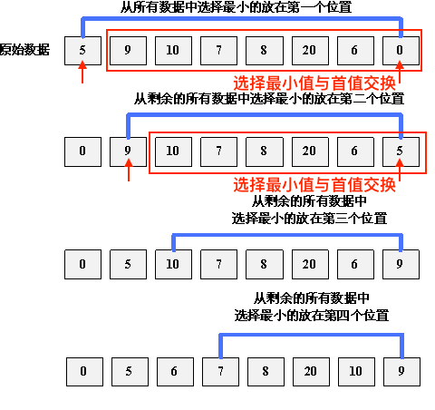
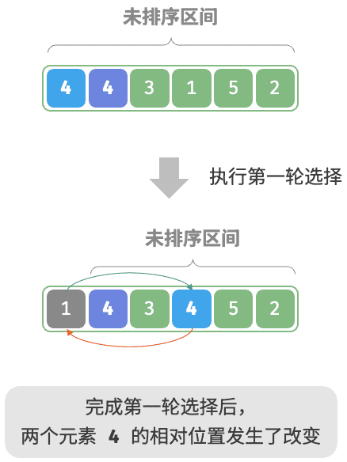
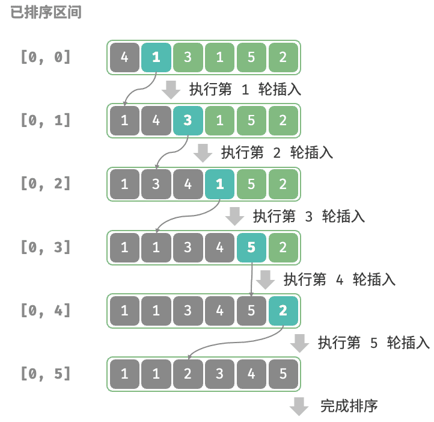
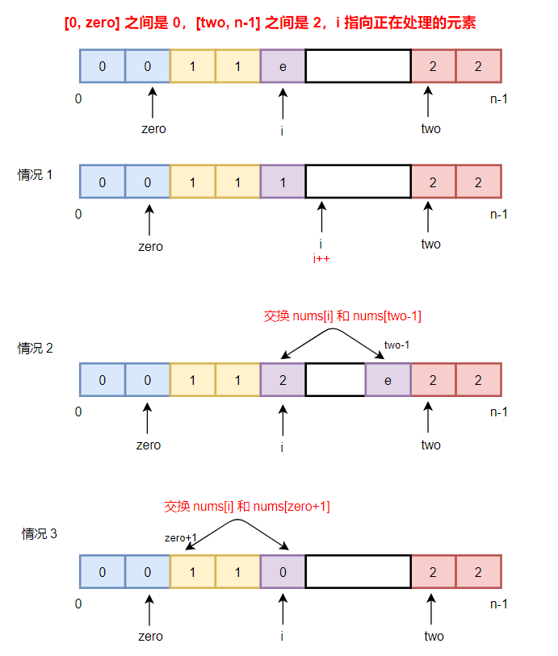

# 排序算法

排序，就是使一串记录，按照其中的某个或某些关键字的大小，递增或递减的排列起来的操作。排序算法，就是如何使得记录按照要求排列的方法。一个优秀的算法可以节省大量的资源。



排序算法是计算机算法中一个基础的领域，且研究比较透彻。

评价排序算法的维度

1. 运行效率。
2. 就地型。通过在原数组上直接操作实现排序，无须借助额外的辅助数组，从而节省内存。
3. 稳定性。稳定排序在完成排序后，相等元素在数组中的相对次序不发生改变。



4. 内部排序与外部排序。
   * 内部排序：数据都在内存中，关注如何使算法时、空复杂度更低。
   * 外部排序：数据太多，无法全部放入内存。还要关注如何使读/写磁盘次数更少。



常见的排序算法


## 经典排序算法

### 冒泡排序

冒泡排序（bubble sort）通过连续地比较与交换相邻元素实现排序。这个过程就像气泡从底部升到顶部一样，因此得名冒泡排序。



* 将较大的元素，向数组的后端移动。
* 如果数组长度为$n$，冒泡排序最坏情况下，遍历的趟数为$n-1$。
* 每一趟遍历，遍历的元素减少一个。

```python
def bubble_sort(nums):
    n = len(nums)
    for i in range(n - 1, 0, -1):
        for j in range(i):
            if nums[j] > nums[j + 1]:
                nums[j], nums[j + 1] = nums[j + 1], nums[j]
```

> [!warning]
>
> `nums[j] > nums[j + 1]`保证两个数值相等不发生交互，所以冒泡排序是稳定的排序。

效率优化：如果某轮“冒泡”中没有执行任何交换操作，说明数组已经完成排序，可直接返回结果。

```python
def bubble_sort_with_flag(nums):
    n = len(nums)
    for i in range(n - 1, 0, -1):
        flag = False
        
        for j in range(i):
            if nums[j] > nums[j + 1]:
                nums[j], nums[j + 1] = nums[j + 1], nums[j]
                flag = True  
        if not flag:
            break
```

#### 时间复杂度

冒泡排序的比较次数：

1. 第1趟：比较$n-1$次。
2. 第2趟：比较$n-2$次。
3. 第3趟：比较$n-3$次。
4. …
5. 最后一趟：比较$1$次。

时间复杂度为
$$
\begin{aligned}
S & =(n-1)+(n-2)+\cdots+1 \\
  & = \frac{(n-1)\times(1+n-1)}{2} \\
  & = \frac{n\times(n-1)}{2} = \frac{n^2-n}{2}\Rightarrow O(n^2)
\end{aligned}
$$

### 选择排序

选择排序（selection sort）：开启一个循环，每轮从未排序区间选择最小的元素，将其放到已排序区间的末尾。



```python
def selection_sort(nums):
    n = len(nums)
    for i in range(n - 1):
        k = i
        for j in range(i + 1, n):
            if nums[j] < nums[k]:
                k = j 
        nums[i], nums[k] = nums[k], nums[i]
```

* 如果数组长度为$n$，最坏情况下遍历的趟数为$n-1$。
* $k$用来记录首值。
* 第$i$趟遍历中，查找的元素从$i+1$到$n$。

选择排序的时间复杂度为$O(n^2)$，选择排序为非稳定排序。



### 插入排序

插入排序的基本操作就是将一个数据插入到已经排好序的有序数据中，从而得到一个新的、个数加一的有序数据，算法适用于少量数据的排序。



* 插入的过程就是，比较当前值与前一个值的大小，如果小就交互，否则则停止。

```python
def insert_sort(arr):
    n = len(arr)
    for i in range(1, n):
        for j in range(i, 0, -1):
            if arr[j] < arr[j-1]:
                arr[j], arr[j-1] = arr[j-1], arr[j]
            else:
                break
```

* 未排序的数据长度从$[1, n-1]$
* 排序的长度从$[0, n-1]$

插入排序的最差时间复杂度为$O(n^2)$，最佳时间复杂度为$O(n)$，插入排序为稳定排序。

## 相关问题

**[75. 颜色分类](https://leetcode.cn/problems/sort-colors/)**

> [!warning]
>
> 如果面试中没有想到合适的算法，就用自己知道的任意排序算法完成题目。

1. 统计不同颜色的数量。

```python
class Solution:
    def sortColors(self, nums: List[int]) -> None:
        map = {0: 0, 1: 0, 2: 0}
        for num in nums:
            map[num] += 1

        for i in range(len(nums)):
            if i < map[0]:
                nums[i] = 0
            elif i < map[0] + map[1]:
                nums[i] = 1
            else:
                nums[i] = 2
```

* 上面的算法称为计数排序
  * 计算排序用于数据的范围有限的数组排序。
  * 算法的时间复杂度和空间复杂度都是 $O(n)$ 。

2. 使用两个标志位
   1. 使用`zero`和`two`表示`0`和`2`的范围
   2. 使用`i`标识当前变量的元素。
      1. 如果当前元素是`0`，和`zero`位置交换，`zero`增加，`i`增加。
      2. 如果当前元素是`1`，元素不动，`i`增加。
      3. 如果当前元素是`2`，和`two`位置交换，`two`减少，`i`增加。



```python
class Solution:
    def sortColors(self, nums: List[int]) -> None:
        zero = -1
        two = len(nums)
        
        i = 0
        while i < two:
            if nums[i] == 0:
                zero += 1
                nums[zero], nums[i] = nums[i], nums[zero]
                i += 1
            elif nums[i] == 2:
                two -= 1
                nums[two], nums[i] = nums[i], nums[two]
            else:
                i += 1
```

* `zero = -1`和`two = len(nums)`表示，待处理数组的范围是`nums[0...n-1]`。
* 算法的时间复杂度 $O(n)$，空间复杂度是 $O(1)$。

## 练习

| 题目名称                                                     |
| ------------------------------------------------------------ |
| [88. 合并两个有序数组](https://leetcode.cn/problems/merge-sorted-array/) |
| [215. 数组中的第K个最大元素](https://leetcode.cn/problems/kth-largest-element-in-an-array/) |

