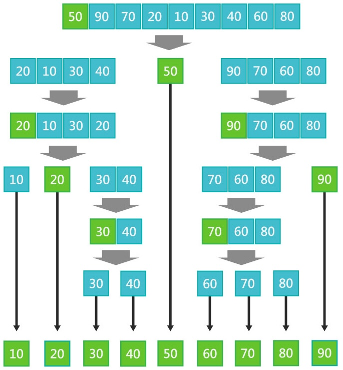
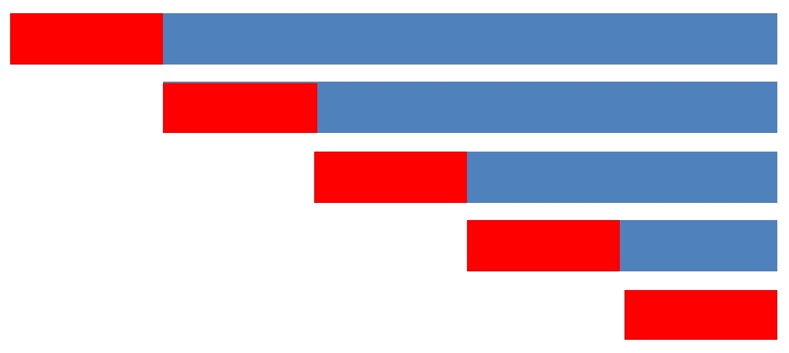
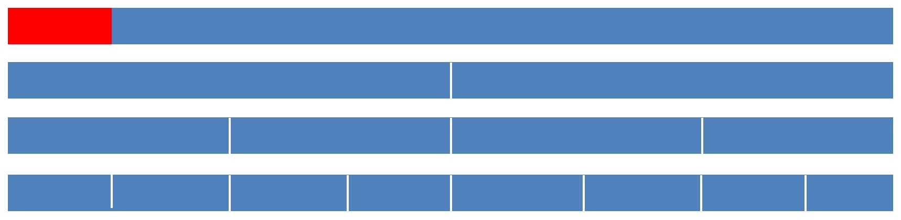
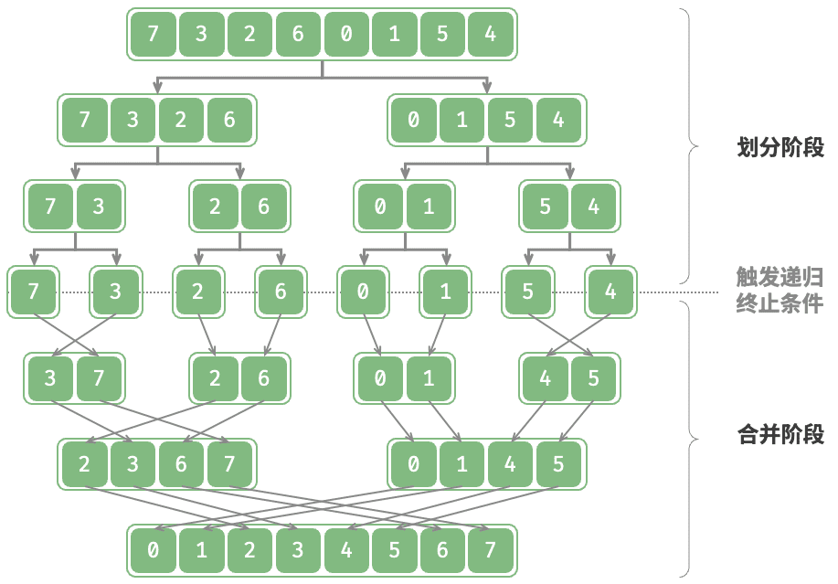
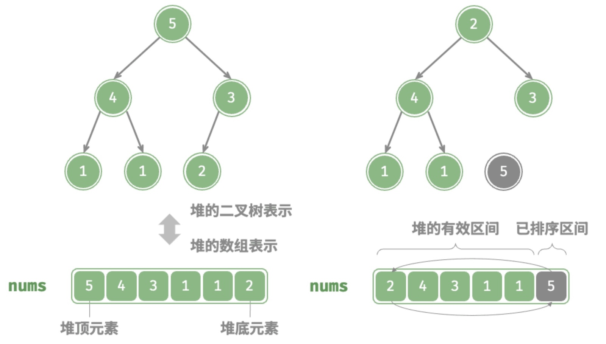

# 更快的排序

> [!note]
>
> 数学上已经证明了，基于比较的排序算法，最坏情况下的最低复杂度就是$O(n\log n)$。

## $n\log n$的排序算法

### 快速排序

快速排序是一种基于分治策略的排序算法：

1. 选择数组中的某个元素作为“基准数”。
2. 将所有小于基准数的元素移到其左侧，而大于基准数的元素移到其右侧。
3. 递归循环处理左右子数组。



```python
def quick_sort(arr):
    n = len(arr)
    if n <= 1:
        return arr
    pivot = arr[0]
    left = []
    right = []
    for i in range(1, n):
        if arr[i] < pivot:
            left.append(arr[i])
        else:
            right.append(arr[i])
    return quick_sort(left) + [pivot] + quick_sort(right)
```

使用栈模拟递归过程

```python
def quick_sort_universal_stack(arr):
    stack = [arr]
    result = []

    while stack:
        item = stack.pop()
        if isinstance(item, list):
            n = len(item)
            if not item:
                continue
            
            if len(item) == 1:
                stack.append(item[0])
                continue

            pivot = item[0]
            left = []
            right = []
            for x in range(1, n):
                if item[x] < pivot:
                    left.append(item[x])
                else:
                    right.append(item[x])
            stack.append(right)  
            stack.append(pivot)   
            stack.append(left)    
        else:
            result.append(item)

    return result
```

最坏时间复杂度，划分极不平衡，每次`pivot`都取得最小值。



* 需要遍历$n$趟。
* 每趟比较的次数从`n-1`到`0`
* 时间复杂度为$O(n^2)$。

最好时间复杂度，每次`pivot`可以将数组分成相等的两部分。



* 遍历的趟数，假设初始序列长度为 $n$，每一趟后规模减半：
  * 第1趟，$\frac{n}{2^1}$。
  * 第2趟，$\frac{n}{2^2}$。
  * …
  * 第H趟，$\frac{n}{2^H}=1$。
  * $2^H=n \Rightarrow H=\log_2n$，遍历的趟数时间复杂的表示为：$O(\log n)$。
* 每趟操作的次数，每次分区只切掉一个元素
  * 第一趟，数组长度为$n$，操作次数$\approx n$。
  * 第二趟，两个长度为$\frac{n}{2}$的子数组，操作总数$\approx \frac{n}{2}+\frac{n}{2}=n$。
  * …
  * 第$i$趟，共有$2^i$个子数组，每个数组的长度为$\frac{n}{2^i}$，操作总数$\sum_{j=1}^{2^i}\frac{n}{2^i}=2^i\cdot\frac{n}{2^i}=n$。
  * 每趟操作的次数均为$n$。
* 所以最好操作的时间复杂度为$O(n\log{n})$。

快速排序为非稳定排序：数组划分时，左边数组和基准数相等的值，可能会被交换至右侧。

> [!think]
>
> 如何使用循环代替递归完成快速排序。

### 归并排序

归并排序（merge sort）是一种基于分治策略的排序算法：

1. 划分阶段：通过递归不断地将数组从中点处分开，将长数组的排序问题转换为短数组的排序问题。
2. 合并阶段：当子数组长度为 1 时终止划分，开始合并，持续地将左右两个较短的有序数组合并为一个较长的有序数组，直至结束。



> [!note]
>
> 归并过程的访问顺序是：
>
> 1. 处理左子树
> 2. 处理右子树
> 3. 合并两个子树。
>
> 上面的处理顺序类似于二叉树后序遍历。

```python
def merge(left, right):
    res = []
    i = j = 0
    while i < len(left) and j < len(right):
        if left[i] < right[j]:
            res.append(left[i])
            i += 1
        else:
            res.append(right[j])
            j += 1
    res.extend(left[i:])
    res.extend(right[j:])
    return res

def merge_sort(arr):
    if len(arr) <= 1:
        return arr
        
    mid = len(arr) // 2
    left = merge_sort(arr[:mid])
    right = merge_sort(arr[mid:])
    
    return merge(left, right)
```

* `res.extend(left[i:])`和`res.extend(right[j:])`是将更长的数组，后面多余的部分拼接上。

> [!tip]
>
> 使用栈模拟递归过程，改写归并排序。

### 堆排序

堆排序（heap sort）是一种基于堆数据结构实现的高效排序算法。一般通过“建堆操作”和“堆顶元素出堆”实现。

设数组的长度为$n$，堆排序的流程为：

1. 输入数组并建立大顶堆。完成后，最大元素位于堆顶。
2. 将堆顶元素（第一个元素）与堆底元素（最后一个元素）交换。完成交换后，推出最后一个元素，即最大值。
3. 将堆顶元素向下调整，重新构造大顶堆。
4. 循环执行第`2.`步和第`3.`步。循环$n-1$轮后，即可完成数组排序。



数组中堆的向下调整

```python
def sift_down(nums, n, i):
    while True:
        l = 2 * i + 1
        r = 2 * i + 2
        ma = i
        if l < n and nums[l] > nums[ma]:
            ma = l
        if r < n and nums[r] > nums[ma]:
            ma = r
        if ma == i:
            break
        nums[i], nums[ma] = nums[ma], nums[i]
        i = ma
```

* `n`表示堆的长度，`i`表示将`i`的值向下调整。

堆排序

```python
def heap_sort(nums):
    for i in range(len(nums) // 2 - 1, -1, -1):
        sift_down(nums, len(nums), i)

    for i in range(len(nums) - 1, 0, -1):
        nums[0], nums[i] = nums[i], nums[0]
        sift_down(nums, i, 0)
```

* 第一个循环创建堆。
* 第二个循环进行排序
  * 排序数组长度为`i`从`n-1`到`1`。
  * 将最大值换到数组最后，使用`sift_down`调整堆。

  堆排序的时间复杂度

1. 建堆操作时间复杂度为$O(n)$。
2. 向下调整时间复杂度为$O(\log n)$。
3. 共循环$n-1$轮。
4. 总体时间复杂度为$O(n\log n)$。

在原数组中排序，空间复杂的为$O(1)$。

非稳定排序：在交换堆顶元素和堆底元素时，相等元素的相对位置可能发生变化。

## 相关问题

> [!think]
>
> 有一个字符串数组，将字符串数组中的每个字符串按照字母排序，之后再将整个字符串数组按照字典顺序排序，求整个操作的时间复杂度？

1. 假设最长的字符串长度为$s$，数组中有$n$个字符串
2. 对每个字符串排序，时间复杂度为$O(s\log s)$。
3. $n$个字符串排序的时间复杂度为$O(ns\log s)$。
4. 将整个字符串数组按照字典顺序排序$O(sn\log n)$（等价于$s$整数的排序算法）。
5. 算法的整体时间复杂度

$$
O(ns\log s)+O(sn\log n)=O(ns\log s+sn\log n)=O(ns(\log s+\log n))
$$

> [!warning]
>
> 上面的算法中$s$和$n$无关，所以任意一个都不能作为常数项忽略

