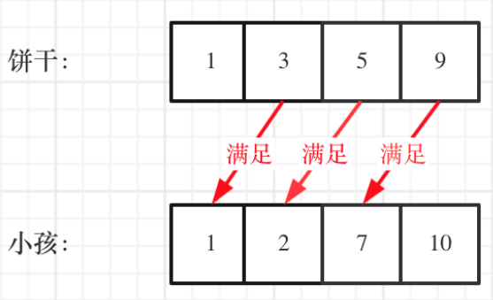
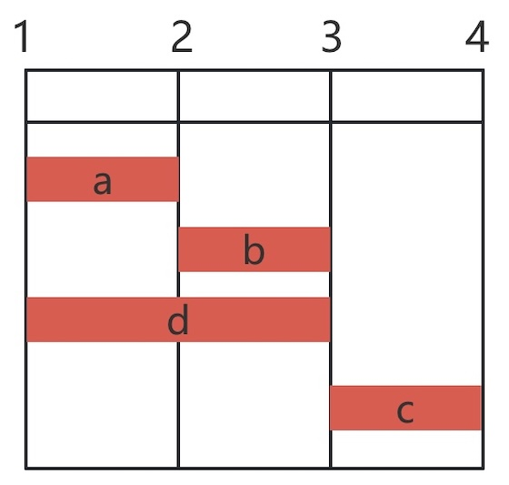

# 贪心算法

贪心算法（greedy algorithm，又称贪婪算法）是指，在对问题求解时，总是做出在当前看来是最好的选择。 也就是说，不从整体最优上加以考虑，算法得到的是在某种意义上的局部最优解。 

> [!alert]
>
> 贪心算法不是对所有问题都能得到整体最优解，关键是确定问题可以用贪心算法解决。

**[455. 分发饼干](https://leetcode.cn/problems/assign-cookies/)**



* 将最大的饼干给胃口最好的小朋友
  * 如果最大的饼干无满足，则该小朋友被放弃。
  * 如果最大的饼干可以满足，则去掉该匹配。
* 以此类推。
* 需要将饼干数组和小朋友数组进行排序。

> [!warning]
>
> 贪心算法通常都需要对数据进行排序。

```python
class Solution:
    def findContentChildren(self, g: List[int], s: List[int]) -> int:
        g.sort(reverse=True)
        s.sort(reverse=True)
        
        child = 0  
        j = 0      
        count = 0  
        
        while child < len(g) and j < len(s):
            if s[j] >= g[child]:
                count += 1
                child += 1
                j += 1
            else:
                child += 1
                
        return count
```

* `s[j] >= g[child]`如果当前最大的饼干能满足当前胃口最大的孩子
  * 去掉该匹配`child += 1`和`j += 1`。
  * 增加一个满足胃口的计数。
* 不能满足，小朋友被放弃。

从最小的角度解决问题

* 优先满足胃口最小的小朋友
  * 如果最小的饼干能满足，则去掉该匹配。
  * 如果最小的饼干无满足，则该饼干无用。
* 以此类推。

```python
class Solution:
    def findContentChildren(self, g: List[int], s: List[int]) -> int:
        g.sort()
        s.sort()
        child = 0
        j = 0
        while child < len(g) and j < len(s):
            if s[j] >= g[child]:
                child += 1
                j += 1
        return child
```

* `s[j] >= g[child]`如果最小的饼干能满足，则去掉该匹配。
* `return child`满足了孩子的数量就是目标结果，剩下的是无法满足的。


**[435. 无重叠区间](https://leetcode.cn/problems/non-overlapping-intervals/)**

* 最少删除多少个区间，等价于最多保留多少个不重叠的区间。
  * 按照区间结尾排序
  * 每次选择结尾最早的，且和前一个区间不重叠的区间。
  * 每次选择结尾最早区间即留给后来者足够大的选择空间




```python
class Solution:
    def eraseOverlapIntervals(self, intervals: List[List[int]]) -> int:
        intervals.sort(key=lambda x: x[1])
        count = 0
        prev_end = float('-inf')
        for start, end in intervals:
            if start >= prev_end:
                prev_end = end
                count += 1
        return len(intervals) - count
```

* `if start >= prev_end`和前面的不重叠则选择。
* 返回`len(intervals) - count`计算需要删除多少个子区间。
* 时间复杂度为排序的时间复杂度。

## 贪心算法的应用

贪心选择性质：在求解问题的过程中，在选择部分最优结果后，不影响后面子问题求解。

验证问题是否满足贪心选择性质比较困难：

* 如果找到反例，则证明问题不满足贪心算法。
* 如果找不到反例，需要用数学归纳法或反正反法证明问题，这个比较困难。

### 贪心算法和动态规划

贪心算法和动态规划都是自底向上解决问题，二者有什么区别是：

* 贪心算法
  * 在当前每一步，都选择眼下看起来最好的那个选项。
  * 选择后不会再回溯，直到选择结束。
* 动态规划
  * 会考虑所有可能的选择，并对比这些选择带来的结果。
  * 先解决子问题，再根据子问题的结果做选择。

> [!think]
>
> 假设要凑齐15 元，纸币面额有 `[1, 5, 11]`：

* 贪心算法：
  1. 先选最大的`11`。
  2. 剩下4元，只能选4个`1`。
  3. 结果：$11 + 1 + 1 + 1 + 1$（5 枚）。
* 动态规划
  1. 凑齐15元
     * 选择1元$\rightarrow$如何凑齐14 元？
     * 选择5元$\rightarrow$如何凑齐10元？
     * 选择11元$\rightarrow$如何凑齐4元？
  2. 如果选三个`5`，只需要3 枚。
  3. 结果：$5 + 5 + 5$（**3 枚**）。

> [!warning]
>
> 贪心算法有可能是整体算法过程的一部分。

## 练习

| 题目名称                                                     |
| ------------------------------------------------------------ |
| [392. 判断子序列](https://leetcode.cn/problems/is-subsequence/) |
