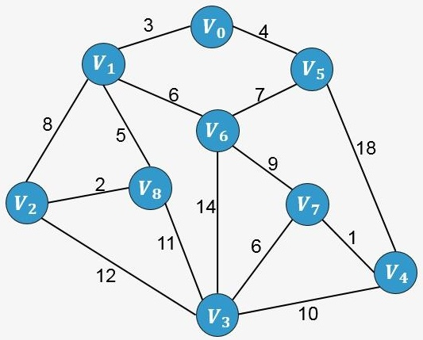
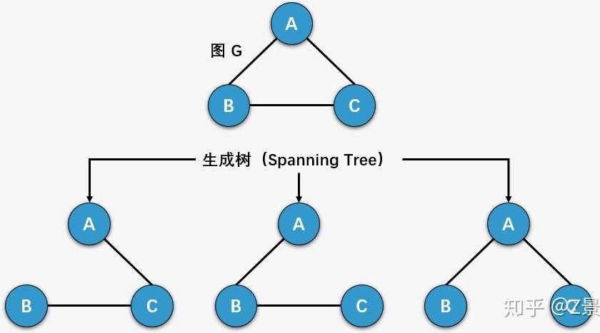
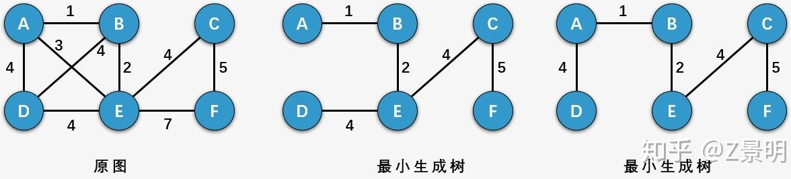
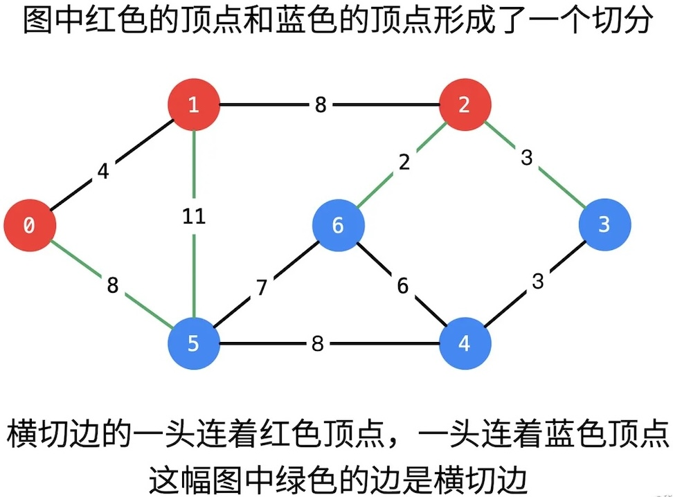
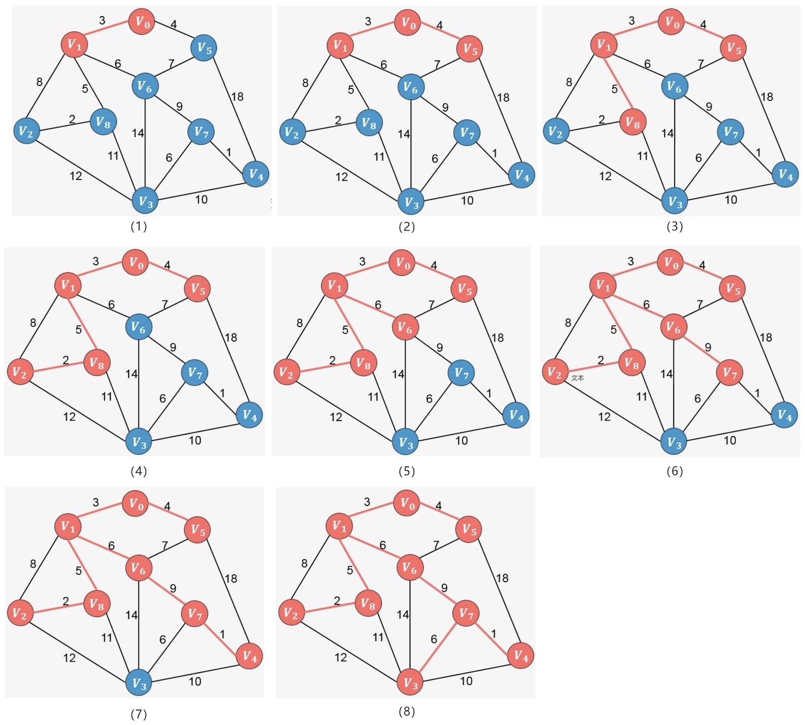

# 最小生成树

## 有权图



每个边上都有权重变量的图称为有权图。有权图可以使用接临矩阵和接临表两种方法实现，下面是有全图的接临表的实现

```python
class GraphAdjList:
    def __init__(self):
        self.adj_list = {}  
    
    def size(self) -> int:
        return len(self.adj_list)
    
    def add_edge(self, vet1, vet2, weight: int = 1):
        if vet1 not in self.adj_list or vet2 not in self.adj_list or vet1 == vet2:
            raise ValueError(f"顶点不存在或相同顶点: {vet1}, {vet2}")
        
        self.adj_list[vet1][vet2] = weight
        self.adj_list[vet2][vet1] = weight
    
    def remove_edge(self, vet1, vet2):
        if vet1 not in self.adj_list or vet2 not in self.adj_list or vet1 == vet2:
            raise ValueError(f"顶点不存在或相同顶点: {vet1}, {vet2}")
        
        self.adj_list[vet1].pop(vet2, None)
        self.adj_list[vet2].pop(vet1, None)
    
    def add_vertex(self, vet):
        if vet in self.adj_list:
            return
        self.adj_list[vet] = {}
    
    def remove_vertex(self, vet):
        if vet not in self.adj_list:
            raise ValueError(f"顶点不存在: {vet}")
        
        for vertex in self.adj_list:
            if vet in self.adj_list[vertex]:
                self.adj_list[vertex].pop(vet)

        self.adj_list.pop(vet)
    
    def print(self):
        print("邻接表（有权图）=")
        for vertex in self.adj_list:
            edges = [f"{v}({w})" for v, w in self.adj_list[vertex].items()]
            print(f"{vertex}: {edges},")
    
    def get_vertices(self):
        return list(self.adj_list.keys())
    
    def get_neighbors(self, vet):
        if vet not in self.adj_list:
            raise ValueError(f"顶点不存在: {vet}")
        return [(neighbor, weight) for neighbor, weight in self.adj_list[vet].items()]
    
    def get_edge_weight(self, vet1, vet2) -> int:
        if vet1 not in self.adj_list or vet2 not in self.adj_list[vet1]:
            raise ValueError(f"边不存在: {vet1}-{vet2}")
        return self.adj_list[vet1][vet2]
    
    def has_edge(self, vet1, vet2) -> bool:
        return vet1 in self.adj_list and vet2 in self.adj_list[vet1]
```

## 生成树

一个连通图的生成树是一个极小的连通子图，它包含图中全部的n个顶点，但只有构成一棵树的n-1条边。



生成树的属性：

- 一个连通图可以有多个生成树；
- 一个连通图的所有生成树都包含相同的顶点个数和边数；
- 生成树当中不存在环；
- 移除生成树中的任意一条边都会导致图的不连通， 生成树的边最少特性；
- 在生成树中添加一条边会构成环。
- 对于包含$n$个顶点的连通图，生成树包含$n$个顶点和$n-1$条边；
- 对于包含$n$个顶点的无向完全图最多包含$n^{n-2}$颗生成树。

### 最小生成树

 有权图的最小生成树，就是原图中边的权值最小的生成树 ，所谓最小是指边的权值之和小于。



* 找到$n-1$条边。
* $n-1$条边链接$n$个顶点。
* 总权重值最小。

> [!important]
>
> 最小生成树一定是针对有权的无向、联通图。

最小生成树的应用：

* 电缆的设计
* 网络的设计
* 电路的设计

### 切分定理

把图中的结点分为两个部分，称为一个切分（Cut）。如果一个边的两个端点，属于切分（Cut）不同的两边，这个边称为横切边（Crossing Edge）。



切分定理：在一幅加权图中，给定任意切分，所有横切边中权重最小的边一定属于图的最小生成树。

> [!important]
>
> 对于任意切分，最短的横切边一定属于最小生成树。

## 最小生成树算法

### Lazy Prim算法



* 使用最小堆来保存所有可选边，每次取值即可选择最小的权重。
* 所有边都需要进入最小堆，如果不是横切边处理跳过。

算法实现

```python
import heapq

class LazyPrimMST:
    def __init__(self, graph):
        self.graph = graph
        self.visited = set()
        self.pq = []  
        self.mst_edges = [] 
        self.total_weight = 0
    
    def _visit(self, vertex):
        self.visited.add(vertex)
        
        for neighbor, weight in self.graph.get_neighbors(vertex):
            if neighbor not in self.visited:
                heapq.heappush(self.pq, (weight, vertex, neighbor))
    
    def find_mst(self, start_vertex=None):
        # 选择起始顶点
        if start_vertex is None:
            vertices = self.graph.get_vertices()
            if not vertices:
                raise ValueError("图为空")
            start_vertex = vertices[0]
        
        # 初始化
        self.visited.clear()
        self.pq.clear()
        self.mst_edges.clear()
        self.total_weight = 0
        
        # 从起始顶点开始
        self._visit(start_vertex)
        
        # 主循环
        num_vertices = self.graph.size()
        while self.pq and len(self.mst_edges) < num_vertices - 1:
            # 弹出最小权重的边
            weight, u, v = heapq.heappop(self.pq)
            
            # 懒惰检查：如果两个端点都已访问，跳过
            if u in self.visited and v in self.visited:
                continue
            
            # 将边加入MST
            self.mst_edges.append((u, v, weight))
            self.total_weight += weight
            
            # 访问未访问的顶点
            new_vertex = v if v not in self.visited else u
            self._visit(new_vertex)
        
        # 检查是否找到MST
        if len(self.mst_edges) != num_vertices - 1:
            raise ValueError(f"图不连通，无法生成最小生成树。"
                           f"找到{len(self.mst_edges)}条边，需要{num_vertices - 1}条边")
        
        return self.mst_edges, self.total_weight
    
    def print_mst(self):
        print("\n最小生成树结果：")
        print("=" * 50)
        for u, v, w in self.mst_edges:
            print(f"  {u} -- {v} \t权重: {w}")
        print(f"\n最小生成树总权重: {self.total_weight}")
        print("=" * 50)
```

算法的时间复杂的度

| 操作           | 次数   | 每次复杂度   | 总复杂度     |
| :------------- | :----- | :----------- | :----------- |
| 将边加入堆     | $O(E)$ | $O(\log E)$  | $O(E\log E)$ |
| 从堆中弹出边   | $O(E)$ | $O(\log E)$  | $O(E\log E)$ |
| 检查边是否有效 | $O(E)$ | $O(1)$       | $O(E)$       |
| 访问顶点       | $O(V)$ | $O(\deg(V))$ | $O(E)$       |

总体时间复杂度为$O(E\log E)$

* 稀疏图：$E \approx  V$
* 稠密图：$E \approx  V^2$

### 其它算法

1. Prime算法，需要使用最小索引堆（Index Min Heap）数据结构实现。
2. Kruskal算法，需要使用并查集（Union-Find）数据结构实现。
