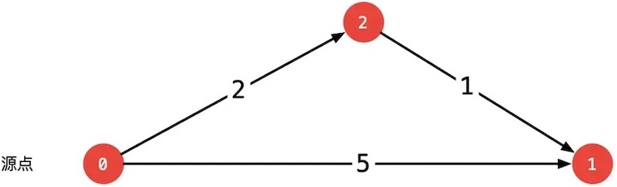
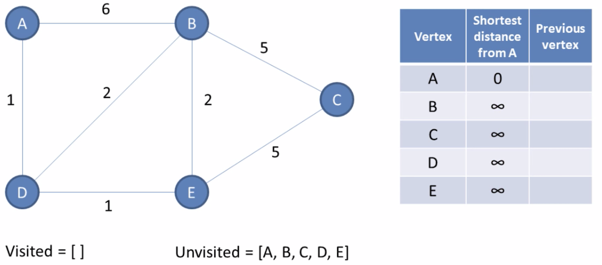
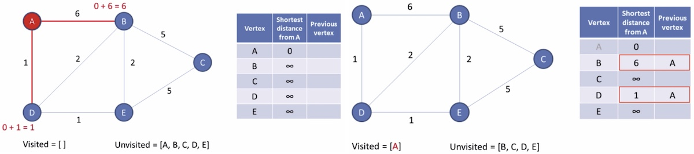
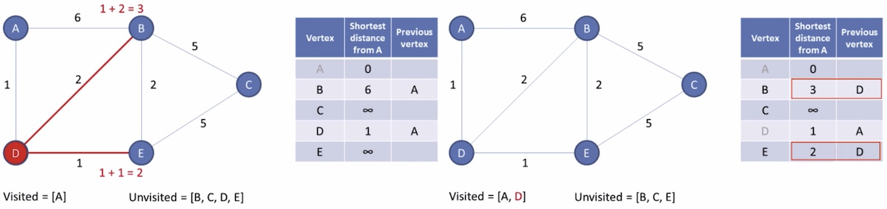
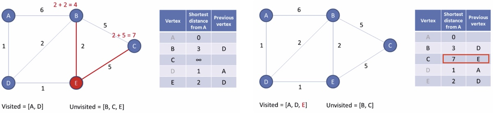
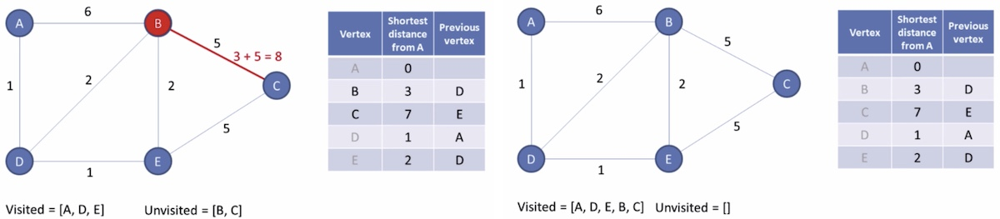

# 最短路径

从一个节点到另一个节点，耗费最小的路径。

单源最短路径：给定一个带权图和一个起点，找出从该起点到图中所有其他顶点的最短路径。这些路径构成了一棵树，称为最短路径树，最短路径树也是一颗生成树。

> [!warning]
>
> 最小生成树是全局最优，最短路径是单目标最优：最短路径树$\ne$最小生成树。
>
> 1. 最小生成树是：连通所有点总代价最小。
> 2. 最短路径是：找两个特定节点之间的单条代价最小的路径。例如：A为起点，每个点到A距离最小。

在最短路径问题中，权重可以是距离、时间、油耗、过路费、红绿灯数量等信息。最短路径的应用：

1. 地图导航：计算从当前位置到目的地的最短。
2. 航班规划：最少经停或最短飞行时间。
3. 物流配送：快递员从仓库到多个客户的最优路线。

## 最短路径算法

### 松弛操作（Relaxation）

从0点出发，经过2到1，比从0到1的消耗更小。松弛操作实际上找到了一条更短的路径。



* $\text{dist}[v]$：当前从源点 $s$ 到顶点 $v$的最短距离估计值。
* $w(u,v)$：边$(u,v)$的权重。

$$
\text{dist}[v]=\min(\text{dist}[v], \text{dist}[u]+w(u,v))
$$

> [!important]
>
> 在三角形中两边之和大于第三边，松弛操作表上看是找到了一个绕道的路径，因此称为松弛操作。

### Dijkstra算法

迪杰斯特拉（Dijkstra）算法，由计算机科学家Dijkstra提出，用于解决单源最短路径问题。

> [!warning]
>
> Dijkstra算法前提是，图中不能有负权边。

1. 初始状态，所有的最短路初始化为无穷。



2. 从起点开始选择最短路径



3. 从最近的接临点中选择最短路径



4. 重复上面的过程



5. 直到未访问的节点为空



代码实现

```python
class Dijkstra:    
    def __init__(self, graph):
        self.graph = graph
        self.INFINITY = float('inf')
    
    def shortest_path(self, source):
        vertices = self.graph.get_vertices()
        if source not in vertices:
            raise ValueError(f"源点 {source} 不存在")
        
        # 初始化
        dist = {v: self.INFINITY for v in vertices}
        prev = {v: None for v in vertices}
        dist[source] = 0
        
        # 最小堆: (距离, 顶点)
        pq = [(0, source)]
        visited = set()
        
        # Dijkstra 主循环
        while pq:
            current_dist, current = heapq.heappop(pq)
            
            if current in visited:
                continue
            
            visited.add(current)
            
            # 遍历所有邻居
            for neighbor, weight in self.graph.get_neighbors(current):
                if neighbor in visited:
                    continue
                
                new_dist = current_dist + weight
                
                if new_dist < dist[neighbor]:
                    dist[neighbor] = new_dist
                    prev[neighbor] = current
                    heapq.heappush(pq, (new_dist, neighbor))
        
        # 构建结果
        result = {}
        for v in vertices:
            if dist[v] == self.INFINITY:
                result[v] = (self.INFINITY, [])
            else:
                path = self._reconstruct_path(prev, source, v)
                result[v] = (dist[v], path)
        
        return result
    
    def _reconstruct_path(self, prev, source, target):
        path = []
        current = target
        
        while current is not None:
            path.append(current)
            current = prev[current]
        
        path.reverse()
        
        if path and path[0] == source:
            return path
        return []
    
    def print_shortest_paths(self, source):
        print(f"\n{'='*60}")
        print(f"Dijkstra 算法结果 (源点: {source})")
        print(f"{'='*60}")
        
        result = self.shortest_path(source)
        
        for vertex, (distance, path) in result.items():
            if distance == self.INFINITY:
                print(f"{vertex}: 不可达")
            else:
                path_str = " -> ".join(path)
                print(f"{vertex}: {distance:3d} | 路径: {path_str}")
```

