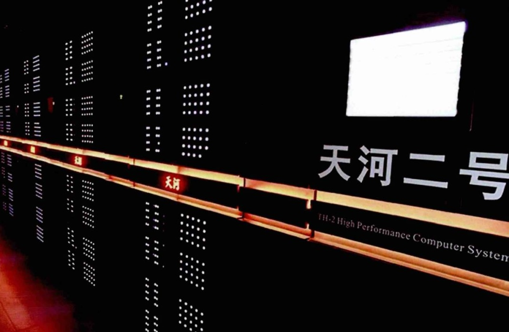

# 算法的复杂度

> [!tip]
>
> 如果$a+b+c=1000$，且$a^2+b^2=c^2$。$a,b,c$ 为自然数，求出所有$a,b,c$可能的组合?

利用条件$a+b+c=1000$，优化算法。

```python
%%time
for a in range(1001):
    for b in range(1001):
        c = 1000 - a - b
        if a**2 + b**2 == c**2:
            print(a, b, c)
```

对于同一问题，给出了两种解决算法，在两种算法的实现中，通过对程序执行的时间进行了测算，发现两段程序执行的时间相差悬殊。

> [!think]
>
> 算法程序的执行时间是否可以反应出算法的效率，即算法的优劣？



只考虑运算时间，不考虑计算机的性能，无法评价算法的性能。

## 衡量算法的时间效率

假定计算机执行算法时，每一个基本操作的时间是一个固定的时间单位，那么有多少个基本操作，就代表会花费多少时间单位，由此可以忽略机器环境的影响，而客观的反应算法的时间效率。
$$
\text{代码执行总时间}=\text{操作步骤数量}\times\text{操作步骤执行时间}
$$

> [!note]
>
> 衡量算法的时间效率主要标准是操作步骤数量。

算法一

```python
for a in range(1001):
    for b in range(1001):
        for c in range(1001):
            if a**2 + b**2 == c**2 and a + b + c == 1000:
                print(a, b, c)
```

1. $\underbrace{\overbrace{\overbrace{a+b} + c } == 1000} $ 操作步骤为3次。
2. $\underbrace{\underbrace{\overbrace{a**2}  + \overbrace{b**2} }  == \overbrace{c**2}} $操作步骤为5次。
3. `print(a, b, c)`操作步骤为1次。
4. 所以每个循环的操作步骤为：$3+5+1=9$次。
5. 代码操作的总步骤：$1001\times1001\times1001\times9$次。

算法二

```python
for a in range(1001):
    for b in range(1001):
        c = 1000 - a - b
        if a**2 + b**2 == c**2:
            print(a, b, c)
```

1. $\underbrace{c = \overbrace{\overbrace{1000 - a}  - b}}$操作步骤为3次。
2. $\underbrace{\underbrace{\overbrace{a**2}  + \overbrace{b**2} }  == \overbrace{c**2}} $操作步骤为5次。
3. `print(a, b, c)`操作步骤为1次。
4. 所以每个循环的操作步骤为：$3+5+1=9$次。
5. 代码操作的总步骤：$1001\times1001\times9$次。

从执行步骤数量来看，算法二优于算法一。

> [!think]
>
> 如果题目的条件$a+b+c=2000$或$a+b+c=3000$时，该问题循环的次数是否会发生变化？

这里的1000、2000和3000是一个变化的量称之为**问题规模**，用n表示。

* 算法一的计算步骤：$n^3\times9$。
* 算法二的计算步骤：$n^2\times9$。

算法的计算步骤是关于问题规模的函数
$$
T=f(n)=n^3\times9
$$
上面的函数可以表示算法随着问题规模不断变化，计算步骤发生变化的主要趋势。

## 时间复杂度

对于一个算法，$n$表示数据规模，$O(f(n))$表示运行算法所需要执行的指令数和 $f(n)$ 成正比。

| 名称   | 所需指令数   | 所需指令数复杂度 |
| ------ | ------------ | ---------------- |
| 算法一 | $n^3\times9$ | $O(n^3)$         |
| 算法二 | $n^2\times9$ | $O(n^2)$         |

其中9均为常量，随着$n$值变大，常量对算法的指令数影响可以忽略。

比较两个算法

1. 算法一：$O(n)$ 所需指令数为  $10000 \times n^2$
2. 算法二：$O(n^2)$ 所需指令数  $10 \times n^3$

| $n$     | 算法一的指令数 | 算法二的指令数 | 算法一是算法二的倍数 |
| ------- | -------------- | -------------- | -------------------- |
| $10$    | $10^6$         | $10^4$         | 100                  |
| $100$   | $10^8$         | $10^7$         | 10                   |
| $1000$  | $10^{10}$      | $10^{10}$      | 1                    |
| $10000$ | $10^{12}$      | $10^{13}$      | 0.1                  |
| $10^5$  | $10^{14}$      | $10^{16}$      | 0.01                 |
| $10^6$  | $10^{16}$      | $10^{19}$      | 0.001                |

> [!warning]
>
> 当数据规模 $n$ 达到一定临界点，时间复杂度低的算法一定会比时间复杂度高的算法快，而且数据规模 $n$ 越大效果越明显。

算法的目标就是处理大量数据。

### 时间复杂度的计算

1. 基本操作，认为其时间复杂度为$O(1)$。

   1. 操作$\underbrace{\text{sum}=\overbrace{100+200}}$步骤为2次。
   2. 操作$\underbrace{\text{sum}=\overbrace{\overbrace{200^2} +\overbrace{1000^2}}}  $步骤为4次。
   3. 上面的两个操作与问题的规模无关，不会随着问题规模的变化而改变，所以时间复杂度表示为$O(1)$。

2. 顺序结构，时间复杂度按加法进行计算。

   ```python
   a = 100
   b = 200
   c = a + b
   ```

   * 操作1、2、3的时间复杂度均为$O(1)$。
   * 将上面的三步时间复杂度相加，执行次数仍然是恒定的算法，与问题规模的大小无关。所以时间复杂度为$O(1)$

3. 循环结构，时间复杂度按乘法进行计算。

   ```python
   for i in range(n):
     	print(i)
   ```

   * 程序的执行次数随n的变化而变化，时间复杂度是$O(n)$。

4. 分支结构，时间复杂度取最大值。

   ```mermaid
   flowchart
       a([开始])-->b{if 条件}--True-->c(O_n)-->e([结束])
       b--False-->f(O_n^2)-->e
   ```

   * 


在算法理论中，$O(f(n))$ 算法复杂度，表示算法执行的上界。在实践中，$O(f(n))$ 表示算法执行的下界。

### 理解数据规模的概念

计算 $O(n)$ 算法在不同规模下所需的时间

```cpp
#include <iostream>
#include <cmath>
#include <vector>

using namespace std;

int main() {
    for (int x = 0; x <= 9; x++) {
        int n = pow(10, x);

        clock_t start = clock();
        int sum = 0;
        for (int i = 0; i < n; i++) {
            sum += i;
        }
        clock_t end = clock();

        cout << "10 ^ " << x << " = " << n << " Time: " << (double)(end - start) / CLOCKS_PER_SEC << "s" << endl;
    }
}
```

如果想在1秒内解决问题，当算法复杂度为 $O(n^2)$ 使用C++语言，处理数据规模大约在$10^4$ 左右（根据个人计算机性能）。

### 常见代码模式的复杂度

1. 交换两个数据，时间复杂度为 $O(1)$​。

```cpp
void swap(int &a, int &b) {
    int temp = a;
    a = b;
    b = temp;
}
```

2. 计算n个整数的和，时间复杂度为 $O(n)$。

```cpp
int sum(int n) {
    int sum = 0;
    for (int i = 0; i < n; i++) {
        sum += i;
    }
    return sum;
}
```

3. 将字符串进行反转，时间复杂度为 $O(n)$​。

```cpp
# include <string>
using namespace std;

void reverse(string &s) {
    int n = s.size();
    for (int i = 0; i < n / 2; i++) {
        swap(s[i], s[n - i - 1]);
    }
}
```

4. 选择排序算法，时间复杂度为 $O(n^2)$。

```cpp
void selectionSort(int arr[], int n) {
    for (int i = 0; i < n; i++) {
        int minIndex = i;
        for (int j = i + 1; j < n; j++) {
            if (arr[j] < arr[minIndex]) {
                minIndex = j;
            }
        }
        swap(arr[i], arr[minIndex]);
    }
}
```

选择排序算法时间复杂度计算
$$
(n-1)+(n-2)+(n-3)+…+0=\frac{(0+n-1)\times n}{2}
=\frac{1}{2}n^2-\frac{1}{2}n=O(n^2)
$$
其中 $n$ 复杂度远小于 $n^2$​。

有双重循环的算法一般复杂度是 $O(n^2)$​。

```cpp
void printInformatio(int n) {
    for (int i = 0; i < n; i++) {
        for (int j = 0; i < 30; i++) {
            cout << "Class" << i << " - " << "No. " << j << endl;
        }
    }
}
```

算法执行的基本操作是 $30\times n$，时间复杂度为 $O(n)$​。

5. 二分查找法，时间复杂度为 $O(\log n)$。

```cpp
int binarySearch(int arr[], int n, int x) {
    int left = 0;
    int right = n - 1;
    while (left <= right) {
        int mid = left + (right - left) / 2;
        if (arr[mid] == x) {
            return mid;
        }
        if (arr[mid] < x) {
            left = mid + 1;
        } else {
            right = mid - 1;
        }
    }
    return -1;
}
```

二分查找法的搜索次数


这个过程等价于 $n$ 经过多少次除以2后，等于1，即 $\log_2n=O(\log n)$

> [!warning]
>
> 不同底的对数之间只差一个常数，所以对数复杂度可以统一表示为 $O(\log n)$。

## 空间复杂度

多开辟一个辅助数组，空间复杂度为 $O(n)$

多开辟一个辅助的二维数组，空间复杂度为 $O(n^2)$

多开辟常数空间，复杂度为 $O(1)$

> [!attention]
>
> 递归调用是有空间代价的


