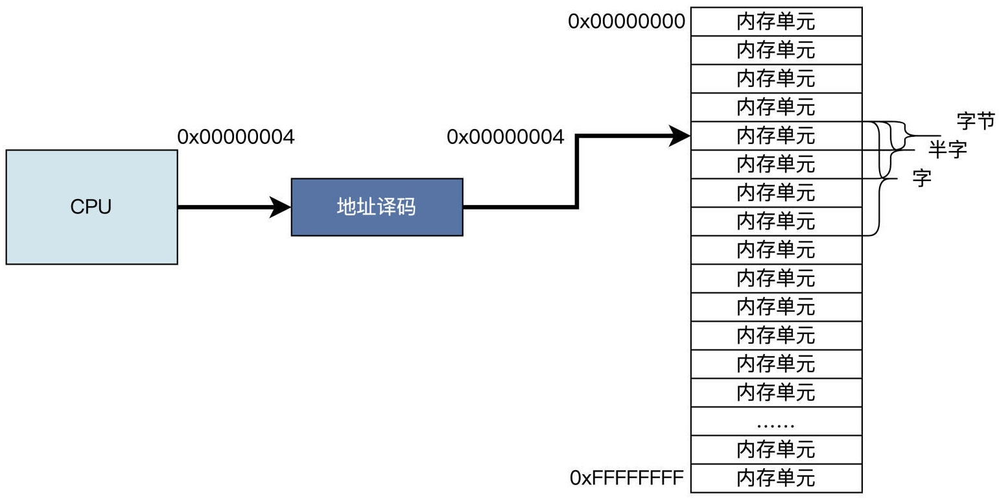
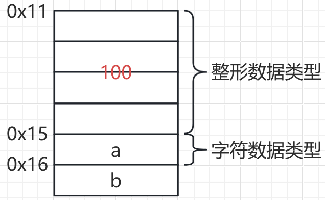
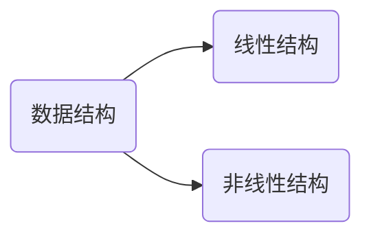
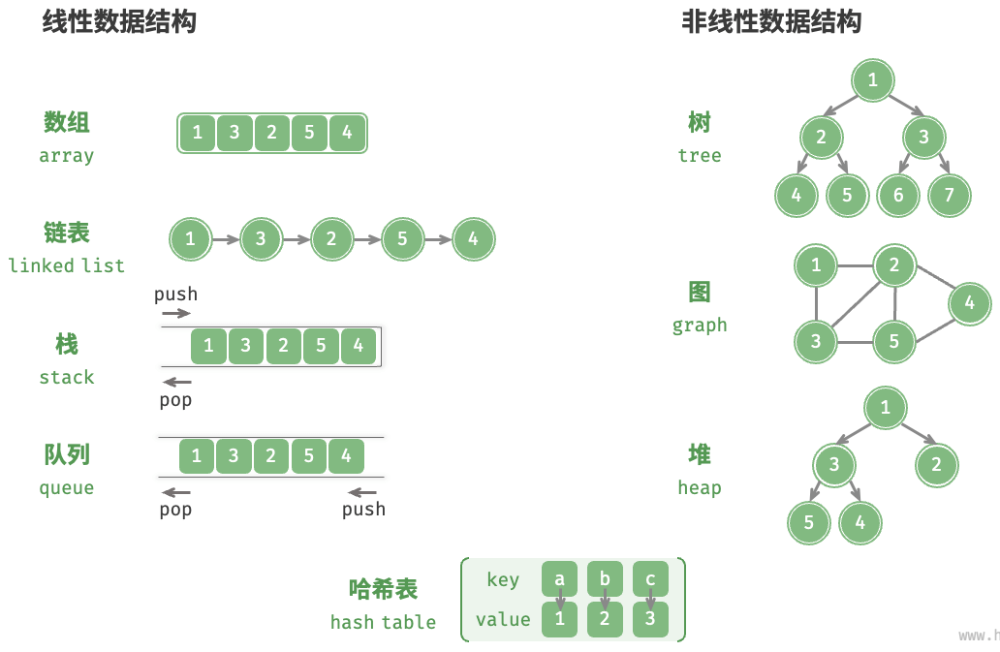

# 数据结构概述

计算机存储、组织数据的方式。数据结构是指相互之间，存在一种或多种特定关系的数据元素的集合。通常情况下，精心选择的数据结构可以带来更高的运行或者存储效率 , 数据结构往往同高效的算法有关。

使用列表存储和查找数据

```python
students = [
    {'id': '2024001', 'name': '张三', 'major': '计算机'},
    {'id': '2024002', 'name': '李四', 'major': '数学'},
    {'id': '2024003', 'name': '王五', 'major': '物理'},
]

for student in students:
    if student['id'] == '2024003':
        print(student)
```

* 根据`id`查找数据时，时间复杂度为$O(n)$

使用字典存储和查找数据

```python
students = {
    '2024001': {'name': '张三', 'major': '计算机'},
    '2024002': {'name': '李四', 'major': '数学'},
    '2024003': {'name': '王五', 'major': '物理'}
}

print(students['2024003'])
```

* 查找数据的时间复杂度为$O(1)$。

> [!note]
>
> 相同的数据，用不同的数据结构存储，存储效率是不同的。

数据结构和算法都是为了提高程序的运行效率：

* 数据结构只是静态的描述了数据元素之间的关系。
* 高效的程序需要在数据结构的基础上设计和选择算法。


> [!note]
>
> 算法是为了解决实际问题而设计的，数据结构是算法需要处理问题的载体。

## 内存结构

比特（bit）是计算机中最小的数据单位，一个比特位只有0 或1两个状态。字节（Byte）是内存基本单位，一个字节等于8个比特。每个内存的基本存储空间都有自己的地址。



内存寻址空间

1. 32位内存空间，地址总线有32根，每根线可以表示0或1。
   * 二进制范围：0到$2^{32}-1$。
   * 十进制容量：约4GB。
   * 16进制表示：
     - 起始地址： `0x00000000`
     - 结束地址： `0xFFFFFFFF`
2. 64位内存空间。址总线有64根。
   * 二进制范围：0到$2^{64}-1$。
   * 十进制容量：约16EB（1EB = 1024PB，1PB = 1024TB）
   * 16 进制表示：
     - 起始地址：`0x0000000000000000`
     - 结束地址：`0xFFFFFFFFFFFFFFFF`
   * 大多数现代64位CPU实际上只使用了48位或52位来进行物理寻址，48位的寻址空间也达到了256TB。

常见的数据空间

* 整形`int`：C/C++、java中一般是4个字节或8个字节。Python中整形是动态长度，没有固定的字节限制。
* 字符`char`：大小完全取决于使用的“编码方式”。
  * ASCII编码，固定1个字节，只能表示128个字符。
  * UTF-8编码，变长编码，1到4个字节。
    * 英文字符，占1 个字节，完全兼容ASCII编码。
    * 大部分中文字符，占3个字节。
    * 表情符号（Emoji）占4个字节。

> [!warning]
>
> UTF-8使用编码前缀，表示字符占几个字节。

| 字节长度 | 字节首部特征 (二进制) | 字节内容结构                          |
| -------- | --------------------- | ------------------------------------- |
| 1字节    | `0...`                | `0xxxxxxx` （兼容 ASCII）             |
| 2字节    | `110..`               | `110xxxxx 10xxxxxx`                   |
| 3字节    | `1110.`               | `1110xxxx 10xxxxxx 10xxxxxx`          |
| 4字节    | `11110`               | `11110xxx 10xxxxxx 10xxxxxx 10xxxxxx` |

数据在内存中的存储



## 数据结构的类型



* 线性结构就是表中各个结点具有线性关系，线性结构的特点：
  1. 线性结构是非空集。
  2. 线性结构所有结点都最多只有一个直接前驱结点和一个直接后继结点。
* 非线性结构就是表中各个结点之间具有多个对应关系，非线性结构的特点
  1. 非线性结构是非空集。
  2. 非线性结构的一个结点可能有多个直接前驱结点和多个直接后继结点。



> [!warning]
>
> 哈希表一般被看做一种非线性结构。
