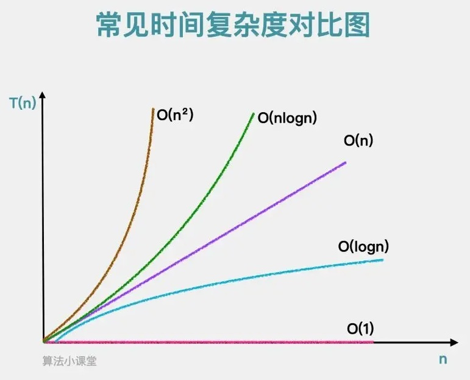

# 算法的复杂度

## 时间复杂度

> [!note]
>
> 算法的时间复杂度 $O$ 表示什么？

对于一个算法，$n$ 表示数据规模，$O(f(n))$ 表示运行算法所需要执行的指令数和 $f(n)$ 成正比。

| 名称                    | 复杂度        | 所需指令数          |
| ----------------------- | ------------- | ------------------- |
| 二分查找法              | $O(\log n)$   | $a \times \log n$   |
| 寻找数组中的最大/最小值 | $O(n)$        | $b \times n$        |
| 归并排序算法            | $O(n \log n)$ | $c \times n \log n$ |
| 选择排序算法            | $O(n^2)$      | $d \times n^2$      |

其中 $a, b, c, d$ 均为常量，随着 $n$ 值变大常量对算法的指令数影响可以忽略。

比较两个算法

1. 算法一：$O(n)$ 所需指令数为  $10000 \times n$
2. 算法二：$O(n^2)$ 所需指令数  $10 \times n^2$

| $n$     | 算法一的指令数 | 算法二的指令数 | 倍数  |
| ------- | -------------- | -------------- | ----- |
| $10$    | $10^5$         | $10^3$         | 100   |
| $100$   | $10^6$         | $10^5$         | 10    |
| $1000$  | $10^7$         | $10^7$         | 1     |
| $10000$ | $10^8$         | $10^9$         | 0.1   |
| $10^5$  | $10^9$         | $10^{11}$      | 0.01  |
| $10^6$  | $10^{10}$      | $10^{13}$      | 0.001 |

> [!warning]
>
> 当数据规模 $n$ 达到一定临界点，时间复杂度低的算法一定会比时间复杂度高的算法快，而且数据规模 $n$ 越大效果越明显。

算法的目标就是处理大量数据。



在算法理论中，$O(f(n))$ 算法复杂度，表示算法执行的上界。在实践中，$O(f(n))$ 表示算法执行的下界。

### 理解数据规模的概念

计算 $O(n)$ 算法在不同规模下所需的时间

```c++
#include <iostream>
#include <cmath>
#include <vector>

using namespace std;

int main() {
    for (int x = 0; x <= 9; x++) {
        int n = pow(10, x);

        clock_t start = clock();
        int sum = 0;
        for (int i = 0; i < n; i++) {
            sum += i;
        }
        clock_t end = clock();

        cout << "10 ^ " << x << " = " << n << " Time: " << (double)(end - start) / CLOCKS_PER_SEC << "s" << endl;
    }
}
```

如果想在1秒内解决问题，当算法复杂度为 $O(n^2)$ 使用C++语言，处理数据规模大约在$10^4$ 左右（根据个人计算机性能）。

### 常见代码模式的复杂度

1. 交换两个数据，时间复杂度为 $O(1)$​。

```c++
void swap(int &a, int &b) {
    int temp = a;
    a = b;
    b = temp;
}
```

2. 计算n个整数的和，时间复杂度为 $O(n)$。

```c++
int sum(int n) {
    int sum = 0;
    for (int i = 0; i < n; i++) {
        sum += i;
    }
    return sum;
}
```

3. 将字符串进行反转，时间复杂度为 $O(n)$​。

```c++
# include <string>
using namespace std;

void reverse(string &s) {
    int n = s.size();
    for (int i = 0; i < n / 2; i++) {
        swap(s[i], s[n - i - 1]);
    }
}
```

4. 选择排序算法，时间复杂度为 $O(n^2)$。

```c++
void selectionSort(int arr[], int n) {
    for (int i = 0; i < n; i++) {
        int minIndex = i;
        for (int j = i + 1; j < n; j++) {
            if (arr[j] < arr[minIndex]) {
                minIndex = j;
            }
        }
        swap(arr[i], arr[minIndex]);
    }
}
```

选择排序算法时间复杂度计算
$$
(n-1)+(n-2)+(n-3)+…+0=\frac{(0+n-1)\times n}{2}
=\frac{1}{2}n^2-\frac{1}{2}n=O(n^2)
$$
其中 $n$ 复杂度远小于 $n^2$​。

有双重循环的算法一般复杂度是 $O(n^2)$​。

```c++
void printInformatio(int n) {
    for (int i = 0; i < n; i++) {
        for (int j = 0; i < 30; i++) {
            cout << "Class" << i << " - " << "No. " << j << endl;
        }
    }
}
```

算法执行的基本操作是 $30\times n$，时间复杂度为 $O(n)$​。

5. 二分查找法，时间复杂度为 $O(\log n)$。

```c++
int binarySearch(int arr[], int n, int x) {
    int left = 0;
    int right = n - 1;
    while (left <= right) {
        int mid = left + (right - left) / 2;
        if (arr[mid] == x) {
            return mid;
        }
        if (arr[mid] < x) {
            left = mid + 1;
        } else {
            right = mid - 1;
        }
    }
    return -1;
}
```

二分查找法的搜索次数


这个过程等价于 $n$ 经过多少次除以2后，等于1，即 $\log_2n=O(\log n)$

> [!warning]
>
> 不同底的对数之间只差一个常数，所以对数复杂度可以统一表示为 $O(\log n)$。

## 空间复杂度

多开辟一个辅助数组，空间复杂度为 $O(n)$

多开辟一个辅助的二维数组，空间复杂度为 $O(n^2)$

多开辟常数空间，复杂度为 $O(1)$

> [!attention]
>
> 递归调用是有空间代价的


### 算法问题从何处着手

1. 理解算法的规则。
2. 明确算法中所使用变量的定义。
3. 注意边界值。

二分查找法：

1. 在已排序数组中查找特定元素。
2. 通过反复将搜索区间划分为两半，并确定目标值可能在哪一半中，从而将搜索范围缩小一半。
3. 这个过程不断重复，直到找到目标值或确定目标值不在数组中。


> [!note]
>
> * 二分查找法师1964年提出的。
> * 第一个没有bug的二分查找法在1962年才出现。

```python
def binary_search(arr, target):
    l = 0
    r = len(arr) - 1  # 在 [left ... right] 的范围里寻找 target
    while l <= r:  # 当 l == r 时，区间 [l...r] 依然是有效的
        mid = (l + r) // 2
        if arr[mid] == target:
            return mid
        elif target > arr[mid]:
            l = mid + 1  # target在 [mid+1 ... r] 中
        else:  # target < arr[mid]
            r = mid - 1  # target在 [l ... mid-1] 中
    return -1
  
if __name__ == '__main__':
    arr = [1, 2, 3, 4, 5]
    target = 2
    result = binary_search(arr, target)
    print(result)
```

> [!warning]
>
> 循环不变量（Loop Invariant）是在程序循环中为真的性质或条件。它是一个逻辑表达式，它在每次迭代循环时保持不变。

修改值的定义

```python
def binary_search(arr, target):
    l = 0
    r = len(arr)  # 在 [left ... right) 的范围里寻找 target
    while l < r:  # 当 l == r 时，区间 [l...r) 是无效的 [7, 7)
        mid = (l + r) // 2   # l + (r - l) // 2 防止溢出 
        if arr[mid] == target:
            return mid
        elif target > arr[mid]:
            l = mid + 1  # target在 [mid+1 ... r) 中
        else:  # target < arr[mid]
            r = mid  # target在 [l ... mid) 中
    return -1
```

> [!warning]
>
> 算法测试中注重小数据量的调试。

### 算法面试题

LeetCode 283，27

给定一个数组 `nums`，编写一个函数将所有 `0` 移动到数组的末尾，同时保持非零元素的相对顺序。

```markdown
输入: nums = [0, 1, 0, 3, 12]
输出: [1, 3, 12, 0, 0]
```

1. 基本思路

```python
class Solution(object):
    def moveZeroes(self, nums):
        nonZero = []
        for num in nums:
            if num:
                nonZero.append(num)

        result = [0 for _ in nums]
        for index, num in enumerate(nonZero):
            result[index] = num

        for index, num in enumerate(nums):
            nums[index] = result[index]

if __name__ == '__main__':
    nums = [0, 1, 0, 3, 12]
    Solution().moveZeroes(nums)
    print(nums)
```

算法的时间复杂度和空间复杂度都是 $O(n)$

2. 原地移动操作

```python
class Solution(object):
    def moveZeroes(self, nums):
        k = 0  # nums 中, [0...k)的元素均为非0元素
        for num in nums:
            if num:
                nums[k] = num
                k += 1

        for i in range(k, len(nums)):
            nums[i] = 0
```

3. 使用数据交换操作

```python
class Solution(object):
    def moveZeroes(self, nums):
        k = 0  # nums 中, [0...k)的元素均为非0元素
        for index, num in enumerate(nums):
            if num:
                nums[k], nums[index] = nums[index], nums[k]
                k += 1
```

4. 避免全部为 0 进行交换

```python
class Solution(object):
    def moveZeroes(self, nums):
        k = 0  # nums 中, [0...k)的元素均为非0元素
        for index, num in enumerate(nums):
            if num:
                if index != k:
                    nums[k], nums[index] = nums[index], nums[k]
                    k += 1
                else:
                    k += 1
```


