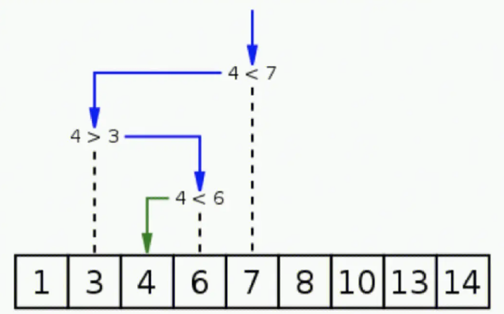
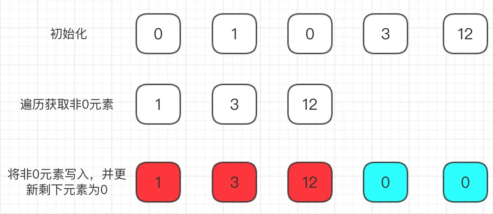

# 数组中的问题

## 如何写出正确的算法

> [!Note]
>
> 二分查找法

二分查找法师1946年提出的，第一个没有bug的二分查找法在1962年才出现。

1. 在**已排序的数组**中查找特定元素。
2. 通过反复将搜索区间划分为两半，并确定目标值可能在哪一半中，从而将搜索范围缩小一半。
3. 这个过程不断重复，直到找到目标值或确定目标值不在数组中。



> [!warning]
>
> 算法编程的注意事项：
>
> 1. 理解算法的规则。
> 2. 明确算法中所使用变量的定义。
> 3. 注意边界值。
> 4. 算法测试中注重小数据量的调试。

```c
int binarySearch(int arr[], int n, int x) {
    int left = 0;
    int right = n - 1; // 在区间 [left, right] 寻找目标值
    // 当 left == right，[left, right]依然有效，表示区间中只有一个元素。
    while (left <= right) { 
        int mid = (left + right) / 2; 
        if (arr[mid] == x) {
            return mid;
        }
        if (arr[mid] < x) {
            left = mid + 1;  // target在[mid + 1, right]中
        } else {
            right = mid - 1; // target在[left, mid - 1]中
        }
    }
    return -1;
}

int main() {
    int arr[] = {1, 3, 4, 6, 7, 8, 10, 13, 14};
    int n = sizeof(arr) / sizeof(arr[0]);
    int x = 4;
    int result = binarySearch(arr, n, x);
    if (result == -1) {
        cout << "Not found" << endl;
    } else {
        cout << "Found at index " << result << endl;
    }
}
```

在查找过程中变量`left`和`right`用来表示数组的边界，尽管数值发生变化，但是逻辑意义不变，称为循环不变量。

循环不变量（Loop Invariant）是在程序循环中为真的性质或条件。它是一个逻辑表达式，它在每次迭代循环时保持不变。

> [!Tip]
>
> 如果查找区间是`[left, right)`，上面的二分查找法应该如何修改。

上面代码的隐含的问题，当`(left + right)`足够大的时候，会产生溢出的问题，所有中间值计算可改为

```c
int mid = left + (right - left) / 2; 
```

## leetcode的使用

[leetcode](https://leetcode.cn/)


## 解决第一Leetcode题目

**LeetCode 283**

给定一个数组 `nums`，编写一个函数将所有 `0` 移动到数组的末尾，同时保持非零元素的相对顺序。

```markdown
输入: nums = [0, 1, 0, 3, 12]
输出: [1, 3, 12, 0, 0]
```

1. 直观的解决方案



```c
#include <iostream>
#include <cmath>
#include <vector>

using namespace std;

class Solution {
public:
    void moveZeroes(vector<int>& nums) {
        vector<int> nonZeroElements;
        for (int i = 0; i < nums.size(); i++) {
            if (nums[i] != 0) {
                nonZeroElements.push_back(nums[i]);
            }
        }

        for (int i = 0; i < nonZeroElements.size(); i++) {
            nums[i] = nonZeroElements[i];
        }

        for (int i = nonZeroElements.size(); i < nums.size(); i++) {
            nums[i] = 0;
        }

    }
};

int main() {
    vector<int> nums = {0, 1, 0, 3, 12};
    Solution().moveZeroes(nums);
    for (int i = 0; i < nums.size(); i++) {
        cout << nums[i] << " ";
    }
    cout << endl;
    return 0;
}
```

算法的时间复杂度和空间复杂度都是 $O(n)$

2. 原地移动操作

```python
class Solution(object):
    def moveZeroes(self, nums):
        k = 0  # nums 中, [0...k)的元素均为非0元素
        for num in nums:
            if num:
                nums[k] = num
                k += 1

        for i in range(k, len(nums)):
            nums[i] = 0
```

3. 使用数据交换操作

```python
class Solution(object):
    def moveZeroes(self, nums):
        k = 0  # nums 中, [0...k)的元素均为非0元素
        for index, num in enumerate(nums):
            if num:
                nums[k], nums[index] = nums[index], nums[k]
                k += 1
```

4. 避免全部为 0 进行交换

```python
class Solution(object):
    def moveZeroes(self, nums):
        k = 0  # nums 中, [0...k)的元素均为非0元素
        for index, num in enumerate(nums):
            if num:
                if index != k:
                    nums[k], nums[index] = nums[index], nums[k]
                    k += 1
                else:
                    k += 1
```


