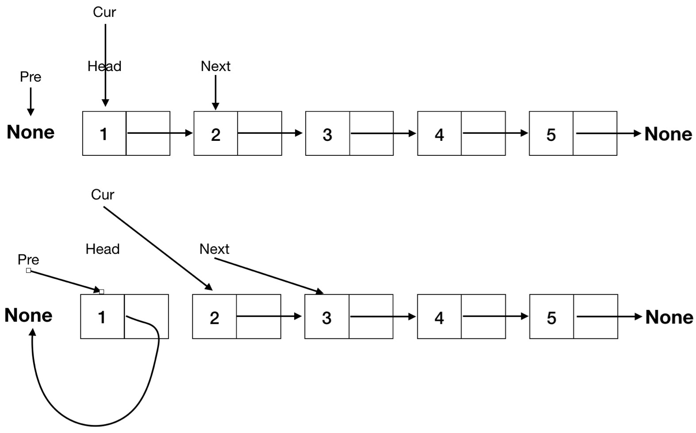
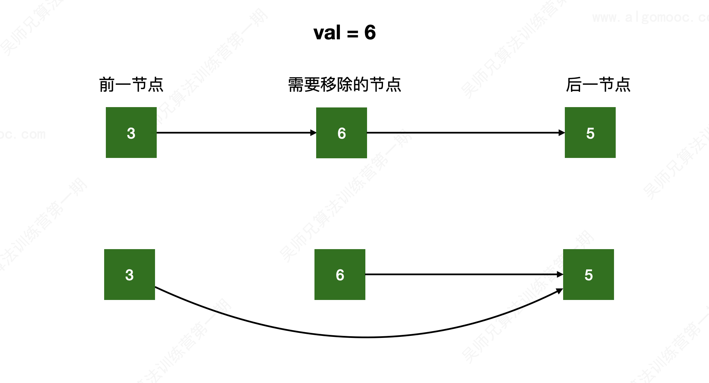

# 链表的使用

链表只能从头到尾进行遍历。

**[leetcode 206 反转链表](https://leetcode.cn/problems/reverse-linked-list/)**



```cpp
class Solution {
public:
    ListNode* reverseList(ListNode* head) {
        ListNode* pre = nullptr;
        ListNode* cur = head;
        while (cur != nullptr) {
            ListNode* next = cur->next;
            cur->next = pre;
            pre = cur;
            cur = next;
        }

        return pre;
    }
};
```

## 链表操作的常用方法

### 链表的虚拟头节点

**[leetcode 203 移除链表元素](https://leetcode.cn/problems/remove-linked-list-elements/)**



> [!attention]
>
> 上述删除方法对最后一个节点适用，但是对第一个节点不适用。


## 相关问题

| 题目编号     | 题目名称                                                     |
| ------------ | ------------------------------------------------------------ |
| Leetcode 92  | [反转链表 II](https://leetcode.cn/problems/reverse-linked-list-ii/) |
| Leetcode 83  | [删除排序链表中的重复元素](https://leetcode.cn/problems/remove-duplicates-from-sorted-list/) |
| Leetcode 86  | [分隔链表](https://leetcode.cn/problems/partition-list/)     |
| Leetcode 328 | [奇偶链表](https://leetcode.cn/problems/odd-even-linked-list/) |
| Leetcode 2   | [两数相加](https://leetcode.cn/problems/add-two-numbers/)    |
| Leetcode 445 | [两数相加 II](https://leetcode.cn/problems/add-two-numbers-ii/) |
|              |                                                              |
|              |                                                              |

