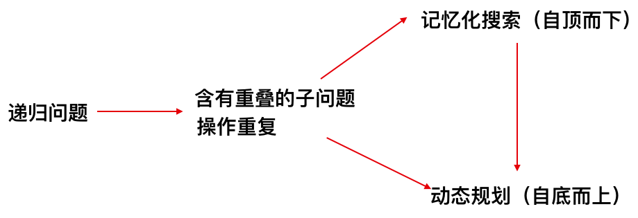
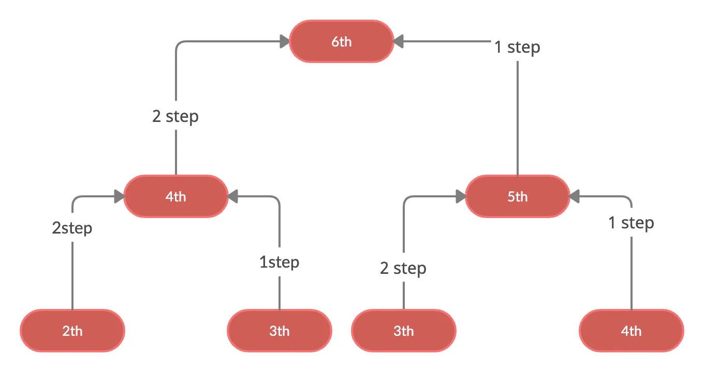

# 动态规划

斐波那契数列
$$
f(n) =
\begin{cases} 
0,  & n=0 \\
1, & n=1 \\
f(n-1) + f(n-2), & n \geqslant 2, n\in N^* \\
\end{cases}
$$

```cpp
int fib(int n) {
    if (n == 0) return 0;
    if (n == 1) return 1;
    return fib(n-1) + fib(n-2);
}
```


记录已计算过的数值，实现记忆化搜索。

```cpp
#include <vector>
#include <iostream>

using namespace std;

vector<int> memo;

int fib(int n) {
    if (n == 0) return 0;
    if (n == 1) return 1;
    if (memo[n] == -1) {
        memo[n] = fib(n - 1) + fib(n - 2);
    }

    return memo[n];
}

int main() {
    int n = 10;
    memo = vector<int>(n + 1, -1);
    int res = fib(n);
    cout << res << endl;
}
```

上面的递归算法是自上而下的解决问题，而动态规划是将这一过程逆转，自下而上的解决问题。

```cpp
#include <vector>
#include <iostream>

using namespace std;

vector<int> memo;

int fib(int n) {
    memo = vector<int>(n + 1, -1);
    memo[0] = 0;
    memo[1] = 1;
    for(int i = 2; i <= n; i++) {
        memo[i] = memo[i - 1] + memo[i - 2];
    }
    return memo[n];
}


int main() {
    int n = 20;
    int res = fib(n);
    cout << res << endl;
}
```

动态规划（Dynamic Programming，简称DP）将原问题分解成若干个子问题，通过解决子问题只需解决一次并将结果保存下来，从而避免了重复计算，提高了算法效率。 通俗来讲，动态规划算法是解决一类具有重叠子问题和最优子结构性质的问题的有效方法。



**[leetcode 20 爬楼梯](https://leetcode.cn/problems/climbing-stairs/)**



1. 递归解法

```python
class Solution {
private:
    int calcWays(int n) {
        if (n == 1) {
            return 1;
        }

        if (n == 2) {
            return 2;
        }

        return calcWays(n - 1) + calcWays(n - 2);
    }

public:
    int climbStairs(int n) {
        return calcWays(n);
    }
};
```

2. 使用记忆化搜索

```cpp
class Solution {
private:
    vector<int> memo;

    int calcWays(int n) {
        if (n == 1) {
            return 1;
        }

        if (n == 2) {
            return 2;
        }

        if (memo[n] == -1) {
            memo[n] = calcWays(n - 1) + calcWays(n - 2);
        }

        return memo[n];
    }

public:
    int climbStairs(int n) {
        memo = vector<int>(n + 1, -1);
        return calcWays(n);
    }
};
```

2. 动态规划算法

```cpp
class Solution {
public:
    int climbStairs(int n) {
        vector<int> memo(n+1, -1);

        memo[0] = 1;
        memo[1] = 1;

        for (int i = 2; i <= n; i++) {
            memo[i] = memo[i-1] + memo[i-2];
        }

        return memo[n];
    }
};
```


## 相关问题

| 题目编号     | 题目名称                                                     |
| ------------ | ------------------------------------------------------------ |
| Leetcode 120 | [三角形最小路径和](https://leetcode.cn/problems/triangle/)   |
| Leetcode 64  | [最小路径和](https://leetcode.cn/problems/minimum-path-sum/) |
|              |                                                              |
|              |                                                              |
|              |                                                              |
|              |                                                              |
|              |                                                              |
|              |                                                              |

